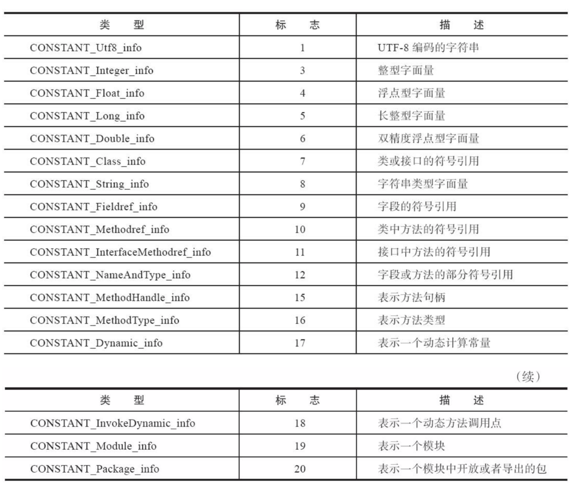
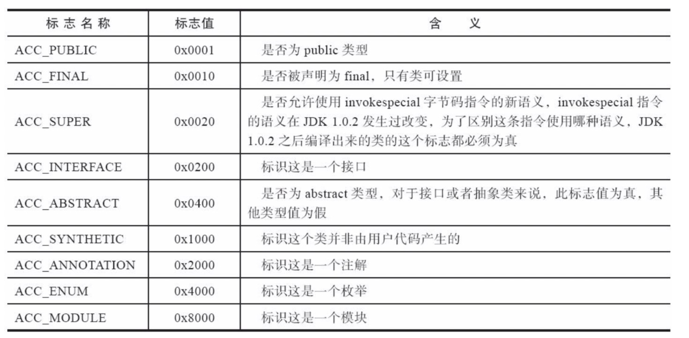
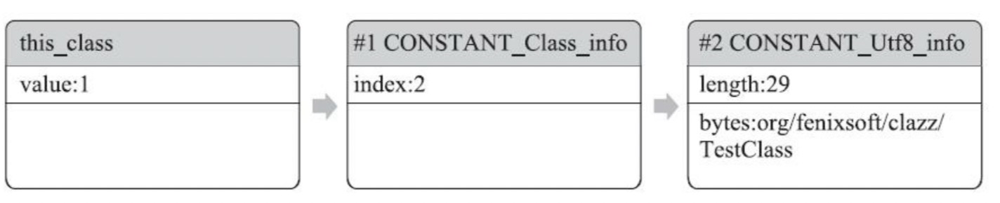
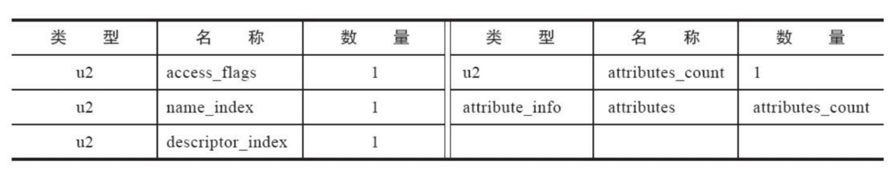
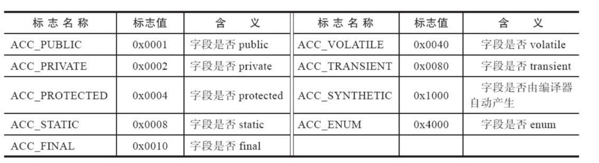
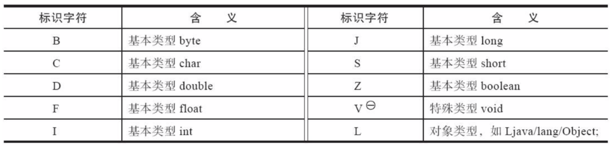
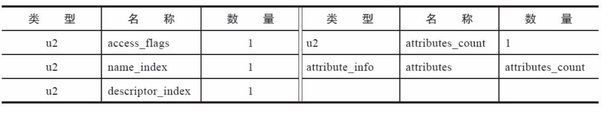
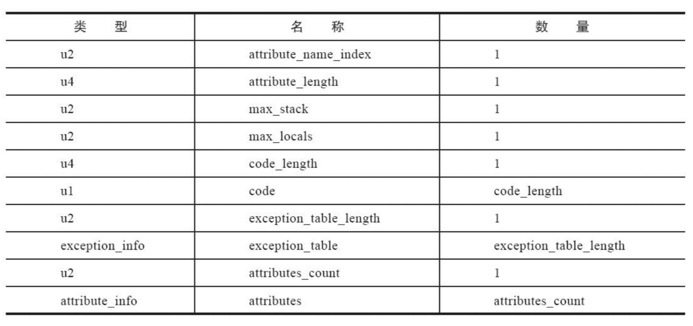
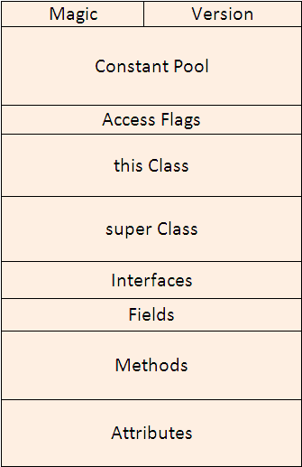

「一次编写，到处运行」为实现这种跨平台的设计，出现了Class文件

java虚拟机不与任何语言绑定，它只与Class文件这种特定的二进制关联

Class文件是以8字节为基础的二进制流，各个数据项目严格按照顺序紧凑地排列在文件之中，中间没有添加任何分隔符。当遇到需要占用8个字节以上的空间数据项时，会按照高位在前的方式分隔成若干个8字节进行存储。

根据《java虚拟机规范》，class文件格式采用一种类似于C语言结构体的伪结构来存储数据，这种伪结构只有两种数据类型：「无符号数」和「表」

+ 无符号数属于基本的数据类型，以u1、u2、u4、u8来分别代表1个字节、2个字节、4个字节和8个字节的无符号数
+ 表是由多个无符号数或者其他表作为数据项构成的复合数据类型，为了便于区分，所有表的命名都习惯性的以「_info」结尾。表用于描述有层次关系的复合结构的数据

整个class文件也可以看作一张表：

| 类型           | 名称                | 数量                    |
| -------------- | ------------------- | ----------------------- |
| u4             | magic               | 1                       |
| u2             | minor_version       | 1                       |
| u2             | major_version       | 1                       |
| u2             | constant_pool_count | 1                       |
| cp_info        | constant_pool       | constant_pool_count - 1 |
| u2             | access_flags        | 1                       |
| u2             | this_class          | 1                       |
| u2             | super_class         | 1                       |
| u2             | interfaces_count    | 1                       |
| u2             | interfaces          | interfaces_count        |
| u2             | fields_count        | 1                       |
| field_info     | fields              | fields_count            |
| u2             | methods_count       | 1                       |
| method_info    | methods             | methods_count           |
| u2             | attribute_count     | 1                       |
| attribute_info | attributes          | attributes_count        |

### magic

每个Class文件的头4个字节被称为魔数，它唯一作用就是确定这个文件是否为一个能被虚拟机接受的Class文件。Class文件的魔数是0xCAFEBABE

### minor_version&major_version

紧接着magic的4个字节存储的是Class文件的版本号

+ minor_verison：次版本号，第5和第6个字节
+ marjor_version：主版本号，第7和第8个字节

###constant_pool_count & constant_pool

minor_version&major_version紧接着常量池。常量池可以比喻为Class文件里的资源仓库，同时也是占用Class文件空间最大的数据项目之一。

由于常量池中常量的数量是不固定的，所以常量池的入口需要放置一项u2类型的数据，代表常量池容量计数值（constant_pool_count）。在Class文件格式规范制定之时，设计者将第0项常量空出来，用来表示「不引用任何一个常量池项目」。所以容量计数是从1开始而不是0。

常量池中主要存放两大类常量：

+ 字面量（Literal）：比较接近于Java语言层面的常量概念，如文本字符串、被声明final的常量值等

+ 符号引用（Symbolic References）：属于编译原理方面的概念，主要包括以下几类常量：
  + 被模块导出或者开放的包（Package）
  + 类和接口的全限定名（Fully Qualified Name）
  + 字段的名称和描述符（Descriptor）
  + 方法的名称和描述符
  + 方法句柄和方法类型（Method Handle、Method Type、Invoke Dynamic）
  + 动态调用点和动态常量（Dynamically-Computed Call Site、Dynamically-Computed Constant）
  
  

常量池数据类型如下：

**注意没有boolean类型**

### Access Flags

在常量池结束之后，紧接着的2个字节代表访问标志（access_flags），这个标志用于识别一些类或者接口层次的访问信息：是否定义为abstract类型，是否被声明为final等

### this_class & super_class & interfaces

类索引（this_class）和父类索引（super_class）都是一个u2类型的数据，而接口索引集合（interfaces）是一组u2类型的数据的集合，Class文件中由这三项数据来确定该类型的继承关系。

+ 类索引用于确定这个类的全限定名，
+ 父类索引用于确定这个类的父类的全限定名（java不允许多重继承，故父类索引只有一个）
+ 接口索引集合用来描述这个类实现了哪些接口。指向

类索引和父类索引各自指向一个类型为CONSTANT_Class_info的类描述符常量，通过CONSTANT_Class_info类型的常量中的索引值可以找到定义在CNSTANT_Utf8_info类型的常量中的全限定名字符串

对于接口索引集合，入口的第一项u2类型的数据为接口计数器（interfaces_count），表示索引表的容量

### field_info

字段表（field_info）用于描述接口或者类中声明的变量。

access_flags它与类中access_flags是类似的，都是一个u2的数据类型

跟随access_flags标志的是两项索引值：name_index和descriptor_index。它们都是对常量池项的引用

+ name_index：字段的简单名称
+ descriptor_index：字段和方法的描述符

简单名称指的是没有类型和参数修饰的方法或者字段名称，描述符是用来描述字段的数据类型、方法的参数列表和返回值

对于数组类型，每一维度使用一个前置的[字符来描述，如java.lang.String[][][][]=>[[Ljava/lang/String，int[]=[I

描述符描述方法时，按照先参数列表、后返回值的顺序描述，参数列表按照参数顺序放在小括号()内
如java.lang.String toString()的描述符为()Ljava/lang/String;

### Methods

 

与**Fields**基本类似，方法中的代码存在名为Code的**Attributes**中

### Attributes

#### 1.Code

max_stack代表了操作数栈（Operand Stack）深度的最大值。虚拟机运行的时候需要根据这个值来分配栈帧（Stack Frame）中的操作栈深度。

max_local代表了局部变量表所需的存储空间。max_local的单位是变量槽（Slot）,变量槽是虚拟机为局部变量分配内存的最小单位。对于byte、char、float、int、short、boolean和returnAddress等长度不超过32位的数据类型，每个局部变量占用一个变量槽，而double、long这两种64的数据类型需要2个变量槽来存放

#### 2.Exception

受检查异常表

#### 3.LineNumberTable

LineNumberTable属性用于描述Java源码行号与字节码行号之间的对应关系。
它不是运行时必须属性。但是会默认生成到Class文件中，如果选择不生成LineNumberTable属性，对程序运行产生的主要影响是当抛异常时，堆栈将不会显示出错的行号，debug也无法设置断点

#### 4.LocalVariableTable & LocalVariableTypeTable

LocalVariableTable用于描述栈帧中局部变量表的变量与Java源码定义变量之间关系。
它不是运行时必须属性。但是会默认生成到Class文件中，如果选择不生成LocalVariableTable属性，对程序产生的主要影响是，其他人引用这个方法时，所有参数名将会丢失

#### 5.SourceFile & SourceDebugExtension

用于记录生成Class文件的源码文件名称，这个属性也是可选的。对于大多数类来说，类名和文件名是一致的

#### 6.ConstantValue

ConstantValue属性的作用是通知虚拟机自动为变量赋值

#### 7.InnerClasses

InnerClass用于记录内部类与宿主类之间的关联

#### 8.Deprecated及Synthetic属性

Deprecated及Synthetic都是布尔属性，只存在有和没有的区别，没有属性值的概念

Deprecated属性用于表示某个类、字段或者方法，已经被程序作者定位不再推荐使用，通过@deprecated注解设置

#### 9.StackMapTable

#### 10.Signature

#### 11.BootstrapMethods

#### 12.MethodParameters

#### 13.模块化相关属性

####14.运行时注解相关属性

