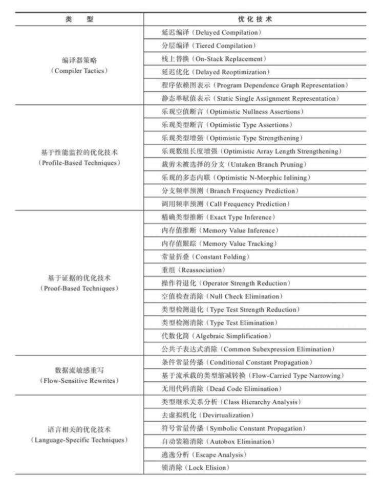
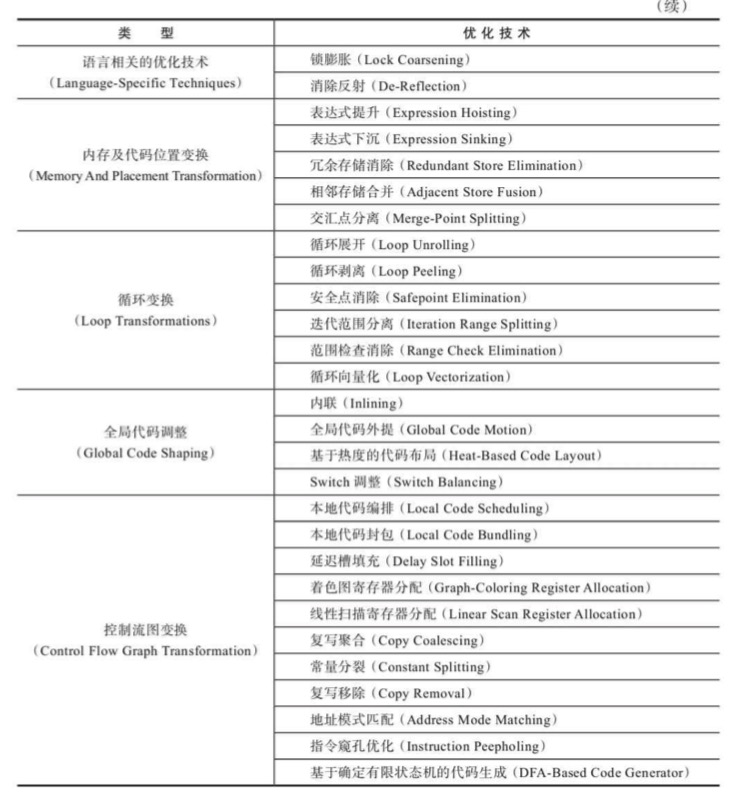

## 优化技术概览

## 方法内联

只有使用invokespecial指令调用的私有方法、实例构造器、父类方法和使用invokestatic指令调用的静态方法才会在编译器进行解析。除了上述四种方法以外（最多再除去被final修饰的方法，尽管它使用invokevirtual指令调用，但也是非虚方法），其他的Java方法调用都必须在运行时进行方法接受者的多台选择，它们都有可能存在多于一个版本的方法接受者。

为了解决虚方法的内联问题，Java虚拟机首先引入了一种名为继承关系分析（Class Hierarchy Analysis，CHA）的技术。这是整个应用程序范围内的类型分析技术，用于确定在目前已加载的类中，某个接口是否哟多于一种的实现、某个类是否存在子类、某个子类是否覆盖了父类的某个虚方法等信息

如果是非虚方法那么直接进行内联就可以了

如果是虚方法，则会向CHA查询此方法在当前程序状态下是否真的有多个目标版本可供选择，如果只有一个版本，那就可以进行内联，这种被称为「守护内联（Guarded Inlining）」不过由于Java程序是动态连接的，说不准什么时候就会加载到新的类型而改变CHA的结论，因此这种内联属于激进预测性优化，必须留好逃生门。如果加载了导致继承关系变化的新类，那么就必须抛弃已经编译的代码，退回到解释状态进行执行，或者重新进行编译

## 逃逸分析

逃逸分析（Escape Analysiss）并不是直接优化代码的手段，而是为其他优化措施提供依据的分析技术

### 栈上分配（Stack Allocations）

如果确定一个对象不会逃逸出线程之外，那让这个对象在栈上分配内存，对象所占用的内存空间就可以随栈帧出栈而销毁。

一般应用中，完全不会逃逸的局部对象和不会逃逸出线程的对象所占比较还是很大的，栈上分配会让垃圾收集子系统的压力降会下降很多

### 标量替换（Scalar Replacement）

若一个数据已经无法再分解成更小的数据表示了，Java虚拟机中的原始数据类型都不能再进一步分解了，那么这些数据就可以被称为标量。相对的，如果一个对象可以被继续分解，称为聚合量，Java中的对象就是典型的聚合量

如果逃逸分析能够证明一个对象不会被方法外部访问，并且这个对象可以被拆散，那么程序真正执行的时候可能不去创建这个对象，而改为直接创建若干个被这个方法使用的成员变量来代替

**标量替换可以视作栈上分配的一种特例**

### 同步消除（Synchronization Elimination）

如果逃逸分析能够确定一个变量不好逃逸出线程，无法被其他线程访问，对这个变量实施的同步措施也就可以安全的消除掉

## 公共子表达式消除（Common Subexpression Elimination）

如果一个表达式E之前已经被计算过了，并且从先前的计算到现在E中的所有变量的值都没有发生变化，那么E的这次出现就称为公共子表达式，对于这种表达式没有必要花时间重新对他计算

## 数组边界检查消除

Java是动态安全的语言，对数组的读写访问不像C、C++那样实质上就是裸指针操作，Java语言中访问数组元素的时候系统将自动进行上下界的范围检查，不满足条件会抛出ArrayIndexOutOfBoundsException这对于开发者来说是一件友好的事情，即使没有写防御代码，也能够避免大多数的溢出攻击。但是每次数组元素读写都带有一次隐含的条件判定操作，是一种性能负担

如foo[3]只有编译期根据数据流分析来确定foo.lenth的值，并判定下标3没有越界，执行的时候就无须判断了
另外，数组访问发生在循环中。编译器只要通过分析判定循环遍历的取值范围永远在区间[0,foo.length]之内，那么循环中就可以把整个数组的上下界检查消除掉

这种尽可能把**运行期检查移到编译器完成**的方式，空指针等异常也会使用

