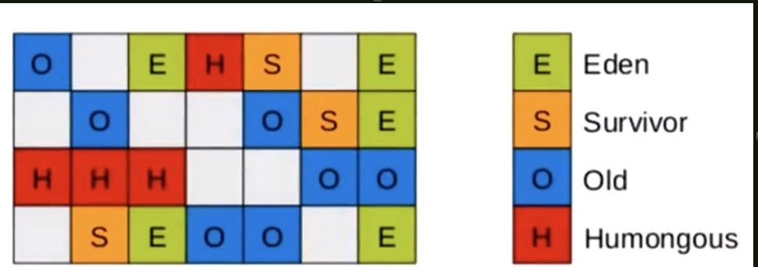

1使用场景

​	大内存，多核处理器

2 特点

把连续的Java堆划分为多个大小相等的独立区域（Region），每个Region都可以根据需要，扮演新生代的Eden空间、Survivor空间或者老年代空间，还有一个特殊的Humongous区域，专门用来存储大对象
大小超过一个Region容量的一半对象即可判断为大对象。每个Region大小可以通过参数-XX:G1HeapRegionSize设定，范围是1MB~32MB。对于超过整个Region容量的超级大对象，将会被存在N个连续的Homongous中，G1大对数行为都把Homongous Region当做老年代一部分看待

​	1 在物理上没有明显的分代概念，逻辑上划分为2048块Region，均分 

​	2 逻辑上分Eden、Survior、Old、Humongous

​	3 默认年轻代的初始占比为5%，可以通过参数调节，在运行的过程中，JVM可以动态调整这个大小

​	4 Eden和Survivor比例默认还是8:1:1

​	5 可控制最大停顿时间

3 Humongous

​	概念

​		1 只要超过50%的region，在G1中被认为Humongous

​		2 如果超过单个region大小，会连续分配多个region存处对象

4 主要GC过程

​	1 初始标记（STW）

​		同CMS

​	2 并发标记

​		同CMS

​	3 最终标记（STW）

​		同CMS

​	4 筛选回收（STW，在Shennandoah中实现了并发，这个收集器相当于G1的增强版）

​			1 对每个region的回收价值和成本进行排序，根据用户配置的期望STW时间，默认200毫秒，来制定回收计划，通过之前的回收时间来计算，将需要回收的region放入Collection Set中

​			2 优先选择回收价值大的区域，选择在更短的时间回收更多的空间的region

5 算法

​	复制算法，相对于CMS的标记清除几乎不会产生垃圾碎片

​	GC的时候整块的region中存活的对象，复制到另一块region中

​			

6 GC分类

​	1 Young GC

​		如果达到新生代的大小上限（默认5%），首先会计算当前Eden和S区的回收时间是否接近设置的停顿时间，如果回收时间远小于设置的停顿时间，此时增加新生代的region比率，否则进行回收，回收规则同之前的Par New的回收方式

​	2 Mixed GC

​		不是Full GC，老年代对象达到设定的比率（默认45%），开始回收Old和Humongous区域，如果没有足够的复制空间会产生Full GC

​	3 Full GC

​		如果没有足够的空region进行复制的时候，会退化成单线程的标记清除，压缩整理

7 特点

​	1 如果region中的存活对象比率大于85%，可以通过参数调节，默认是不会回收这个区域

​	2 可以通过参数设置一次回收过程中，做几次筛选回收，这样可以提高用户体验减少单次的筛选过程，默认8次，相当于把筛选回收拆成8段执行

### 跨Region引用怎么解决？

每个Region都有自己的记忆集，这些记忆集会记录下别的Region指向自己的指针

整个GC堆上都采用了新的region-based设计——把GC堆划分为很多（例如1024）个相同大小的region，然后在上面动态地、逻辑地选择其中一些region作为eden region，一些作为survivor region，一些作为old generation region。

其中属于young generation的region不需要记录outgoing reference的信息（或者从其它young generation出发的incoming reference的信息），因为这些region会在每次GC的时候都被完全扫描——G1里的三种GC模式，young、mixed和full，都保证会完全扫描young generation里的所有region。

而属于old generation的region则可以被单独选出来放到mixed GC里去做收集，这些region就需要记录outgoing和incoming reference的信息。其中outgoing reference是直接通过跟HotSpot里其它GC一样的card table来记录的，而incoming reference则是通过G1特有的per-region remembered set结合card table来记录的。

为此G1比以前的HotSpot GC新增了一种remembered set的设计，但是同时也使用了跟以前HotSpot VM里其它GC完全一样的card table。

因此G1比其他传统垃圾收集器有着更高的内存占用负担，大约相当于10%~20%的内存

### 并发标记阶段如何保证收集线程与用户线程互不干扰地运行？

由于每个Region都有remembered set,故采用原始快照（SATB）解决

此外，垃圾收集对用户线程影响还体现在回收过程中新创建对象的内存分配上，G1为每一个Region设计了两个名为TAMS（Top at Mark Start）指针，把Region中的一部分空间划分出来用于并发回收过程中的新对象分配，并发回收时新分配的对象地址都必须要在两个指针位置以上。G1收集器默认在这个地址以上的对象是被隐式标记过的，即默认是存活的，不纳入回收范围

### 怎么样建立起可靠的停顿预测模型？

G1收集器会记录每个Region的回收耗时、每个Region记忆集里的脏卡数量等各个可测量步骤花费的成本，并分析得出平均值、标准差、置信度等

## CMS & G1选择

与CMS的「标记-清除」算法不同，G1从整体来看是基于「标记-整理」算法实现的收集器，从局部上看又是基于「标记-整理」算法实现。**这意味着G1运作期间不会产生内存碎片**

### 内存占用角度

虽然CMS和G1都是要卡表来处理跨代指针，但G1的卡表实现更复杂，而且每个Region无论扮演新生代还是老年代都必须有一份卡表

### 执行负载角度

它们都使用了写屏障。CMS用写后屏障更新维护卡表；而G1除了写后屏障来进行同样的卡表维护操作外，为了实现原始快照（SATB）算法，还需要写前屏障来跟踪并发时的指针变化情况

目前在小内存应用上CMS的表现优于G1，平衡点在6G~8G之间

