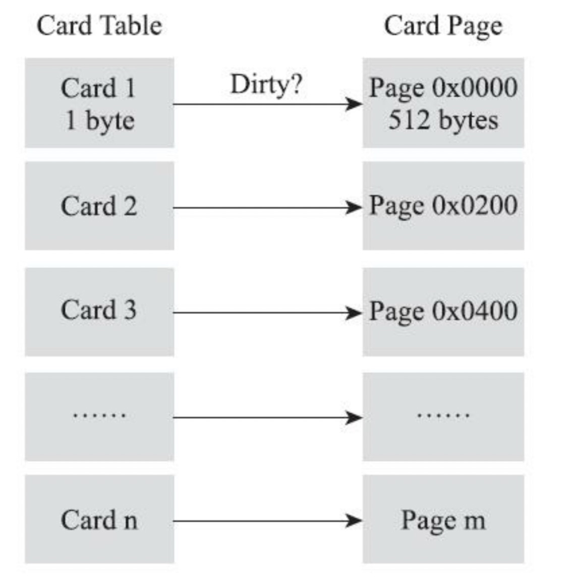
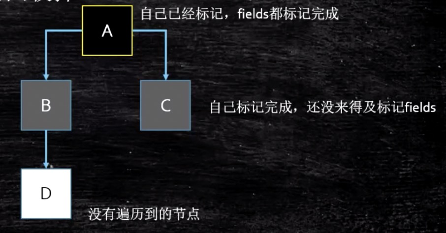
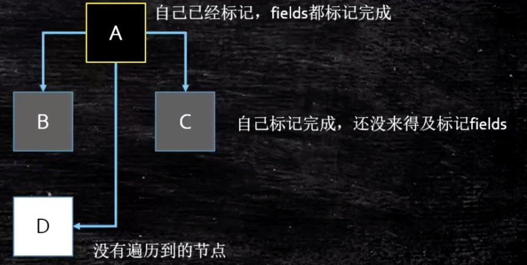

## 1.根节点枚举

**所有收集器在根节点枚举这一步骤时都是必须Stop The Word**

**以为根节点枚举需要STW，故为了减少根节点枚举的时间，HotSpot使用OopMap的数据结构来达到这个目的。**

## 2.安全点&安全区域

在OopMap的协助下，HotSpot可以快速准确完成GC Roots的枚举，**但如果为每一条指令都生成对应的OopMap，那么将会需要大量的额外存储空间**
为了解决这个问题，HotSpot只在特点的位置记录OopMap，这些位置被称为**「安全点（SafePoint）」**

安全点既不能太少以至于收集器等待的时间过长，又不能太多导致过分增大运行时的内存负荷
安全点位置的选择基本是以「是否具有让程序长时间执行的特征」为标准选定的

如何在垃圾收集发生时让所有线程都跑到安全点，然后停顿下来？

+ 抢占式中断（几乎没有虚拟机采用）
+ 主动式中断

安全点机制保证了程序执行时，但是用户线程处于Sleep状态或者Blocked状态需要靠**「安全区域」**来保证

## 3.记忆集与卡表

假如现在进行一次新生代的垃圾收集（Minor GC）,但新生代完全有可能被老年代引用，为了找出该区域中存活的对象，不得不在固定的GC Root之外，再额外遍历整个老年代中所有对象来确保可达性分析的正确性。反过来也一样，为解决这个跨代引用问题，引用了**记忆集（Remember Set）**这种结构

记忆集可以按精度划分：

+ 字长精度
+ 对象精度
+ 卡精度

其中卡精度被称为**卡表（Card Table）**



HotSpot中卡表的卡页是2的9幂，即512字节

卡表（Card Table）被实现为一个简单的字节数组，即卡表的每个标记项为1个字节（**类似于BitMap**）。

当对一个对象引用进行写操作时（对象引用改变），写屏障逻辑将会标记对象所在的卡页为dirty。

### 卡表带来的问题

#### 无条件写屏障带来的性能开销

HotSpot是通过写屏障来维护卡表状态的。这里的写屏障指的是虚拟机层面对引用类型赋值的AOP切面

**在G1出现之前都只使用了写后屏障**

每次对引用的更新，无论是否更新了老年代对新生代对象的引用，都会进行一次写屏障操作。

####高并发下伪共享带来的性能开销

假设CPU缓存行大小为64字节，由于一个卡表项占1个字节，这意味着，64个卡表项将共享同一个缓存行。

HotSpot每个卡页为512字节，那么一个缓存行将对应64个卡页一共64*512=32KB。

如果不同线程对对象引用的更新操作，恰好位于同一个32KB区域内，这将导致同时更新卡表的同一个缓存行，从而造成缓存行的写回、无效化或者同步操作，间接影响程序性能。

一个简单的解决方案，就是不采用无条件的写屏障，而是先检查卡表标记，只有当该卡表项未被标记过才将其标记为dirty。

这就是JDK 7中引入的解决方法，引入了一个新的JVM参数-XX:+UseCondCardMark，在执行写屏障之前，先简单的做一下判断。如果卡页已被标识过，则不再进行标识。

简单理解如下：

```
if (CARD_TABLE [this address >> 9] != 0)
  CARD_TABLE [this address >> 9] = 0;
```

与原来的实现相比，只是简单的增加了一个判断操作。

虽然开启-XX:+UseCondCardMark之后多了一些判断开销，但是却可以避免在高并发情况下可能发生的并发写卡表问题。通过减少并发写操作，进而避免出现虚共享问题（false sharing）。

是否打开需要根据具体情况进行权衡

## 4.并发的可达性分析&三色标记算法

在跟节点枚举这个步骤中，由于GC Root相比整个Java堆中的全部对象还算是极少数，且在各种优化技巧加持下（如OopMap）,它带来的停顿已经是非常短暂且相对固定。但是从GC Root继续遍历对象图这一步骤就必定与Java堆容量成正比例关系了

想降低用户线程的停顿，让GC线程**异步执行**，从而可以以中断时间极少的代价或者完全没有中断来进行整个 GC，进而引入了三色标记算法。

+ 白色：表示对象尚未被垃圾收集器访问过
+ 黑色：表示对象已经被垃圾收集器访问过，且这个对象所有引用都已经扫描过
+ 灰色：表示对象已经被垃圾收集器访问过，但这个对象至少存在一个引用还没有被扫描过

### 三色标记的问题：并发情况下的漏标问题

**同时满足以下2个条件会发生漏标问题：**

+ **插入了一条或多条从黑色对象到白色对象的新引用，图中的A->D**
+ **删除了全部从灰色对象到该白色对象的直接或间接引用,图中的B->D**





漏标会导致回收掉正在使用的对象从而产生错误。解决这个问题只需要破坏两个条件的任意一个即可，故有两种方法：

+ **增量更新（Incremental Update）**：破坏的是第一个条件，当黑色对象插入新的指向白色对象的引用关系时，就将这个新插入的引用记录下来（**即将A改成灰色**），等并发扫描之后，**再将这些记录过的引用关系中的黑色对象为根，重新扫描一次**
+ **原始快照（Snapshot At The Beginning，SATB）**：破坏的是第二个条件，当灰色对象要删除指向白色对象的引用关系时，就**将这个要删除的引用（即图中的D）记录下来**，等并发扫描之后，**再将这些记录过的引用关系中的灰色为根，重新扫描一次**

**CMS是基于增量更新来做并发标记的，G1则是用原始快照实现的**

**G1由于每个Regin都有Remember Set记录Incoming Reference信息，恰好可以用这个RSet来做原始快照，故采用原始快照实现**

