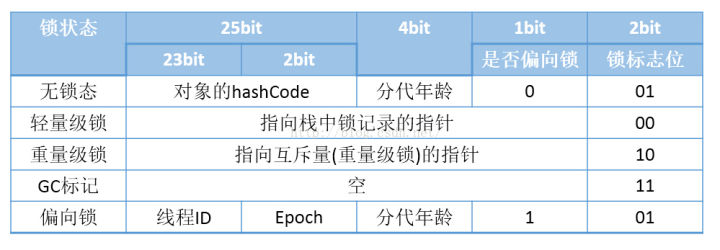
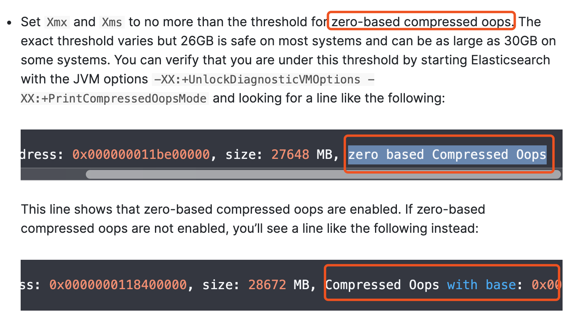
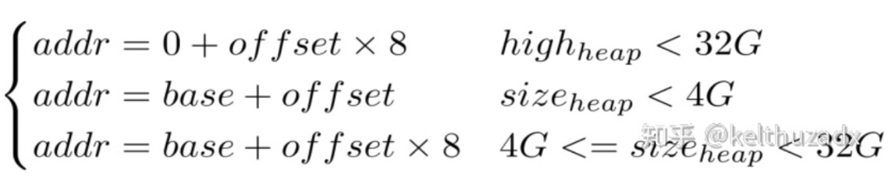
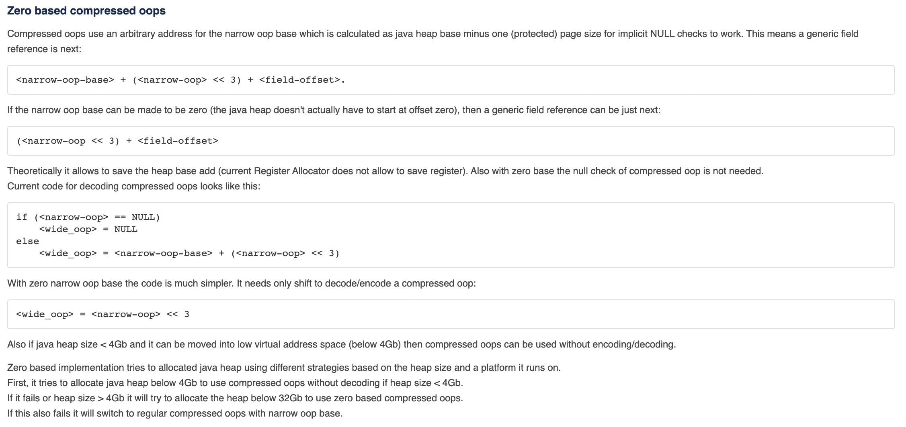

##1.对象内存布局

HotSpot虚拟机中，对象在内存中存储的布局可以分为三块区域：

+ 对象头（Header）
+ 实例数据（Instance Data）
+ 对齐填充（Padding）

## 2.对象头

+ Mark Word
  + 32位JVM：4byte
  + 64位JVM：8byte
+ Klass Word
  + 32位JVM：4byte
  + 64位JVM：8byte
  + 64位JVM开启指针压缩：4byte
+ array length（只有数组对象才有）
  + 32位JVM：4byte
  + 64位JVM：8byte
  + 64位JVM开启指针压缩：4byte

## 3.Mark Word

#### 32位：



####64位：


## 4.分析工具

```xml
<dependency>
    <groupId>org.openjdk.jol</groupId>
    <artifactId>jol-core</artifactId>
    <version>0.10</version>
</dependency>
```

```java
System.out.println(ClassLayout.parseInstance(object).toPrintable());
object为我们的锁对象
```

##5.为什么需要对齐填充

4G内存=4*1024MB=4*1024*1024KB=4*1024*1024*1024Byte=4*1024*1024*1024*1024Bit
也就是说4G内存=2^35个bit
也就需要35位才能表示表示，但是32位操作系统只有32位，向表示4G内存的话，就只能让每位表示的数据多一些，操作系统规定了一次IO最小单位是1byte,而1Byte=8Bit，所以只需要2^35/8位就可以表示4G内存了

JVM同理，只要一次最小拿8个byte,就可以扩大8倍，也就是32G 


1.如果堆大小小于4G，直接砍掉高32位，避免解码编码过程
2.如果堆的高位地址小于32G，说明不需要基址（base）就能定位堆中任意对象，这种模式称为**零基压缩（Zero-based Compressed Oops Mode）**
一般堆内存在26G以下可以开启**零基压缩**，但这不是绝对的，可以通过添加JVM参数-XX:UnlockDiagnosticVMOptions -XX:+PrintCompressedOopsMode，观察启动时打印日志来判断是否开启**零基压缩**



3.如果堆处于4G到32G范围，只能通过「基址+偏移x缩放」才能定位堆中任意对象
4.如果堆内存大于32G，无法开启指针压缩



官网对于指针压缩的解释

https://wiki.openjdk.java.net/display/HotSpot/CompressedOops

