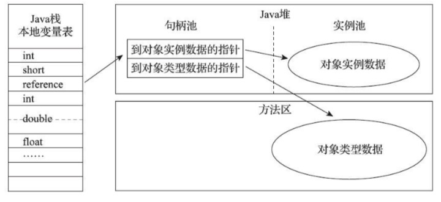
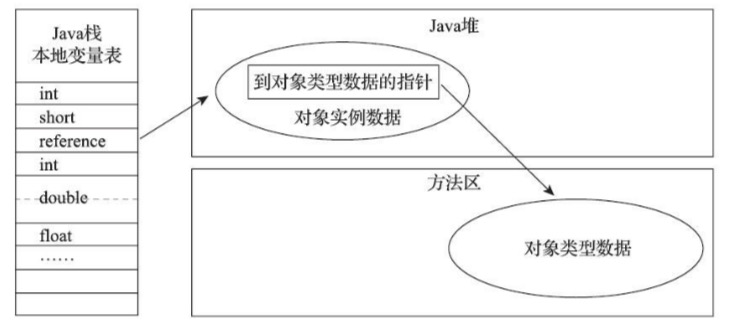

Java程序会通过栈上的reference数据来操作堆上的具体对象。reference在《Java虚拟机规范》只规定了它是一个指向对象的引用，并没有定义这个引用应该通过什么方式去定位，主流的访问方式主要有两种：

+ 句柄访问
  
+ 直接访问

使用句柄来访问的最大好处是reference中存储的是稳定的句柄地址，在对象被移动（GC时移动对象是非常普遍的行为）时只会改变句柄中的实例数据指针，而reference本身不需要修改

使用直接指针来访问的最大好处是速度更快，节省了一次指针定位的时间开销（HotSpot的实现方式）

**因为一个对象可能有很多处引用**，也就是有很多的 reference。如果用对象句柄的方式访问，那么当对象移动时，仅仅需要改变一下句柄中的对象地址即可；然而如果 reference 直接存储对象地址的话，那对象移动时，JVM 就必须找出该对象的所有引用然后修改为新的地址。

