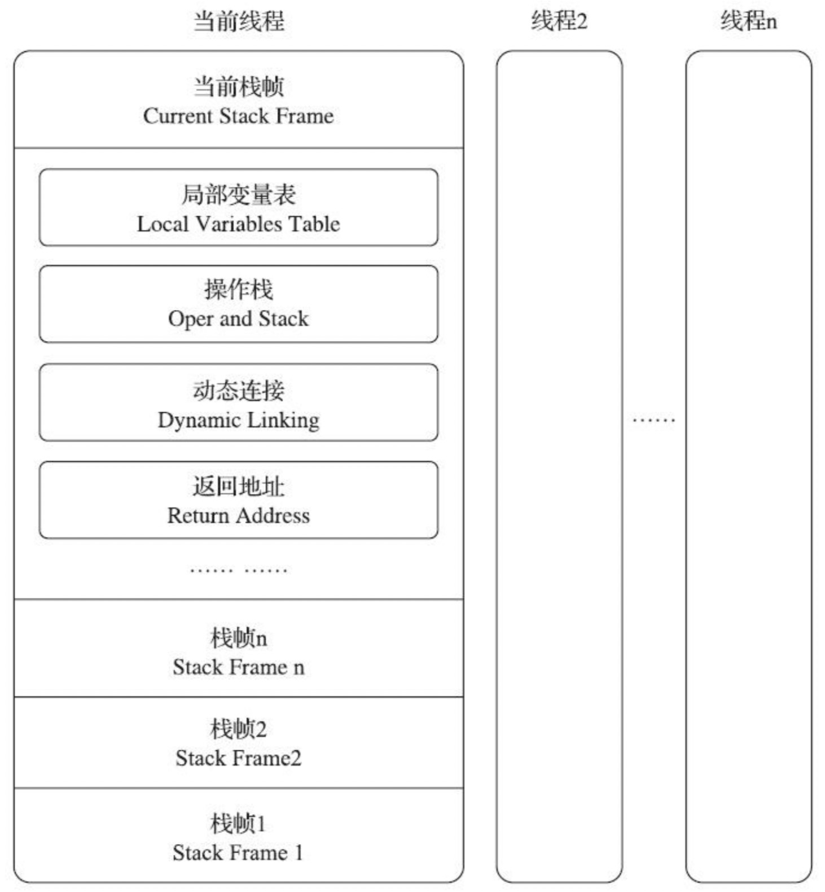
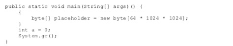
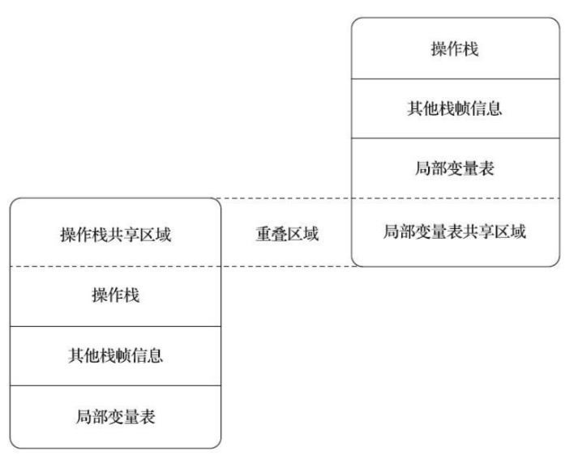

栈帧（Stack Frame）是虚拟机运行时数据区中的虚拟机栈的栈元素

每一个栈帧都包括了**局部变量表、操作数栈、动态连接、方法返回地址**和一些额外的附加信息。
在编译Java程序源码的时候，栈帧中需要多大的局部变量表，需要多深的操作数栈就已经被分析计算出来，并写入到方法表的Code属性之中。换言之，一个栈帧需要分配多少内存，并不会受到程序运行期变量数据的影响，仅仅取决于程序源码和具体的虚拟机实现栈内存布局形式

对于执行引擎来讲，活动线程中，只有位于栈顶的方法才是在运行的，只有位于栈顶的栈帧才是生效的，被称为“当前栈帧（Current Stack Frame）”

### 局部变量表（Local Variables Table）

局部变量表是一组变量值的存储空间，用于存放方法参数和方法内部定义的局部变量。在Java程序被编译为Class文件时，就在方法的Code属性的max_local数据项中确定了该方法所需分配的局部变了表最大容量。

局部变量表的容量以变量槽（Variable Slot）为最小单位，《Java虚拟机规范》中并没有明确的指出一个变量槽应占用的内存空间大小，只是很有导向地说到每个变量槽都应能存放一个boolean、byte、char、short、int、float、reference或returnAddress类型的数据，

对于64位的数据类型，Java虚拟机会以高位对齐的方式为其分配两个连续的变量槽空间。不过由于局部变量表是建立在线程堆栈中的，属于线程私有数据，不会引起数据竞争和线程安全问题

为了尽可能节省栈帧耗用的内存空间，局部变量表中的变量槽是可以重用的，方法体中定义的变量，其作用域并不一定会覆盖整个方法体，如果当前字节码PC计数器的值已经超出了某个变量的作用域，那这个变量对应的变量槽就可以交给其他变量来重用。不过，这样设计出了节省栈帧空间以外，还会伴随有少量副作用，例如在某些情况下变量槽的复用会直接影响到系统的垃圾收集行为。

运行结果如下，还是有64MB的内存没有被回收掉，placeholder能否被回收的根本原因就是：局部变量表的变量槽是否还存有placeholder数组对象的引用，代码虽然已经离开了placeholder的作用域，但在此之后，再也没发生过任何对局部变量表的读写操作，placeholder原本所占用的变量槽还没有被其他变量所复用，所以作为GC Roots一部门的局部变量表仍然保持着对它的关联。如果遇到一个方法，其后面的代码有一些耗时很长的操作，而前面又定义了占用了大量内存但实际上已经不会在使用的变量，手动将其设置为null值，这种操作可以作为一种在极特殊情形下的「奇技」来使用。

从编码的角度讲，以恰当的变量作用域来控制变量回收时间才是最优雅的解决方法。
从执行的角度讲，使用赋null操作来优化内存回收是建立在对字节码执行引擎概念的理解之上的，「公有设计，私有实现」来强调概念模型与实际执行过程是外部看起来等效，内部看上去可以完全不同。赋null值的操作在经过即时编译优化后几乎是一定会被当做无效操作清除的。

### 操作数栈（Operand Stack）

最大深度在编译的时候就被写入到Code属性的max_stack数据项之中。32位数据类型所占的栈容量为1，64位数据类型占的栈容量是2。
两个不同栈帧作为不同方法的虚拟机栈的元素，是完全独立的。但是在大多虚拟机的实现都会进行一些优化处理，令两个栈帧出现一部分重叠。让下面栈帧的部分操作数栈与上面栈帧的部分局部变量表重叠在一起，不仅节约了一些空间，更重要的是在进行方法调用时就可以直接公用一部分数据，无须进行额外的参数复制传递了。

Java虚拟机的解释执行引擎被称为「基于栈的执行引擎」，里面的栈就是操作数栈

### 动态连接

每个栈帧都包含一个指向**运行时常量池**中该栈帧所属方法的引用。

**先有动态连接，后根据动态连接创建栈帧**

### 方法返回地址

当一个方法开始执行后，只有两种方式退出这个方法。第一种方式是执行引擎遇到任意一个方法返回的字节码指令，这种退出的方式称为「正常调用完成」
另外一种退出方式是在方法执行的过程中遇到了异常，只要在本方法的异常表中没有搜索到匹配的异常处理器，就会导致方法退出，这种退出方式称为「异常调用完成」，这种方式退出，不会给它上层调用者提供任何返回值的

无论采用何种退出方式，在方法退出之后，都必须返回到最初方法被调用的位置，程序才能继续执行，方法返回时可能需要栈帧中保存一些信息，用来帮助恢复它的上层主调方法的执行状态。一般来说，方法正常退出时，主调方法的PC计数器的值就可以作为返回地址。方法异常退出时，返回地址是要通过异常处理器表来决定的，栈帧中一般不会保存这部分信息

### 附加信息

调试、性能收集相关信息