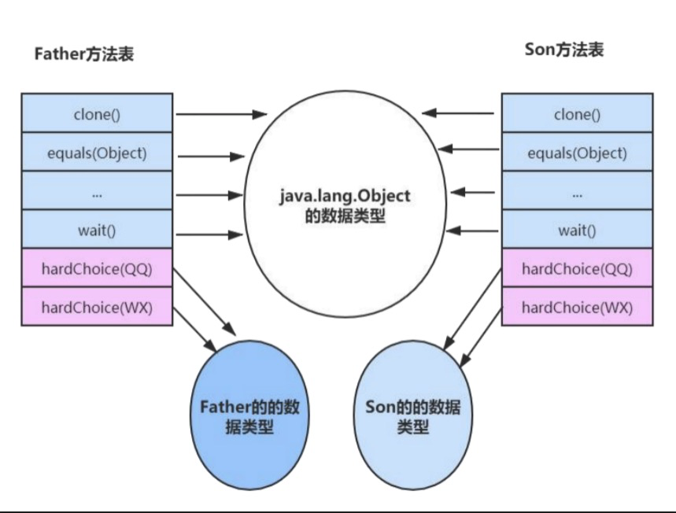

动态分派会执行非常频繁的动作，JVM 运行时会频繁的、反复的去搜索元数据，所以 JVM 使用了一种优化手段，这个就是在**方法区中建立一个虚方法表（virtual method table，简称vtable）**。**使用虚方法表索引来替代元数据查找(**invokevirtual的多态查找流程)**以提高性能**。

在实现上，最常用的手段就是为类在方法区中建立一个虚方法表。虚方法表中存放着**各个方法的实际入口地址**。如果某个方法在子类中没有被重写，那子类的虚方法表里面的地址入口和父类相同方法的地址入口是一致的，都指向父类的实现入口。**如果子类中重写了这个方法，子类方法表中的地址将会替换为指向子类实现版本的入口地址**。下图中，Son 重写了来自Father 的全部方法，因此 Son 的方法表没有指向Father 类型数据的箭头。但是 Son 和Father都没有重写来自 Object 的方法，所以它们的方法表中所有从 Object 继承来的方法都指向了 Object 的数据类型。

+ 针对于方法调用动态分派的过程，虛拟机会在类的方法区建立一个**虚方法表**的数据结构(virtual method table, vtable)。 
+ 针对于invokeinterface指令来说，虚拟机会建立一个叫做**接口方法表**的数据结构 (interface method table, itable)。

**方法表一般在类加载的连接**阶段进行初始化,准备了类的变量初始值后,虚拟机会把该类的方法表也初始化完毕

“虚方法表”（）是实现虚方法查找的一种方式。它既不是唯一的方式也不一定是最快的方式。
这属于JVM的实现细节的层次，在Java语言规范与JVM规范里都是没有规定的。

