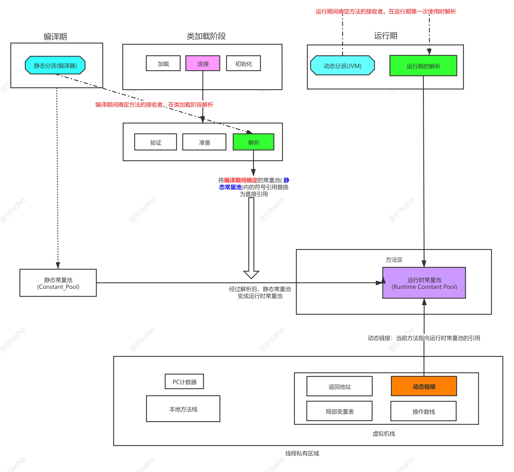

方法调用并不等同于方法执行,方法调用阶段唯一的任务就是**确定被调用方法的版本(即调用哪一个方法)**

根据在哪个阶段 符号引用 转化成直接引用，将方法调用分成：**解析调用** 与 **分派调用**。

## 1. JVM方法调用的字节码指令

#### 非虚方法的调用

1. **invokestatic**: 调用静态方法, 
2. **invokespecial**：调用自己的私有方法、构造方法（<init>）以及父类(super调用)的方法,

#### 虚方法的调用

1. **invokevirtual**: 调用虚方法，运行期动态查找的方法(排除调用final修饰的方法)
2. **invokeinterface**: 调用接口中的方法，实际上是在运行期决定的，决定到底调用实现该接口的哪个对象的特定方法。invokeinterface 和 invokevirtual 指令类似，不过作用于接口类；

1. **invokedynamic**: 先在运行时动态解析出调用点限定符所引用的方法，然后再执行该方法。前面4 条调用指令，分派逻辑都固化在Java虚拟机内部，而invokedy namic指令的分派逻辑是由用户设定的引导方法来决定的。

------

### 解析的目的

将符号引用转为直接引用。

### 分派的目的

确定方法的接收者。

**静态分派**：**编译期**间确定方法的接收者。在类加载阶段**解析**。

**动态分派**：**运行期**间确定方法的接收者。在运行期第一次使用时**解析**。

#### 解析的时机

类加载或者运行期  （虚拟机）

解析的**前提**是编译器确定，不是发生在编译期

#### 静态分派的时机

编译期 （编译器）

#### 动态分派的时机

运行期    (虚拟机)

**方法的重载是一种静态的行为，在编译期就可以完全确定。**

**方法的重写是运行期行为。**

如果方法在编译期就确定了具体的调用版本，这个版本在运行时是不可变的，这样的方法称为**非虚方法。**

只要能被**invokestatic**和**invokespecial**指令调用的方法，都可以在解析阶段中确定唯一的调用版本， Java语言里符合这个条件的方法共有静态方法、私有方法、构造方法、父类方法4种，再加上被final修饰的方法(尽管它使用invokevirtual指令调用)，这5种方法调用会在类加载的时候就可以把符号引用解析为该方法的直接引用。这些方法统称为“**非虚方法**”(Non-Virtual Method)，与之相反，其他方法就被称为“**虚方法**”(Virtual Method)。

-----------

