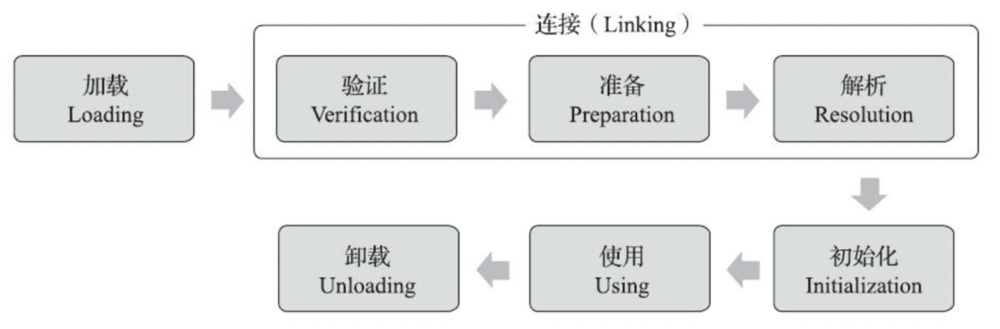
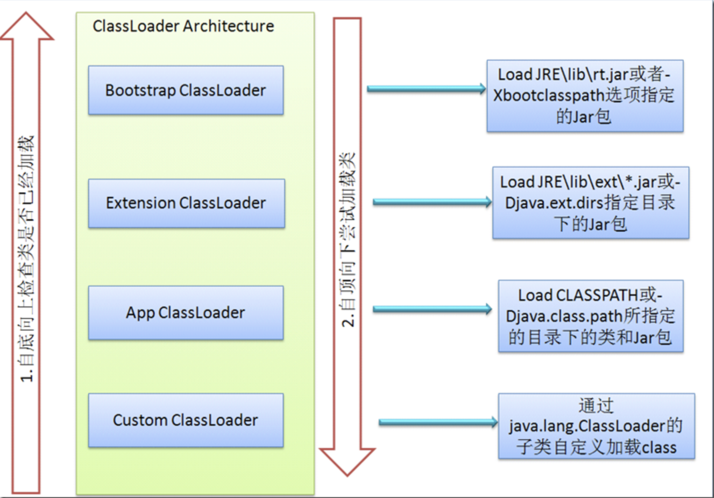

## 1. 类加载过程



1. 加载（Loading）
2. 连接（Linking）
   1. 验证（Verification）
   2. 准备（Preparation）
   3. 解析（Resolution）
3. 初始化（Initialization）

### 1.1 加载

1. 通过一个类的全限定名来获取此类的二进制字节流
2. 将这个类所代表的静态存储结构转化为方法区的运行时数据结构
3. **在内存生成一个代表这个类的Class对象，作为这个类的各种数据的访问入口**

二进制流可以从zip压缩包，网络获取（Web Applet）,运行时计算生成（动态代理），文件生成（Jsp）等等

### 1.2 验证

验证是连接阶段的第一步，这一阶段的目的是确保Class文件的字节流中包含的信息符合《Java虚拟机规范》的全部约束要求，防止方位数组边界以外的数据、跳转到不存在的代码行之类的事情发生，以保障不会危害虚拟机的自身安全。

1. 文件格式验证（验证字节流是否符合Class文件规范）

   1. 是否以魔数0xCAFEBABY开头
   2. 主次版本号是否存在
   3. 常量池常量是否有不被支持的常量类型（检查常量tag标志）
   4. ....

2. 元数据验证（对字节码描述的信息）

   1. 这个类的父类是否继承了不允许被继承的类
   2. 类中的字段、方法是否与父类产生矛盾（覆盖了父类的final字段等）
   3. ...

3. 字节码验证（对类的方法体即Class文件中的Code属性进行校验分析，保证不会危害安全）

   1. 保证任何跳转指令都不会跳转到方法体以外的字节码指令上
   2. 保证方法体中的类型转换总是有效的，例如把对象赋值给与它完全不相干的一个数据类型

   由于**数据流分析**和**控制流分析**的高度复杂性Java虚拟机的设计团队为了避免过多的执行时间消耗在字节码验证阶段中，JDK6之后的Javac编译器和J把虚拟机进行了一项联合优化，把尽可能多的校验辅助措施挪到Javac编译器里进行。具体做法是给方法体Code属性的属性表中新增了一项名为StackMapTable的属性，这项属性描述了方法体所有基本块开始时本地变量表盒操作栈应有的状态，在字节码验证期间，Java虚拟机就不需要根据程序推导这项状态的合法性，只需要检查StackMapTable属性中的记录是否合法即可。
   -XX:-UseSplitVerifier可以关闭这项优化。

4. 符号引用验证（确保解析行为能正常执行）

   1. 符号引用中通过字符串描述的全限定名是否能找到对应的类
   2. 符号引用中的类、字段、方法的可访问性（private、public...）是否可被当前类访问

### 1.3 准备

为类中定义的变量（即静态变量）分配内存并设置类变量**初始值**的阶段。这时候进行内存分配的仅包括类变量，不包括实例变量

###1.4 解析

将常量池内的符号引用替换为直接引用的过程。

+ 符号引用：一组符号来描述所引用的目标，可以是任何形式的字面量，只要使用时能无歧义定位到目标即可
+ 直接引用：直接指向目标的指针、相对偏移量或者是一个能间接定位到目标的句柄

### 1.5 初始化

初始化阶段就是执行类构造器方法的过程

## 2. 双亲委派模型



###2.1 JDK为什么要使用双亲委派模型

**安全**
如果不使用这种委托模式，那我们就可以随时使用自定义的String来动态替代java核心api中定义的类型，这样会存在非常大的安全隐患，而双亲委托的方式，就可以避免这种情况，因为String已经在启动时就被引导类加载器（Bootstrcp ClassLoader）加载，所以用户自定义的ClassLoader永远也无法加载一个自己写的String，除非你改变JDK中ClassLoader搜索类的默认算法。

### 2.2 自定义类加载器&破坏双亲委派模型

ClassLoader 里面有三个重要的方法 loadClass()、findClass() 和 defineClass()。

loadClass() 方法是加载目标类的入口，它首先会查找当前 ClassLoader 以及它的双亲里面是否已经加载了目标类，如果没有找到就会让双亲尝试加载，如果双亲都加载不了，就会调用 findClass() 让自定义加载器自己来加载目标类。ClassLoader 的 findClass() 方法是需要子类来覆盖的，不同的加载器将使用不同的逻辑来获取目标类的字节码。拿到这个字节码之后再调用 defineClass() 方法将字节码转换成 Class 对象

```java
protected Class<?> loadClass(String name, boolean resolve)
    throws ClassNotFoundException
{
    synchronized (getClassLoadingLock(name)) {
        //检查该类是否已经加载过
        Class c = findLoadedClass(name);
        if (c == null) {
            //如果该类没有加载，则进入该分支
            long t0 = System.nanoTime();
            try {
                if (parent != null) {
                    //当父类的加载器不为空，则通过父类的loadClass来加载该类
                    c = parent.loadClass(name, false);
                } else {
                    //当父类的加载器为空，则调用启动类加载器来加载该类
                    c = findBootstrapClassOrNull(name);
                }
            } catch (ClassNotFoundException e) {
                //非空父类的类加载器无法找到相应的类，则抛出异常
            }

            if (c == null) {
                //当父类加载器无法加载时，则调用findClass方法来加载该类
                long t1 = System.nanoTime();
                c = findClass(name); //用户可通过覆写该方法，来自定义类加载器

                //用于统计类加载器相关的信息
                sun.misc.PerfCounter.getParentDelegationTime().addTime(t1 - t0);
                sun.misc.PerfCounter.getFindClassTime().addElapsedTimeFrom(t1);
                sun.misc.PerfCounter.getFindClasses().increment();
            }
        }
        if (resolve) {
            //对类进行link操作
            resolveClass(c);
        }
        return c;
    }
}
```

自定义加载器的话，需要继承 `ClassLoader` 。
如果我们不想打破双亲委派模型，就重写 `ClassLoader` 类中的 `findClass()` 方法即可，无法被父类加载器加载的类最终会通过这个方法被加载。
但是，如果想打破双亲委派模型则需要重写 `loadClass()` 方法

### 2.3为什么要破坏双亲委派

- Tomcat，类加载器架构，自己定义了多个类加载器，
  - 保证了同一个服务器的两个Web应用程序的Java类库隔离；
  - 保证了同一个服务器的两个Web应用程序的Java类库又可以相互共享；比如多个Spring组织的应用程序不能共享，会造成资源浪费；
  - 保证了服务器尽可能保证自身的安全不受不受部署Web应用程序影响；
  - 支持JSP应用的服务器，大多需要支持热替换(HotSwap)功能。
- OSGi(Open Service GateWay Initiative)，是基于Java语言的动态模块化规范。已成为Java世界的“事实上”的模块化标准，最为熟悉的案例的Eclipse IDE。

