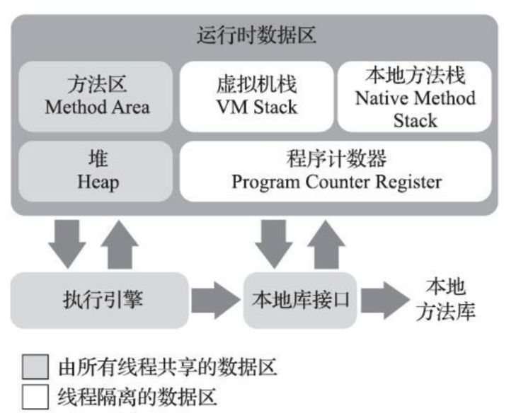

## 1.程序计数器（Program Counter Register）

当前线程执行的字节码的行号指示器，通过这个值来获取程序下一条需要执行的命令

**多线程情况下，如果当前线程被挂起了，通过程序计数器的值来继续执行**

线程私有的，每个线程都有独立的程序计数器

## 2.Java虚拟机栈(Java Virtual Machine Stack)

线程私有。

每个方法被执行的时候，Java虚拟机都会同步创建一个栈帧（Stack Frame），用于存储：局部变量表、操作数栈、动态连接、返回地址。每一个方法调用直至执行完毕的过程，就对应一个栈帧在虚拟机栈中从入栈到出栈的过程

**Jvm的方法执行是基于栈的，而不是基于寄存器的**

## 3.本地方法栈（Native Method Stacks）

线程私有。

与虚拟机栈区别是，本地方法栈是为虚拟机使用到的本地（Native）方法服务

《Java虚拟机规范》对本地方法栈中方法使用的语言、使用方式与数据结构没有任何强制规定，在HotSpot的实现中，虚拟机栈和本地方法栈是合二为一的

## 4.Java堆（Java Heap）

几乎所有的对象实例都在堆中分配，说几乎是因为随着即时编译技术的进步，栈上分配、标量替换技术是在栈上分配的。

为提升对象分配时的效率，引入了TLAB(Thread Local Allocation Buffer)

## 5.方法区（Method Area）

各个线程共享的区域，用于存储被虚拟机加载的类型信息、常量、静态变量、即时编译器编译后的代码缓存等。

**方法区是逻辑概念，永久代和元数据是HotSpot虚拟机的具体实现**

