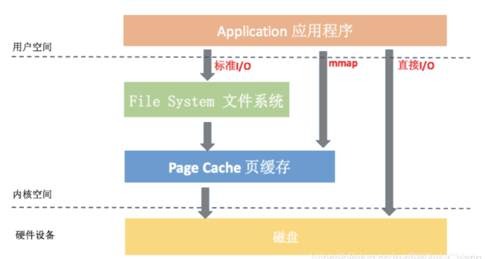
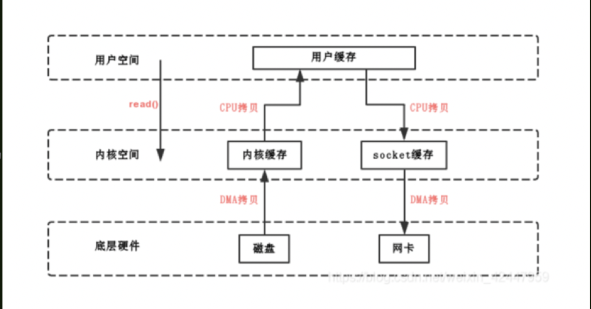
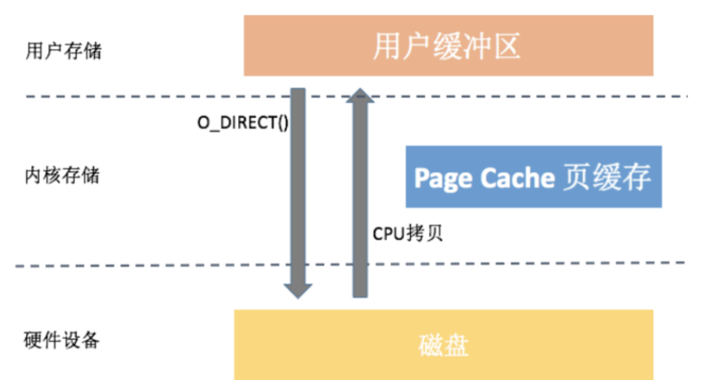
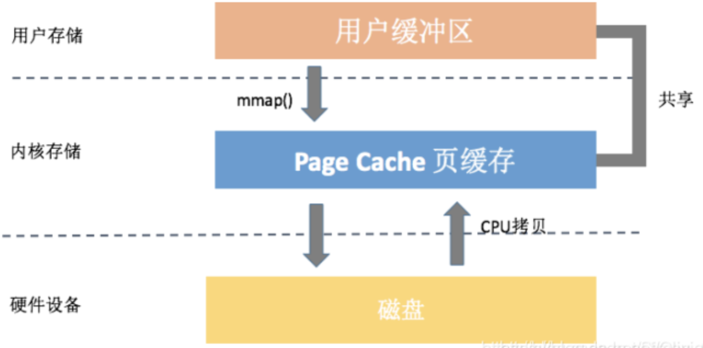

Linux一共有三种I/O方式，分别是标准I/O、直接I/O、mmap



## 标准I/O(Buffered I/O)



**数据先从磁盘复制到内核空间的缓冲区，然后从内核空间缓冲区复制到应用程序的地址空间。**

### 读操作：

操作系统检查内核的缓冲区有没有需要的数据，如果已经缓存了，那么就直接从缓存中返回；否则从磁盘中读取，然后缓存在操作系统的缓存中。

### 写操作：

将数据从用户空间复制到内核空间的缓存中。这时对用户程序来说写操作就已经完成，至于什么时候再写到磁盘中由操作系统决定，除非显示地调用了sync等同步命令。

### 缓存I/O的优点：

1）在一定程度上分离了内核空间和用户空间，保护系统本身的运行安全；

2）可以减少读盘的次数，从而提高性能。

### 缓存I/O的缺点：

数据在传输过程中需要在应用程序地址空间和缓存之间进行多次数据拷贝操作，这些数据拷贝操作所带来的CPU以及内存开销是非常大的。以及会发生多次用户态和内核态切换


从中可以看出来，缓存 I/O 可以很大程度减少真正读写磁盘的次数，从而提升性能。但是延迟写机制可能会导致数据丢失，那系统究竟会在什么时机真正把页缓存的数据写入磁盘呢？

Page Cache 中被修改的内存称为“脏页”，内核通过 flush 线程定期将数据写入磁盘。具体写入的条件我们可以通过 /proc/sys/vm 文件或者sysctl -a | grep vm 命令得到。

```bash
// 
flush 每隔 5 秒执行一次
vm.dirty_writeback_centisecs = 500
// 内存中驻留 30 秒以上的脏数据将由flush 在下一次执行时写入磁盘
vm.dirty_expire_centisecs = 3000
// 指示若脏页占总物理内存 10％以上，则触发 flush 把脏数据写回磁盘
vm.dirty_background_ratio = 10
// 系统所能拥有的最大脏页缓存的总大小
vm.dirty_ratio = 20
123456789
```

**在实际应用中，如果某些数据我们觉得非常重要，是完全不允许有丢失风险的，这个时候我们应该采用同步写机制。在应用程序中使用 sync、fsync、msync 等系统调用时，内核都会立刻将相应的数据写回到磁盘。**

## 直接I/O



直接IO就是应用程序直接访问磁盘数据，而不经过内核缓冲区，这样做的目的是减少一次从内核缓冲区到用户程序缓存的数据复制。比如说数据库管理系统这类应用，它们更倾向于选择它们自己的缓存机制，因为数据库管理系统往往比操作系统更了解数据库中存放的数据，数据库管理系统可以提供一种更加有效的缓存机制来提高数据库中数据的存取性能。

###直接IO优点

减少操作系统缓冲区和用户地址空间的拷贝次数。降低了CPU的开销，和内存带宽。对于某些应用程序来说简直是福音，将会大大提高性能。

### 直接IO的缺点：

如果访问的数据不在应用程序缓存中，那么每次数据都会直接从磁盘加载，这种直接加载会非常耗时。通常直接IO与异步IO结合使用，会得到比较好的性能。（异步IO：当访问数据的线程发出请求之后，线程会接着去处理其他事，而不是阻塞等待）

## mmap

mmap是指将硬盘上文件的位置与进程逻辑地址空间中一块大小相同的区域一一对应，当要访问内存中一段数据时，转换为访问文件的某一段数据。这种方式的目的同样是减少数据在用户空间和内核空间之间的拷贝操作。当大量数据需要传输的时候，采用内存映射方式去访问文件会获得比较好的效率。
使用内存映射文件处理存储于磁盘上的文件时，将不必再对文件执行I/O操作，这意味着在对文件进行处理时将不必再为文件申请并分配缓存，所有的文件缓存操作均由系统直接管理，由于取消了将文件数据加载到内存、数据从内存到文件的回写以及释放内存块等步骤，使得内存映射文件在处理大数据量的文件时能起到相当重要的作用。



mmap内存映射过程：

进程在虚拟地址空间中为映射创建虚拟映射区域。

内核把文件物理地址和进程虚拟地址进行映射。

进程发起对这片映射空间的访问，引发缺页异常，实现文件内容到物理内存（主存）的拷贝。

换句话说，在调用 mmap 后，只是在进程的虚拟空间中分配了一段空间，真实的物理地址还不会分配的。当进程第一次访问这段空间（当作内存一样），CPU 陷入 OS 内核执行异常处理。然后异常处理会在这个时间分配物理内存，并用文件的内容填充这片内存，然后才返回进程的上下文，这时进程才会感知到这片内存里有数据。

###mmap的优点：

1. 减少系统调用。我们只需要一次 mmap() 系统调用，后续所有的调用像操作内存一样，而不会出现大量的 read/write 系统调用。
2. 减少数据拷贝。普通的 read() 调用，数据需要经过两次拷贝；而 mmap 只需要从磁盘拷贝一次就可以了，并且由于做过内存映射，也不需要再拷贝回用户空间。
3. 可靠性高。mmap 把数据写入页缓存后，跟缓存 I/O 的延迟写机制一样，可以依靠内核线程定期写回磁盘。但是需要提的是，mmap 在内核崩溃、突然断电的情况下也一样有可能引起内容丢失，当然我们也可以使用 msync来强制同步写。

### mmap的缺点

1. 虚拟内存增大。mmap 会导致虚拟内存增大，我们的 APK、Dex、so 都是通过 mmap 读取。而目前大部分的应用还没支持 64 位，除去内核使用的地址空间，一般我们可以使用的虚拟内存空间只有 3GB 左右。如果 mmap 一个 1GB 的文件，应用很容易会出现虚拟内存不足所导致的 OOM。
2. 磁盘延迟。mmap 通过缺页中断向磁盘发起真正的磁盘 I/O，所以如果我们当前的问题是在于磁盘 I/O 的高延迟，那么用 mmap() 消除小小的系统调用开销是杯水车薪的。
3. mmap 在数据加载到 page cache 的过程中，会触发大量的 page fault 和建立页表映射的操作，开销并不小。