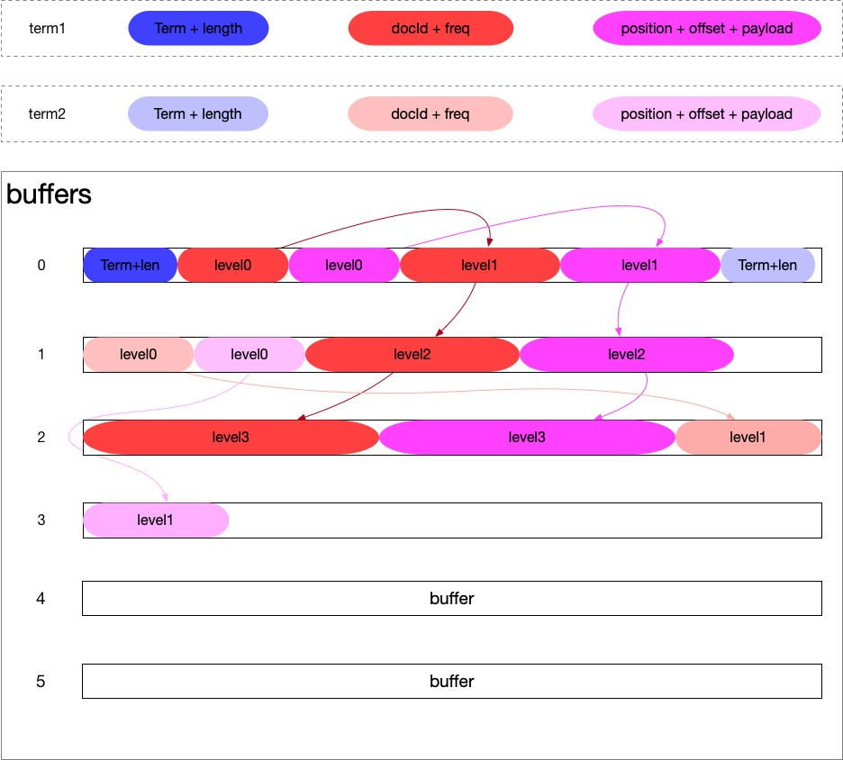

#1 概述

ByteBlockPool是Lucene实现**高效的可变长的基本类型数组**。它能有效的避免Java堆中由于分配小对象而引发内存碎片化从而导致Full GC的问题，同时还解决数组长度增长所需要数据拷贝问题，最后是不再需要申请超大且连续的内存。

主要是用于存储term的倒排信息，一般包括以下三部分：

+ length + term：前一个或者前2个字节存储长度，表示后面用多少个字节存储term的值
+ docId + freq：存在term的文档Id及其term在文档中的频数
+ position + offset + payload：term在各文档出现的位置（term序号,增量存储），offset是当前term相对于上term的字符增量

#2 结构

如下图所示，ByetBlockPool主要维护了一个二维数组buffers[]，由多个buffer组成，左侧的数字代表每个buffer在二维数组buffers[]的index位置，每个buffer的长度是固定的，当一个buffer被写满以后，需要申请一个新的buffer，如果二维数组buffers[]达到阀值需要扩容，仅仅将已有的buffer引用拷贝一次，而不需要拷贝数据本身。从而会缓解频繁数组扩容带来的GC问题。




一个Term可能出现在多个文档中，在每个文档中出现的次数和位置也是无法确定的，在索引这个Term的过程中，Lucene是无法预知需要多大的数组来存储倒排信息的。我们不能把一个Term的所有Posting都索引完再去索引下一个Term，因为这样效率太低了。这样就造成了每个term的Posting信息在ByteBlockPool不是连续存储的。

为了连接Term的posting信息，Lucene在ByteBlockPool设计了一个可变长的逻辑结构---Slice链表。

Lucene将Slice分成了10个层级，逐层递增，十层后大小恒定。Slice后四个位置用来存储下个Slice节点的offset，每个term对应的最后一个Slice的最后一个字节用于存储层级数。Slice节点可以跨越多个Buffer， Slice链表为我们提供了一个逻辑上连续的内存块 。

这种设计方案的一个好处：Buffer是相对比较紧凑的结构，能够更高效的利用Buffer内存。按Zipf定律可知一个单词出现的次数与它在频率表里的排名成反比，也就是说可能会有很多Term的频率是很低的，同样也有小部分Term的频率则非常高，Slice的设计正是考虑到了这一分布特点。

#3 成员

##3.11 属性

```java
//--------------------------------------静态成员---------------------------------------------//
/** 当前层的下一层是第几层,最高9层 */
public final static int[] NEXT_LEVEL_ARRAY = {1, 2, 3, 4, 5, 6, 7, 8, 9, 9};
/** 每一层块的大小 */
public final static int[] LEVEL_SIZE_ARRAY = {5, 14, 20, 30, 40, 40, 80, 80, 120, 200};
/** 第一层slice的大小 */
public final static int FIRST_LEVEL_SIZE = LEVEL_SIZE_ARRAY[0];
/** 用于根据offset计算对应的buffer位置，即行下标,定位buffer位置的掩码 */
public final static int BYTE_BLOCK_SHIFT = 15;
/** 默认每个块(buffer)的大小  2^15 */
public final static int BYTE_BLOCK_SIZE = 1 << BYTE_BLOCK_SHIFT;
/** 根据起始位置计算在当前块中位置的掩码 */
public final static int BYTE_BLOCK_MASK = BYTE_BLOCK_SIZE - 1;
/** 计算占用内存大小 */
private static final long BASE_RAM_BYTES = RamUsageEstimator.shallowSizeOfInstance(ByteBlockPool.class);
//--------------------------------------实例成员---------------------------------------------//
/** 块数组，每一项代表一个数组块 */
public byte[][] buffers = new byte[10][];
/** 当前块的索引 */
private int bufferUpto = -1;
/** 当前块中数据起始位置*/
public int byteUpto = BYTE_BLOCK_SIZE;
/** 当前块 */
public byte[] buffer;
/** 当前块头部在整体pool中的位置，等于 (bufferUpto -1)*BYTE_BLOCK_SIZE 计算总偏移量为：byteOffset+byteUpto。*/
public int byteOffset = -BYTE_BLOCK_SIZE;
/**分配器，生成buffer对象，回收buffer */
private final Allocator allocator;
```

## 3.2 分配器

buffer的扩容与回收依赖分配器来实现，Lucene针对不同的场景实现了3种分配器。

+ DirectAllocator： 不回收、不记录内存占用。
+ DirectTrackingAllocator：可以进行回收操作和内存占用记录。
+ RecyclingByteBlockAllocator：回收buffer中未使用的内存并重用，可以记录内存占用情况。

# 4 主要方法

## 4.1 切换buffer

```java
public void nextBuffer() {
    //如果块的数量已达到上限,则需要进行扩容,扩容分2步:1.申请更大的数组 2.将原数组复制到新数组中
    if (1+bufferUpto == buffers.length) {
      //整体扩容的原则是:倾向于花费更多的CPU来避免浪费内存
      //NUM_BYTES_OBJECT_REF：当前JVM用多少个字节表示一个对象引用，JRE64位开启引用压缩为4，否则为8.
      //delta=Max((length+1)/8,3),即一次扩容增加1/8的大小
      //newLength = (length+1)+delta ,如果开启指针压缩，NUM_BYTES_OBJECT_REF=4，那么newLength需要取2的整数倍
      byte[][] newBuffers = new byte[ArrayUtil.oversize(buffers.length+1, NUM_BYTES_OBJECT_REF)][];
      //将原块数组复制到新的块数组中,并将引用指到新的块数组上
      System.arraycopy(buffers, 0, newBuffers, 0, buffers.length);
      buffers = newBuffers;
    }
    //生成一个新的块,并将buffer指向新生成的块,块的下标+1
    buffer = buffers[1+bufferUpto] = allocator.getByteBlock();
    bufferUpto++;
    //新生成的块,还没有被使用,所以byteUpto置成0
    byteUpto = 0;
    //更新当前块头部的位置
    byteOffset += BYTE_BLOCK_SIZE;
  }
```

## 4.2 写入数据

```java
public void append(final BytesRef bytes) {
    int bytesLeft = bytes.length;
    int offset = bytes.offset;
    while (bytesLeft > 0) {
      int bufferLeft = BYTE_BLOCK_SIZE - byteUpto;
      if (bytesLeft < bufferLeft) {
        //当前块的容量足够,写入到当前块中
        System.arraycopy(bytes.bytes, offset, buffer, byteUpto, bytesLeft);
        byteUpto += bytesLeft;
        break;
      } else {
        //当前块容量不够,能写多少写多少，切换到下一个块上写剩下的
        if (bufferLeft > 0) {
          System.arraycopy(bytes.bytes, offset, buffer, byteUpto, bufferLeft);
        }
        nextBuffer();
        bytesLeft -= bufferLeft;
        offset += bufferLeft;
      }
    }
  }
```

## 4.3 Slice链表相关

### 4.31 创建Slice链表

注意此方法在分配过程中**不支持跨块**，即分配的**slice块都在一个块中**，因此，**块并不紧凑。**

```java
/**
* 分配一个指定大小的slice链表头部
* 用于在buffer中分配level = 0的slice，这一层级的slice的大小为5，结束标志位16。
* 所谓分配实际上就是在末尾位置写上结束标志。
* 注意此方法在分配过程中不支持跨块，即分配的slice块都在一个块中，因此，块并不紧凑。
*/
public void append(final BytesRef bytes) {
    int bytesLeft = bytes.length;
    int offset = bytes.offset;
    while (bytesLeft > 0) {
      int bufferLeft = BYTE_BLOCK_SIZE - byteUpto;
      if (bytesLeft < bufferLeft) {
        //当前块的容量足够,写入到当前块中
        System.arraycopy(bytes.bytes, offset, buffer, byteUpto, bytesLeft);
        byteUpto += bytesLeft;
        break;
      } else {
        //当前块容量不够,能写多少写多少，切换到下一个块上写剩下的
        if (bufferLeft > 0) {
          System.arraycopy(bytes.bytes, offset, buffer, byteUpto, bufferLeft);
        }
        nextBuffer();
        bytesLeft -= bufferLeft;
        offset += bufferLeft;
      }
    }
  }
```

### 4.32 生成并连接下一层Slice

```java
  /**
   * 当slice写满时，需要申请下一层的slice，并将两部分连成链表
   * 1.在块中申请新的slice作为下一层,写入结束标志
   * 2.将原slice的除了结束标识外的后三个字节,写入到新slice的前三字节
   * 3.将下层slice的位置(offset)写入到原slice包括结束标志在内的4个字节，完成链表的连接。
   */
  public int allocSlice(final byte[] slice, final int upto) {
    //结束符对16求余为当前层数。每个层次的块都有不同的结束符，第1层16，第2层17，第3层18...
    final int level = slice[upto] & 15;
    //下层slice的层数
    final int newLevel = NEXT_LEVEL_ARRAY[level];
    //下层slice的大小
    final int newSize = LEVEL_SIZE_ARRAY[newLevel];

    // 如果当前块大小不足以写入slice的小,则切换到下一个块去写(也就是说之前的块没有被写满就切换了,块中的数据不是连续的,会浪费一些内存)
    if (byteUpto > BYTE_BLOCK_SIZE-newSize) {
      nextBuffer();
    }

    final int newUpto = byteUpto;
    //当前slice在块中的offset，
    final int offset = newUpto + byteOffset;
    //块中数据指针移动
    byteUpto += newSize;

    //将结束符前三位拷贝到下层slice的前三位
    //加上结束符一共4个字节，一起构成slice链表的指针,连接到下一层slice
    buffer[newUpto] = slice[upto-3];
    buffer[newUpto+1] = slice[upto-2];
    buffer[newUpto+2] = slice[upto-1];

    // 将偏移量(也即指针)写入到连同结束符在内的四个byte
    //原slice拷贝过的三位连同结束符一共4位，表示下一级slice在buffers中的offset，注意offset是结束符后一位，不是slice首位
    slice[upto-3] = (byte) (offset >>> 24);
    slice[upto-2] = (byte) (offset >>> 16);
    slice[upto-1] = (byte) (offset >>> 8);
    slice[upto] = (byte) offset;

    // 在新的块写入结束符，大小为:层数+16
    buffer[byteUpto-1] = (byte) (16|newLevel);

    return newUpto+3;
  }
```

## 4.4 读取相关

### 4.41 读取单个字节

```java
public byte readByte(long offset) {
    //块的索引
    int bufferIndex = (int) (offset >> BYTE_BLOCK_SHIFT);
    //在块中的位置
    int pos = (int) (offset & BYTE_BLOCK_MASK);
    byte[] buffer = buffers[bufferIndex];
    return buffer[pos];
  }
```

### 4.42 读取并将数据拷贝到byte[]

```java
  /**
   * 读取数据
   * @param offset        pool的偏移量
   * @param bytes         读取出的byte数组
   * @param bytesOffset   读取出的byte数组从第几位开始填充
   * @param bytesLength   读取的长度
   */
  public void readBytes(final long offset, final byte bytes[], int bytesOffset, int bytesLength) {
    int bytesLeft = bytesLength;
    //块的索引
    int bufferIndex = (int) (offset >> BYTE_BLOCK_SHIFT);
    //块中数据的位置
    int pos = (int) (offset & BYTE_BLOCK_MASK);
    while (bytesLeft > 0) {
      //如果不能在bufferIndex块中读完,需要进入下一个块读取剩下的部分
      byte[] buffer = buffers[bufferIndex++];
      int chunk = Math.min(bytesLeft, BYTE_BLOCK_SIZE - pos);
      System.arraycopy(buffer, pos, bytes, bytesOffset, chunk);
      bytesOffset += chunk;
      bytesLeft -= chunk;
      pos = 0;
    }
  }
```

### 4.43 将数据读取到BytesRef中

如果读取的数据在**一个buffer**中，直接返回**引用**，如果在**多个buffer**中需要**数组拷贝**

```java
  /**
   * 将数据读取到BytesRef中
   * BytesRef需要设置length
   * @param ref
   * @param offset
   */
  public void setRawBytesRef(BytesRef ref, final long offset) {
    int bufferIndex = (int) (offset >> BYTE_BLOCK_SHIFT);
    int pos = (int) (offset & BYTE_BLOCK_MASK);
    if (pos + ref.length <= BYTE_BLOCK_SIZE) {
      //需要读取的数据全在一个块中，把引用指向pool中的数组即可
      ref.bytes = buffers[bufferIndex];
      ref.offset = pos;
    } else {
      //需要读取的数据在多个块中,需要把pool中的数组拷贝到新的数组中
      ref.bytes = new byte[ref.length];
      ref.offset = 0;
      readBytes(offset, ref.bytes, 0, ref.length);
    }
  }
```

### 4.44 将数据读取到BytesRef中

与setRawBytesRef方法类似,只不过在跨**buffer**读取时，新生成的**字节数组**由**builder**获得，**拷贝数据**后被引用。

```java
/**
   * 与setRawBytesRef方法类似。
   * 与setRawBytesRef不同的是：
   * 1.result不需要设置length
   * 2.在跨块取时，新生成的字节数组由builder获得，拷贝数据后被引用。
   * @param builder
   * @param result
   * @param offset
   * @param length
   */
  void setBytesRef(BytesRefBuilder builder, BytesRef result, long offset, int length) {
    result.length = length;

    int bufferIndex = (int) (offset >> BYTE_BLOCK_SHIFT);
    byte[] buffer = buffers[bufferIndex];
    int pos = (int) (offset & BYTE_BLOCK_MASK);
    if (pos + length <= BYTE_BLOCK_SIZE) {
      //数据在一个块中,直接引用pool的对象,不进行复制
      result.bytes = buffer;
      result.offset = pos;
    } else {
      //数据在多个块中
      builder.grow(length);
      result.bytes = builder.get().bytes;
      result.offset = 0;
      readBytes(offset, result.bytes, 0, length);
    }
  }
```

### 4.45 读取指定Term

此方法用于**读取指定词**，textStart指明表示长度的数据位置，长度的编码占1-2个字节，解码后其后面对应的长度范围就是**term**的**数据**，读取的就是这部分数据，这里**不支持**跨buffer读取，都是直接引用**buffer**，不存在拷贝。

```java
  /**
   * 主要用于读取指定term
   * term的长度是一个或者2个字节
   * 不能跨块读取
   * @param term
   * @param textStart 指明表示长度的数据位置
   */
  public void setBytesRef(BytesRef term, int textStart) {
    final byte[] bytes = term.bytes = buffers[textStart >> BYTE_BLOCK_SHIFT];
    int pos = textStart & BYTE_BLOCK_MASK;
    if ((bytes[pos] & 0x80) == 0) {
      //长度是一个字节
      term.length = bytes[pos];
      term.offset = pos+1;
    } else {
      //长度是2个字节
      //1xxx xxxx 连同后一个字节共同表示长度，需要解码
      // length is 2 bytes 去第1字个节前7位为低位y 第二个字节为高8位x: xxxx xxxx yyyy yyy
      term.length = (bytes[pos]&0x7f) + ((bytes[pos+1]&0xff)<<7);
      term.offset = pos+2;
    }
    assert term.length >= 0;
  }
```

## 4.5 ByteBlockPool对象重置

此方法用于对字节块池的重置，主要作用是对buffer进行回收。

+ 如果0填充为true,则将所有使用过的字节置0；反之什么都不做
+ 如果重用第一行为true，则将其余行置bull；反之所有行置null；
+ 调整游标，重用第一行则游标则为初始完成位，对象可直接使用；反之，调用完reset方法后需要调用一下nextBuffer方法初始化游标。

```java
  /**
   * 重置pool为初始状态,reuseFirst如果为true 会在重置后把引用指到第一个块上,所以reset()之后不需要调用nextBuffer()
   * @param zeroFillBuffers 是否填充成0，如果使用slice 则应该为true
   * @param reuseFirst 是否重用第一个块,如果为true:reset()之后不需要调用nextBuffer()
   */
  public void reset(boolean zeroFillBuffers, boolean reuseFirst) {
    //如果块没有被分配,该方法什么也不做
    if (bufferUpto != -1) {
      //块已经被分配使用
      if (zeroFillBuffers) {
        for(int i=0;i<bufferUpto;i++) {
          //使用过的块用0填充
          Arrays.fill(buffers[i], (byte) 0);
        }
        //正在使用的块用0填充
        Arrays.fill(buffers[bufferUpto], 0, byteUpto, (byte) 0);
      }

     if (bufferUpto > 0 || !reuseFirst) {
       final int offset = reuseFirst ? 1 : 0;
       // 回收块
       allocator.recycleByteBlocks(buffers, offset, 1+bufferUpto);
       //有一些分配器有没有回收算法,比如DirectAllocator,所以需要在此回收对象
       Arrays.fill(buffers, offset, 1+bufferUpto, null);
     }
      //设置游标
     if (reuseFirst) {
       bufferUpto = 0;
       byteUpto = 0;
       byteOffset = 0;
       buffer = buffers[0];
     } else {
       bufferUpto = -1;
       byteUpto = BYTE_BLOCK_SIZE;
       byteOffset = -BYTE_BLOCK_SIZE;
       buffer = null;
     }
    }
  }
```

