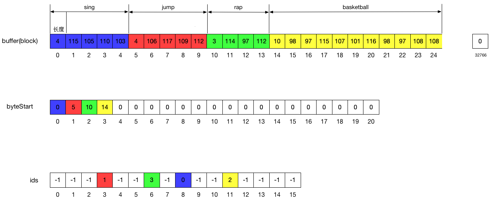
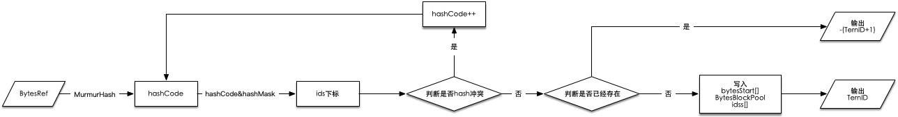

# 1.概述

Lucene在构建postings的时候，会使用BytesRefHash这种数据结构。

BytesRefHash是一个类似于HashMap的数据结构，但是不具备通用性，BytesRefHash存储的键值对分别是Term和TermID。

该类的主要用途就是将所有的BytesRef对象存储到一个连续的空间中，并且查询阶段达到O(1)的复杂度。

无论是通过termID去查询Term所对应的BytesRef,还是通过BytesRef去查询TermID，时间复杂度都是O(1)。

出于内存考虑，因为BytesRefHash尽可能避免用到对象类型，HashMap这种结构很难解决HashCode冲突的问题。

# 2.结构

BytesRefHash主要维护了ids[]、bytesStart[]、BytesBlockPool三者之间的关系，如下图。



**BytesBlockPool**

是Lucene实现的一种可变长的基本类型数组，用来解决数组扩容的问题。且内存是连续分配的，能够提供快速随机访问。主要用来存储Term的倒排信息。

**ids[]**

数组下标是BytesRef对利用MurmurHash算法计算出的hash值，数组元素则是termID。

主要用于根据BytesRef去查找TermID。

**bytesStart[]**

数组下标是termID，TermID是从0递增连续的，bytesStart的数据也是连续的，数组元素是termID对应的BytesRef值在buffers[][]中的起始位置。

主要用于根据TermID去查找BytesRef.

# 3.主要方法

## 3.1 findHash

利用murmur_hash确定BytesRef的hashcode,如果hashcode冲突，循环hashcode++，寻找没被占用的hash值

源码分析：

```java
private int findHash(BytesRef bytes) {
  assert bytesStart != null : "bytesStart is null - not initialized";
  //murmur_hash3算法进行hash
  int code = doHash(bytes.bytes, bytes.offset, bytes.length);

  // hashMask=ids.size()-1,即hashMask是计算当前位置的掩码 code&hashMask值为在ids中的的位置
  int hashPos = code & hashMask;
  int e = ids[hashPos];
  //判断是否hash是否冲突
  if (e != -1 && !equals(e, bytes)) {
    //如果冲突，循环code++去寻找一个位置
    // Conflict; use linear probe to find an open slot(see LUCENE-5604):
    do {
      code++;
      hashPos = code & hashMask;
      e = ids[hashPos];
    } while (e != -1 && !equals(e, bytes));
  }
  // 没有在ids数组中找到bytes
  return hashPos;
}
```

## 3.2 add

将BytesRef存储到BytesBlockPool中，并在BytesRefHash建立映射关系。

如果BytesRef已经存在，则返回-(TermID+1)；如果BytesRef不存在，写入BytesBlockPool、bytesStart[]、ids[]，并返回TermID。

流程如下图：



源码分析：

```java
public int add(BytesRef bytes) {
  assert bytesStart != null : "Bytesstart is null - not initialized";
  final int length = bytes.length;
  // 计算BytesRef在ids[]中的下标
  final int hashPos = findHash(bytes);
  int e = ids[hashPos];

  if (e == -1) {
    // 如果BytesRef之前不存在，写入BytesBlockPool、bytesStart[]、ids[]
    final int len2 = 2 + bytes.length;
    //判断BytesBlockPool中当前块（buffer）是否足够
    if (len2 + pool.byteUpto > BYTE_BLOCK_SIZE) {
      if (len2 > BYTE_BLOCK_SIZE) {
        throw new MaxBytesLengthExceededException("bytes can be at most "
                                                  + (BYTE_BLOCK_SIZE - 2) + " in length; got " + bytes.length);
      }
      //写入下一个块中
      pool.nextBuffer();
    }
    //当前块（buffer）
    final byte[] buffer = pool.buffer;
    //当前块中数据的起始位置
    final int bufferUpto = pool.byteUpto;
    if (count >= bytesStart.length) {
      //如果bytesStart写满了,进行扩容
      bytesStart = bytesStartArray.grow();
      assert count < bytesStart.length + 1 : "count: " + count + " len: "
        + bytesStart.length;
    }
    //分配TermID
    e = count++;
    //bufferUpto(当前块中数据起始位置) + byteOffset(数据在当前块的偏移量)=总偏移量
    bytesStart[e] = bufferUpto + pool.byteOffset;

    //存储长度和字节数据，其中长度最多占2个字节,如果长度小于128使用一个字节存储，否则用2个字节存储，并且第一位固定为1。即最大长度2^15-2=32766,
    //或然跟随规则的形式存储，对于一个byte，低7位来存储数据，最高位表示是否还有下一位数字
    if (length < 128) {
      // 使用一个字节用来存储长度
      buffer[bufferUpto] = (byte) length;
      pool.byteUpto += length + 1;
      assert length >= 0: "Length must be positive: " + length;
      // 将数据存储在ByteBlockPool中
      System.arraycopy(bytes.bytes, bytes.offset, buffer, bufferUpto + 1, length);
    } else {
      // 使用两个字节用来存储长度
      // 其中第一个字节的第一位固定是1，用来区分长度是一个字节还是2个字节,其余7位用来表示长度的低七位
      buffer[bufferUpto] = (byte) (0x80 | (length & 0x7f));
      //第二个字节用来表示长度的高8位
      buffer[bufferUpto + 1] = (byte) ((length >> 7) & 0xff);
      pool.byteUpto += length + 2;
      //将数据存储在ByteBlockPool中
      System.arraycopy(bytes.bytes, bytes.offset, buffer, bufferUpto + 2, length);
    }
    assert ids[hashPos] == -1;
    //ids[]数组下标是murmur3hash计算出的hash值,值是termID
    ids[hashPos] = e;
    //判断是否需要扩容
    if (count == hashHalfSize) {
      rehash(2 * hashSize, true);
    }
    return e;
  }
  //如果BytesRef已经存在，返回-(TermID+1)
  return -(e + 1);
}
```

## 3.3 find

根据BytesRef去查找TermID。

```java
public int find(BytesRef bytes) {
  return ids[findHash(bytes)];
}
```

## 3.4 get

根据termID查找Term

```java
public BytesRef get(int bytesID, BytesRef ref) {
  assert bytesStart != null : "bytesStart is null - not initialized";
  assert bytesID < bytesStart.length: "bytesID exceeds byteStart len: " + bytesStart.length;
  // 根据termID，从bytesStart[]数组中取出在BytesBlockPool中的位置，从而取出BytesRef
  pool.setBytesRef(ref, bytesStart[bytesID]);
  return ref;
}
```

## 3.5 byteStart

根据termID去查找在BytesBlockPool中的位置

```java
public int byteStart(int bytesID) {
  assert bytesStart != null : "bytesStart is null - not initialized";
  assert bytesID >= 0 && bytesID < count : bytesID;
  return bytesStart[bytesID];
}
```

## 3.6 sort

按照BytesRef存储的Term值的大小的排序，调用改方法会破坏BytesRefHash的结构，所以需要在调用clear方法重用BytesRefHash。

排序使用的是基数排序，如果字符串公共前缀过长，中途会改成IntroSorter排序

```java
public int[] sort() {
  //将ids中的元素重新排列，紧密放在数组前面几个位置
  final int[] compact = compact();
  //most significant bit（高位到低位）基数排序
  new StringMSBRadixSorter() {
    BytesRef scratch = new BytesRef();
    @Override
    protected void swap(int i, int j) {
      int tmp = compact[i];
      compact[i] = compact[j];
      compact[j] = tmp;
    }
    @Override
    protected BytesRef get(int i) {
      pool.setBytesRef(scratch, bytesStart[compact[i]]);
      return scratch;
    }
  }.sort(0, count);
  return compact;
}
```

