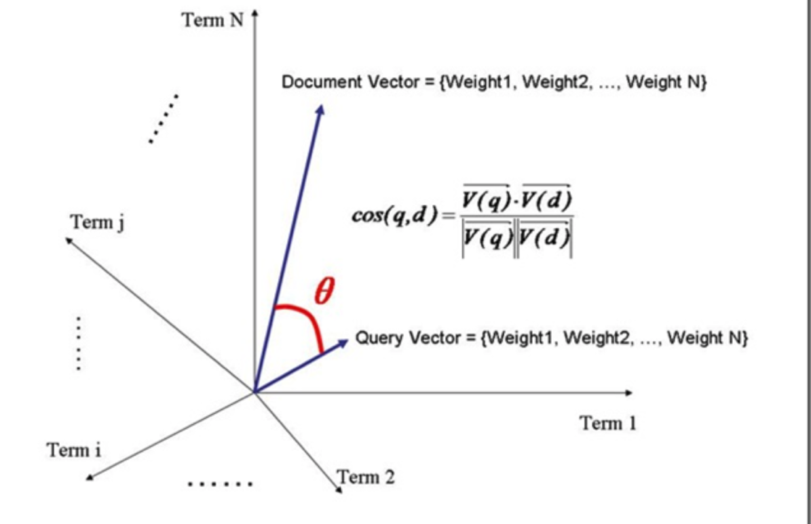
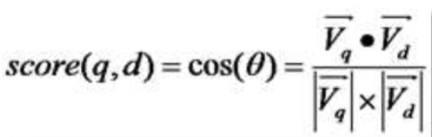
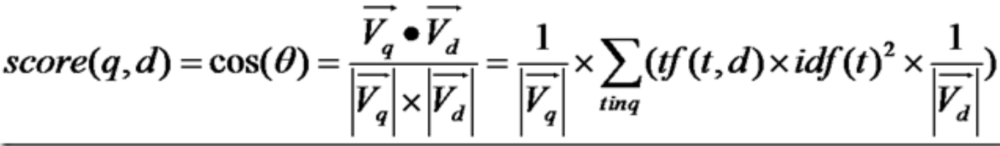
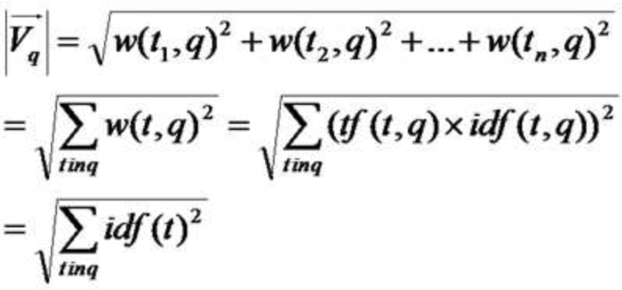

lucene打分机制是采用空间向量模型的，即计算Query与Doc这两个向量的cos值

我们把一个文档中的词（term）的权重看作一个向量
Document = {term1,term2,...,termN}
Document Vector= {weight1,weight2,...,weightN}

同样我们把Query也用作向量表示
Query = {term1,term2,...,termN}
Query Vector= {weight1,weight2,...,weightN}

Document向量Vd=<W(t1,d),W(t2,d),...,W(tn,d)>
Query向量Vq=<W(t1,q),W(t2,q),...,W(tn,q)>

Vq*Vd = w(t1, q)*w(t1, d) + w(t2, q)*w(t2, d) + ...... + w(tn ,q)*w(tn, d)

w 代表 weight，计算公式一般为 tf*idf。
Vq*Vd = tf(t1, q)*idf(t1, q)*tf(t1, d)*idf(t1, d) + tf(t2, q)*idf(t2, q)*tf(t2, d)*idf(t2, d) + ...... + tf(tn ,q)*idf(tn, q)*tf(tn, d)*idf(tn, d)

+ 由于是点积，则此处的 t1, t2, ......, tn 只有查询语句和文档的并集有非零值，只在查询语句出现的或只在文档中出现的 Term 的项的值为零。
+ 在查询的时候，很少有人会在查询语句中输入同样的词，因而可以假设 tf(t, q)都为 1
+  idf 是指 Term 在多少篇文档中出现过，其中也包括查询语句这篇小文档，因而 idf(t, q)和 idf(t, d)其实是一样的，是索引中的文档总数加一，当索引中的文档总数足够大的时候，查询语句这篇小文档可以忽略，因而可以假设 idf(t, q) = idf(t, d) = idf(t)

Vq*Vd = tf(t1, d) * idf(t1) * idf(t1) + tf(t2, d) * idf(t2) * idf(t2) + ...... + tf(tn, d) * idf(tn) * idf(tn)

