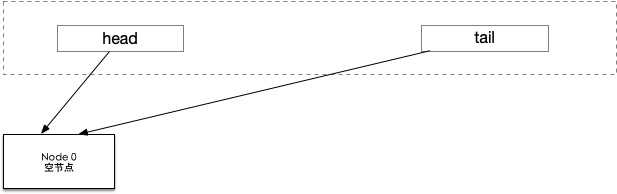
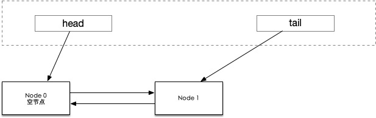
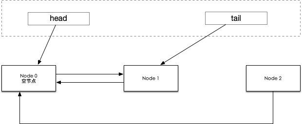
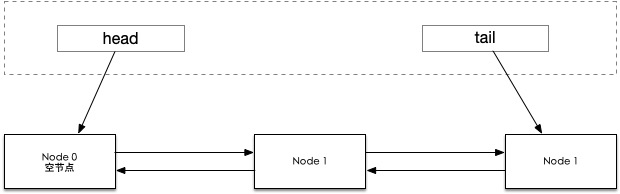
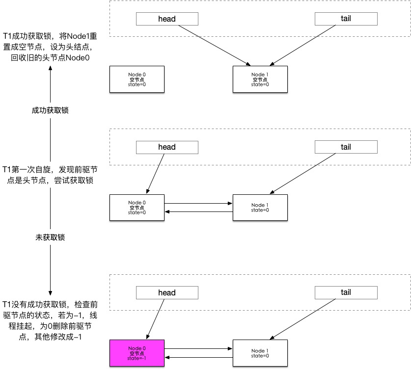
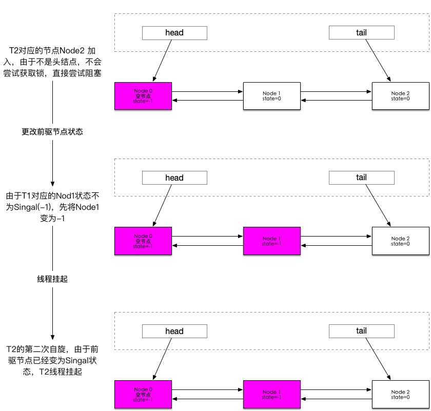
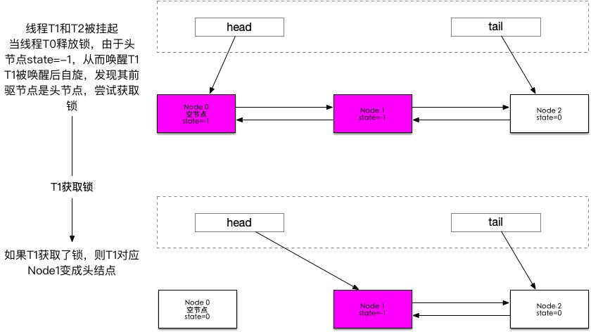

# 1. 什么是AQS

AQS的全称叫AbstractQueuedSynchronizer，是一个抽象队列同步器，java中ReentrantLock、Semaphore等都是由AQS来实现的。

AQS主要解决两个问题：

+ 如何线程安全的修改同步状态？
+ 得不到资源的线程怎么处理？如何排队？

# 2. AQS是如何线程安全的修改同步状态的？

```java
private volatile int state;
```

AQS中有个名为state的字段，代表同步状态，并提供了3个访问这个字段

```java
protected final int getState() {return state;}
protected final void setState(int newState) {state = newState;}
protected final boolean compareAndSetState(int expect, int update) {
  //unsafe.compareAndSwapInt其实就是获取该对象中state在内存中的偏移量
  return unsafe.compareAndSwapInt(this, stateOffset, expect, update);
}
//stateOffset是state在内存中的位置的偏移量
private static final long stateOffset;
static {
  try {
    stateOffset = unsafe.objectFieldOffset
      (AbstractQueuedSynchronizer.class.getDeclaredField("state"));
    headOffset = unsafe.objectFieldOffset
      (AbstractQueuedSynchronizer.class.getDeclaredField("head"));
    tailOffset = unsafe.objectFieldOffset
      (AbstractQueuedSynchronizer.class.getDeclaredField("tail"));
    waitStatusOffset = unsafe.objectFieldOffset
      (Node.class.getDeclaredField("waitStatus"));
    nextOffset = unsafe.objectFieldOffset
      (Node.class.getDeclaredField("next"));

  } catch (Exception ex) { throw new Error(ex); }
}
```

getState()和setState()都是普通的getter、setter方法，但是由于state是volatile修饰的，所以能够**保证可见性**，但是**不能保证原子性**，也就是说getState()只能获取state的相对新值，而不是最新值。

compareAndSetState()方法是**通过CAS来修改内存中state的值**，CAS能够**保证原子性**，state又是被volatile修饰的，能够**保证可见性和有序性**，故而是**线程安全的**。也就是说通过compareAndSetState()方法可以线程安全的修改同步状态、

#  3 得不到资源的线程怎么处理？

得不到资源的线程一般有2种方式处理：

+ 自旋
+ 线程挂起，等待唤醒

线程挂起的好处是不占用CPU资源，但是线程挂起和恢复会发生上下文切换；自旋锁的好处是不会造成上下文切换，但是会占用CPU资源，占用时间过长或者线程数过多的话，对CPU压力比较大。

AQS的对得不到资源的线程，**时而自旋，时而挂起**。

**如果自旋的时候多个线程操作一个变量，会造成各个CPU之间频繁的缓存同步**，为了解决这个问题，AQS基于CLH队列的思想设计了一个队列。传统CLH队列是所有线程在其前驱节点的属性上进行自旋。而AQS是先自旋，后挂起。

# 4 AQS中CLH队列的实现

## 4.1 AQS中等待队列的结构

AQS中的CLH是一个双向的FIFO的队列。是用链表实现的。在AQS中维护了队列的头节点和尾结点的引用。

```java
private transient volatile Node head;
private transient volatile Node tail;
static final class Node{
    //节点状态
    volatile int waitStatus;
    //前驱节点
    volatile Node prev;
    //后继节点
    volatile Node next;
    //在该节点等待或者自旋的线程
    volatile Thread thread;
    //下个等待condition的节点
    Node nextWaiter;  
}
```

其中Node节点共有5种状态:

|   状态    | 状态值 |                             含义                             |
| :-------: | :----: | :----------------------------------------------------------: |
|     0     |   0    |                一个Node被初始化的时候的默认值                |
| CANCELLED |   1    |                  线程获取锁的请求已经取消了                  |
|  SIGNAL   |   -1   |               线程已经准备好了，就等资源释放了               |
| CONDITION |   -2   |       当前节点在等待condition，也就是在condition队列中       |
| PROPAGATE |   -3   | 当前线程处在SHARED情况下，该字段才会使用<br />示当前场景下后续的acquireShared能够得以执行 |

## 4.2 线程加入等待队列

### 4.2.1 实现逻辑

#### 使用当前线程构造Node



####  尝试在队尾添加



#### 发生竞争，有线程先入队，则入队失败



####  入队结束



### 4.2.2 源码

```java
private Node addWaiter(Node mode) {
  //线程对应的Node节点
  Node node = new Node(Thread.currentThread(), mode);
  Node pred = tail;
  if (pred != null) {
    //当前node的前驱指向尾节点
    node.prev = pred;
		//用CAS的方式，将当前node设置为新的尾节点,如果失败，说明线程竞争
    if (compareAndSetTail(pred, node)) {
      pred.next = node;
      return node;
    }
  }
  //lockfree方式插入队尾
  enq(node);
  return node;
}
private Node enq(final Node node) {
  //经典的lockfree算法：循环+CAS
  for (;;) {
    Node t = tail;
    if (t == null) {
       //初始化头节点
      if (compareAndSetHead(new Node()))
        tail = head;
    } else {
      node.prev = t;
      if (compareAndSetTail(t, node)) {
        t.next = node;
        return t;
      }
    }
  }
}
```

**值得注意的是：**
node.prev = t;
每个线程都会有一个node，这一行只是把当前线程对应node的前驱节点设置成tail节点。然后经过cas去把tail节点指向当前线程的node节点。如果cas失败，在重新获取tail节点引用，循环上诉操作。
所以node.prev = t;不存在线程安全问题，不需要用CAS去操作，但是node.prev是volatile修饰的变量，也就是说写入node.prev的时候需要加内存屏障，造成性能损失。
JDK1.9之后为了解决这个问题，引入了VarHandle，用VarHandle的set方法去执行node.prev = t;避免加内存屏障


`Varhandle`是对变量或参数定义的变量系列的动态强类型引用，包括静态字段，非静态字段，数组元素或堆外数据结构的组件。 在各种访问模式下都支持访问这些变量，包括简单的读/写访问，volatile 的读/写访问以及 CAS (compare-and-set)访问。简单来说 `Variable` 就是对这些变量进行绑定，通过 `Varhandle` 直接对这些变量进行操作。

## 4.3 等待队列里线程自旋与挂起

#### 线程T1在等待队列的自旋与挂起



#### 线程T2加入等待队列，T2的自旋与挂起



### 源码分析

```java
final boolean acquireQueued(final Node node, int arg) {
  // 标记是否成功拿到资源
  boolean failed = true;
  try {
    // 标记等待过程中是否中断
    boolean interrupted = false;
    // 开始自旋，要么获取锁，要么挂起
    for (;;) {
      final Node p = node.predecessor();
      // 如果前驱是头结点，也就是说当前线程是等待队列的第一个线程（因为头结点是空节点），就尝试获取锁
      if (p == head && tryAcquire(arg)) {
        // 获取锁成功，头指针移动到当前node
        setHead(node);
        p.next = null; // help GC
        failed = false;
        //成功获取锁，返回
        return interrupted;
      }
      // 说明当前线程没有获取到锁（被抢占）或不是头结点，此时就要判断当前线程是否要被挂起，防止无限自旋浪费资源。
      if (shouldParkAfterFailedAcquire(p, node) &&
          parkAndCheckInterrupt())
        interrupted = true;
    }
  } finally {
    if (failed)
      cancelAcquire(node);
  }
}
```

```java
private static boolean shouldParkAfterFailedAcquire(Node pred, Node node) {
  // 获取前驱节点的状态
  int ws = pred.waitStatus;
	// SIGNAL状态的节点，释放锁后，会唤醒其后继节点。 因此，此线程可以安全的挂起
  if (ws == Node.SIGNAL)
    return true;
  // waitStatus>0是取消状态
  if (ws > 0) {
    // 循环向前查找取消节点，把取消节点从队列中剔除
    do {
      node.prev = pred = pred.prev;
    } while (pred.waitStatus > 0);
    pred.next = node;
  } else {
    // CAS设置前驱节点等态为SIGNAL
    compareAndSetWaitStatus(pred, ws, Node.SIGNAL);
  }
  return false;
}
// 挂起线程，返回中断状态
private final boolean parkAndCheckInterrupt() {
  LockSupport.park(this);
  return Thread.interrupted();
}
```

# 5 资源释放

#### 5.1 释放锁过程：



#### 如果此时线程T3来竞争锁，T3是在T2后面还是直接和T1竞争？

**如果直接和T1竞争，就是非公平锁，否则就是公平锁**

#### 5.2 源码分析：

```java
public final boolean release(int arg) {
  if (tryRelease(arg)) {
    Node h = head;
    //h == null Head还没初始化。waitStatus == 0 表明后继节点对应的线程仍在运行中，不需要唤醒。
    if (h != null && h.waitStatus != 0)
      unparkSuccessor(h);
    return true;
  }
  return false;
}

private void unparkSuccessor(Node node) {
  // 获取头结点waitStatus
  int ws = node.waitStatus;
  // CAS将节点state置为初始值0
  if (ws < 0)
    compareAndSetWaitStatus(node, ws, 0);
  // 后继节点
  Node s = node.next;
  // 如果下个节点是null或者下个节点被cancelled，就找到队列最开始的非cancelled的节点
  if (s == null || s.waitStatus > 0) {
    s = null;
    // 就从尾部节点开始找，到队首，找到队列第一个waitStatus<0的节点。
    //  next指针在head节点的后继节点处断开，因此只能通过prev指针反向遍历
    for (Node t = tail; t != null && t != node; t = t.prev)
      if (t.waitStatus <= 0)
        s = t;
  }
  // 如果当前节点的下个节点不为空，而且状态<=0，就把当前节点unpark
  if (s != null)
    LockSupport.unpark(s.thread);
}
```


# 6 ReentrantLock 锁实现

ReetrantLock有公平锁和非公平锁两种实现，以非公平锁为例：

```java
static final class NonfairSync extends Sync {
        final void lock() {
            if (compareAndSetState(0, 1))
                setExclusiveOwnerThread(Thread.currentThread());
            else
                acquire(1);
        }
        protected final boolean tryAcquire(int acquires) {
            return nonfairTryAcquire(acquires);
        }
}
```

如果线程没有成功修改state状态，会调用AQS中的acquire()方法，如下

```java
public final void acquire(int arg) {
        if (!tryAcquire(arg) &&
            acquireQueued(addWaiter(Node.EXCLUSIVE), arg))
            selfInterrupt();
}
```

