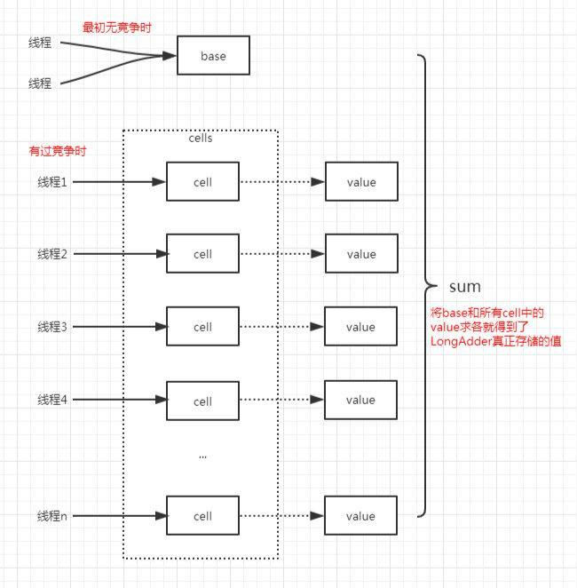

## 1.LongAdder的由来

高并发下多线程同时去操作一个变量会造成大量线程CAS失败，然后处于自旋状态，导致严重浪费CPU资源，降低了并发性。此外还会有**伪共享**的问题
LongAdder就是JDK1.8为了解决这个问题而产生的

##2.LongAdder设计理念



LongAdder继承了Striped64类，来实现累加功能的,它是实现高并发累加的工具类； 
Striped64的设计核心思路就是通过内部的分散计算来避免竞争。 
Striped64内部包含一个base和一个Cell[] cells数组，又叫hash表。 
没有竞争的情况下，要累加的数通过cas累加到base上；如果有竞争的话，会将要累加的数累加到Cells数组中的某个cell元素里面。所以整个Striped64的值为sum=base+∑[0~n]cells

```java
/** 
 * 存放Cell的hash表，大小为2的幂。 
 */  
transient volatile Cell[] cells;  
/** 
 * 基础值，
 * 1. 在没有竞争时会更新这个值；
 * 2. 在cells初始化的过程中，cells处于不可用的状态，这时候会尝试将通过cas操作值累加到base。 
 */  
transient volatile long base;  
/**
 * 它的作用是当要修改cells数组时加锁，防止多线程同时修改cells数组
 * 0为无锁，1为加锁，加锁的状况有三种：
 * 1. cells数组初始化的时候
 * 2. cells数组扩容的时候 
 * 3. 如果cells数组中某个元素为null，给这个位置创建新的Cell对象的时候
 */
transient volatile int cellsBusy;
```

内部类Cell做了缓存行对齐，解决伪共享的问题

```java
//为提高性能，使用注解@sun.misc.Contended，用来避免伪共享，
@sun.misc.Contended static final class Cell {
  //用来保存要累加的值
  volatile long value;
  Cell(long x) { value = x; }
  //使用UNSAFE类的cas来更新value值
  final boolean cas(long cmp, long val) {
    return UNSAFE.compareAndSwapLong(this, valueOffset, cmp, val);
  }
  private static final sun.misc.Unsafe UNSAFE;
  //value在Cell类中存储位置的偏移量；
  private static final long valueOffset;
  //这个静态方法用于获取偏移量
  static {
    try {
      UNSAFE = sun.misc.Unsafe.getUnsafe();
      Class<?> ak = Cell.class;
      valueOffset = UNSAFE.objectFieldOffset
        (ak.getDeclaredField("value"));
    } catch (Exception e) {
      throw new Error(e);
    }
  }
}
```

## 3.实现源码

### 3.1 add方法

```java
 public void add(long x) {
 
        Cell[] as; long b, v; int m; Cell a;
        /**
         * 如果一下两种条件则继续执行if内的语句
         * 1. cells数组不为null（不存在争用的时候，cells数组一定为null，一旦对base的cas操作失败，才会初始化cells数组）
         * 2. 如果cells数组为null，如果casBase执行成功，则直接返回，如果casBase方法执行失败（casBase失败，说明第一次争用冲突产生，需要对cells数组初始化）进入if内；
         * casBase方法很简单，就是通过UNSAFE类的cas设置成员变量base的值为base+要累加的值
         * casBase执行成功的前提是无竞争，这时候cells数组还没有用到为null，可见在无竞争的情况下是类似于AtomticInteger处理方式，使用cas做累加。
         */
        if ((as = cells) != null || !casBase(b = base, b + x)) {
            //uncontended判断cells数组中，当前线程要做cas累加操作的某个元素是否#不#存在争用，如果cas失败则存在争用；uncontended=false代表存在争用，uncontended=true代表不存在争用。
 
            boolean uncontended = true;
            /**
            *1. as == null ： cells数组未被初始化，成立则直接进入if执行cell初始化
            *2. (m = as.length - 1) < 0： cells数组的长度为0
            *条件1与2都代表cells数组没有被初始化成功，初始化成功的cells数组长度为2；
            *3. (a = as[getProbe() & m]) == null ：如果cells被初始化，且它的长度不为0，则通过getProbe方法获取当前线程Thread的threadLocalRandomProbe变量的值，初始为0，然后执行threadLocalRandomProbe&(cells.length-1 ),相当于m%cells.length;如果cells[threadLocalRandomProbe%cells.length]的位置为null，这说明这个位置从来没有线程做过累加，需要进入if继续执行，在这个位置创建一个新的Cell对象；
            *4. !(uncontended = a.cas(v = a.value, v + x))：尝试对cells[threadLocalRandomProbe%cells.length]位置的Cell对象中的value值做累加操作,并返回操作结果,如果失败了则进入if，重新计算一个threadLocalRandomProbe；
 
            如果进入if语句执行longAccumulate方法,有三种情况
            1. 前两个条件代表cells没有初始化，
            2. 第三个条件指当前线程hash到的cells数组中的位置还没有其它线程做过累加操作，
            3. 第四个条件代表产生了冲突,uncontended=false
            **/
            if (as == null || (m = as.length - 1) < 0 ||
                (a = as[getProbe() & m]) == null ||
                !(uncontended = a.cas(v = a.value, v + x)))
                longAccumulate(x, null, uncontended);
        }
    }

```

### 3.2 longAccumulate方法

```java
final void longAccumulate(long x, LongBinaryOperator fn,
                              boolean wasUncontended) {
        //获取当前线程的threadLocalRandomProbe值作为hash值,如果当前线程的threadLocalRandomProbe为0，说明当前线程是第一次进入该方法，则强制设置线程的threadLocalRandomProbe为ThreadLocalRandom类的成员静态私有变量probeGenerator的值，后面会详细将hash值的生成;
        //另外需要注意，如果threadLocalRandomProbe=0，代表新的线程开始参与cell争用的情况
        //1.当前线程之前还没有参与过cells争用（也许cells数组还没初始化，进到当前方法来就是为了初始化cells数组后争用的）,是第一次执行base的cas累加操作失败；
        //2.或者是在执行add方法时，对cells某个位置的Cell的cas操作第一次失败，则将wasUncontended设置为false，那么这里会将其重新置为true；第一次执行操作失败；
       //凡是参与了cell争用操作的线程threadLocalRandomProbe都不为0；
        int h;
        if ((h = getProbe()) == 0) {
            //初始化ThreadLocalRandom;
            ThreadLocalRandom.current(); // force initialization
            //将h设置为0x9e3779b9
            h = getProbe();
            //设置未竞争标记为true
            wasUncontended = true;
        }
        //cas冲突标志，表示当前线程hash到的Cells数组的位置，做cas累加操作时与其它线程发生了冲突，cas失败；collide=true代表有冲突，collide=false代表无冲突 
        boolean collide = false; 
        for (;;) {
            Cell[] as; Cell a; int n; long v;
            //这个主干if有三个分支
            //1.主分支一：处理cells数组已经正常初始化了的情况（这个if分支处理add方法的四个条件中的3和4）
            //2.主分支二：处理cells数组没有初始化或者长度为0的情况；（这个分支处理add方法的四个条件中的1和2）
            //3.主分支三：处理如果cell数组没有初始化，并且其它线程正在执行对cells数组初始化的操作，及cellbusy=1；则尝试将累加值通过cas累加到base上
            //先看主分支一
            if ((as = cells) != null && (n = as.length) > 0) {
                /**
                 *内部小分支一：这个是处理add方法内部if分支的条件3：如果被hash到的位置为null，说明没有线程在这个位置设置过值，没有竞争，可以直接使用，则用x值作为初始值创建一个新的Cell对象，对cells数组使用cellsBusy加锁，然后将这个Cell对象放到cells[m%cells.length]位置上 
                 */
                if ((a = as[(n - 1) & h]) == null) {
                    //cellsBusy == 0 代表当前没有线程cells数组做修改
                    if (cellsBusy == 0) {
                        //将要累加的x值作为初始值创建一个新的Cell对象，
                        Cell r = new Cell(x); 
                        //如果cellsBusy=0无锁，则通过cas将cellsBusy设置为1加锁
                        if (cellsBusy == 0 && casCellsBusy()) {
                            //标记Cell是否创建成功并放入到cells数组被hash的位置上
                            boolean created = false;
                            try {
                                Cell[] rs; int m, j;
                                //再次检查cells数组不为null，且长度不为空，且hash到的位置的Cell为null
                                if ((rs = cells) != null &&
                                    (m = rs.length) > 0 &&
                                    rs[j = (m - 1) & h] == null) {
                                    //将新的cell设置到该位置
                                    rs[j] = r;
                                    created = true;
                                }
                            } finally {
                                //去掉锁
                                cellsBusy = 0;
                            }
                            //生成成功，跳出循环
                            if (created)
                                break;
                            //如果created为false，说明上面指定的cells数组的位置cells[m%cells.length]已经有其它线程设置了cell了，继续执行循环。
                            continue;
                        }
                    }
                   //如果执行的当前行，代表cellsBusy=1，有线程正在更改cells数组，代表产生了冲突，将collide设置为false
                    collide = false;

                /**
                 *内部小分支二：如果add方法中条件4的通过cas设置cells[m%cells.length]位置的Cell对象中的value值设置为v+x失败,说明已经发生竞争，将wasUncontended设置为true，跳出内部的if判断，最后重新计算一个新的probe，然后重新执行循环;
                 */
                } else if (!wasUncontended)  
                    //设置未竞争标志位true，继续执行，后面会算一个新的probe值，然后重新执行循环。 
                    wasUncontended = true;
                /**
                *内部小分支三：新的争用线程参与争用的情况：处理刚进入当前方法时threadLocalRandomProbe=0的情况，也就是当前线程第一次参与cell争用的cas失败，这里会尝试将x值加到cells[m%cells.length]的value ，如果成功直接退出  
                */
                else if (a.cas(v = a.value, ((fn == null) ? v + x :
                                             fn.applyAsLong(v, x))))
                    break;
                /**
                 *内部小分支四：分支3处理新的线程争用执行失败了，这时如果cells数组的长度已经到了最大值（大于等于cup数量），或者是当前cells已经做了扩容，则将collide设置为false，后面重新计算prob的值
                else if (n >= NCPU || cells != as)
                    collide = false;
                /**
                 *内部小分支五：如果发生了冲突collide=false，则设置其为true；会在最后重新计算hash值后，进入下一次for循环
                 */
                else if (!collide)
                    //设置冲突标志，表示发生了冲突，需要再次生成hash，重试。 如果下次重试任然走到了改分支此时collide=true，!collide条件不成立，则走后一个分支
                    collide = true;
                /**
                 *内部小分支六：扩容cells数组，新参与cell争用的线程两次均失败，且符合库容条件，会执行该分支
                 */
                else if (cellsBusy == 0 && casCellsBusy()) {
                    try {
                        //检查cells是否已经被扩容
                        if (cells == as) {      // Expand table unless stale
                            Cell[] rs = new Cell[n << 1];
                            for (int i = 0; i < n; ++i)
                                rs[i] = as[i];
                            cells = rs;
                        }
                    } finally {
                        cellsBusy = 0;
                    }
                    collide = false;
                    continue;                   // Retry with expanded table
                }
                //为当前线程重新计算hash值
                h = advanceProbe(h);

            //这个大的分支处理add方法中的条件1与条件2成立的情况，如果cell表还未初始化或者长度为0，先尝试获取cellsBusy锁。
            }else if (cellsBusy == 0 && cells == as && casCellsBusy()) {
                boolean init = false;
                try {                           // Initialize table
                    //初始化cells数组，初始容量为2,并将x值通过hash&1，放到0个或第1个位置上
                    if (cells == as) {
                        Cell[] rs = new Cell[2];
                        rs[h & 1] = new Cell(x);
                        cells = rs;
                        init = true;
                    }
                } finally {
                    //解锁
                    cellsBusy = 0;
                }
                //如果init为true说明初始化成功，跳出循环
                if (init)
                    break;
            }
            /**
             *如果以上操作都失败了，则尝试将值累加到base上；
             */
            else if (casBase(v = base, ((fn == null) ? v + x :
                                        fn.applyAsLong(v, x))))
                break;                          // Fall back on using base
        }
    }
```