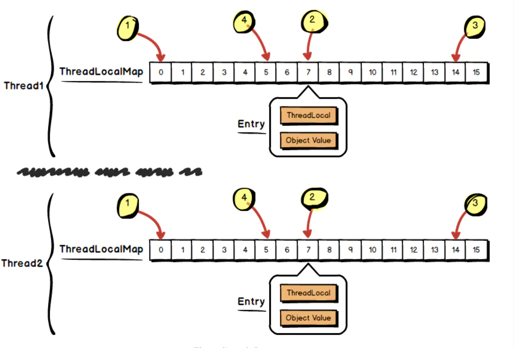
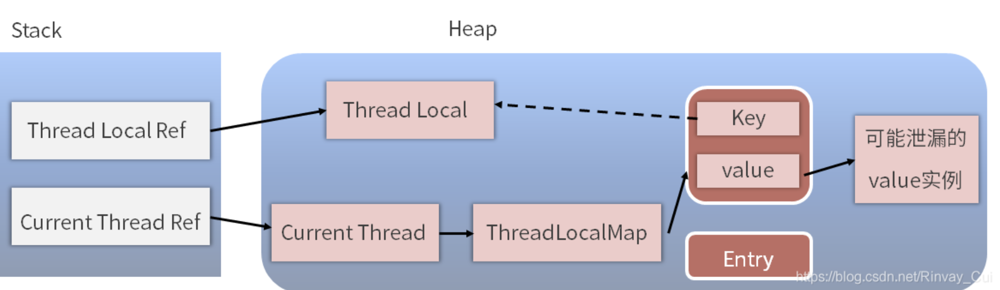

## 1.整体结构

在ThreadLocalMap中，初始化一个大小16的Entry数组，Entry对象用来保存每一个key-value键值对，只不过这里的key永远都是ThreadLocal对象。通过ThreadLocal对象的set方法，结果把ThreadLocal对象自己当做key，放进了ThreadLocalMap中



## 2.ThreadLocalMap

**使用线性探测法避免hash冲突**

```java
 		/**
     * 初始容量 —— 必须是2的幂
     */
    private static final int INITIAL_CAPACITY = 16;

    /**
     * 存放数据的table，Entry类的定义在下面分析
     * 同样，数组长度必须是2的冥。
     */
    private Entry[] table;

    /**
     * 数组里面entrys的个数，可以用于判断table当前使用量是否超过负因子。
     */
    private int size = 0;

    /**
     * 进行扩容的阈值，表使用量大于它的时候进行扩容。
     */
    private int threshold; // Default to 0
    
    /**
     * 定义为长度的2/3
     */
    private void setThreshold(int len) {
        threshold = len * 2 / 3;
    }
```

### 魔数0x61c88647

斐波那契散列的乘数可以用(long) ((1L << 31) * (Math.sqrt(5) - 1))可以得到2654435769，如果把这个值给转为带符号的int，则会得到-1640531527。换句话说 (1L << 32) - (long) ((1L << 31) * (Math.sqrt(5) - 1))得到的结果就是1640531527也就是0x61c88647 。

生成hash code间隙为这个魔数，可以让生成出来的值或者说ThreadLocal的ID较为均匀地分布在2的幂大小的数组中。

```java
private static final int HASH_INCREMENT = 0x61c88647;

private static int nextHashCode() {
   return nextHashCode.getAndAdd(HASH_INCREMENT);
}
```

可以看出，它是在上一个被构造出的ThreadLocal的ID/threadLocalHashCode的基础上加上一个魔数0x61c88647的

## 3.内存泄露问题

###3.1产生内存泄露的原因



我们可能会在业务代码中执行了 ThreadLocal instance = null 操作，想清理掉这个 ThreadLocal 实例，但是假设我们在 ThreadLocalMap 的 Entry 中强引用了 ThreadLocal 实例，那么，虽然在业务代码中把 ThreadLocal 实例置为了 null，但是在 Thread 类中依然有这个引用链的存在。
为了解决这个问题，ThreadLocalMap 中的 Entry 继承了 WeakReference 弱引用

```java
static class Entry extends WeakReference<ThreadLocal<?>> {
  /** The value associated with this ThreadLocal. */
  Object value;

  Entry(ThreadLocal<?> k, Object v) {
    super(k);
    value = v;
  }
}
```

弱引用的特点是，如果这个对象只被弱引用关联，而没有任何强引用关联，那么这个对象就可以被回收，所以弱引用不会阻止 GC。因此，这个弱引用的机制就避免了 ThreadLocal 的内存泄露问题。

可是，如果我们继续研究的话会发现，虽然 ThreadLocalMap 的每个 Entry 都是一个对 key 的弱引用，但是这个 Entry 包含了一个对 value 的强引用，还是刚才那段代码
可以看到，value = v 这行代码就代表了强引用的发生。

### 3.2 如何避免内存泄露

JDK 同样也考虑到了这个问题，在执行 ThreadLocal 的 set、remove、rehash 等方法时，它都会扫描 key 为 null 的 Entry，如果发现某个 Entry 的 key 为 null，则代表它所对应的 value 也没有作用了，所以它就会把对应的 value 置为 null，这样，value 对象就可以被正常回收了。

所以，在使用完了 ThreadLocal 之后，我们应该手动去调用它的 remove 方法，目的是防止内存泄漏的发生。

##4.父子线程传递

Thread类有两个ThreadLocalMap变量。一个用于保存ThreadLocal对象和其value值；一个用于保存InheritableThreadLocal对象和其value值

```java
/* ThreadLocal values pertaining to this thread. This map is maintained
* by the ThreadLocal class. */
ThreadLocal.ThreadLocalMap threadLocals = null;

/*
* InheritableThreadLocal values pertaining to this thread. This map is
* maintained by the InheritableThreadLocal class.
*/
ThreadLocal.ThreadLocalMap inheritableThreadLocals = null;

```

当new Thread()时，调用Thread的init方法。ThreadLocal.createInheritedMap()创建一个新的ThreadLocalMap，并copy父Thread的Map数据

## 5.拓展ThreadLocal

**5.1 Netty的FastThreadLocal<V>**

```java
private final int index;
public FastThreadLocal() {
    index = InternalThreadLocalMap.nextVariableIndex();
}
public static int nextVariableIndex() {
    int index = nextIndex.getAndIncrement();
    return index;
}
static final AtomicInteger nextIndex = new AtomicInteger();

public static final Object UNSET = new Object();
Object[] array = new Object[32];
Arrays.fill(array, UNSET);
```

每个FastThreadLocal对象都有一个index，该index是全局自增的AtomicInteger.getAndIncrement()。UnpaddedInternalThreadLocalMap维护一个初始32长度的Object[]数组，数组存放value值

set()时，根据FastThreadLocal的index，将value插入到Object[index]下，因为index是全局自增的，不会出现slot槽有值的情况；get()时，根据index，直接数组Object[index]读取value即可；remove()时，设置Object[index] = new Object();

FastThreadLocal相对于ThreadLocal，不需要hash，不需要线性探测(O(1)->O(n))，不需要在数组中存放ThreadLocal对象本身。缺点是有多少FastThreadLocal对象，就得至少多长数组，也无法利用回收后的数组槽(nextIndex自增导致)

**5.2Spring的NamedThreadLocal<T>**

```java
public class NamedThreadLocal<T> extends ThreadLocal<T> {
    private final String name;

    /**
     * Create a new NamedThreadLocal with the given name.
     * @param name a descriptive name for this ThreadLocal
     */
    public NamedThreadLocal(String name) {
        Assert.hasText(name, "Name must not be empty");
        this.name = name;
    }

    @Override
    public String toString() {
        return this.name;
    }
}
```

## 6.TransmittableThreadLocal

https://github.com/alibaba/transmittable-thread-local
