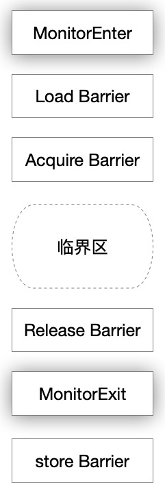

## 1 锁的作用

保证原子性、可见性、有序性。

+ 原子性：通过**互斥**保证原子性。一个锁只能被一个线程持有。
+ 可见性：锁的获得隐含**刷新处理器缓存**的动作，锁的释放隐含**冲刷处理器缓存**的动作
+ 有序性：由于可见性的保障，写线程在临界区对共享变量的更新对读线程是可见的，并且，由于原子性的保障，同一时间只有一个线程能够执行临界区的代码。即在读线程看来这些变量是同一时间更新的，没有必要（也无法）区分写线程是以什么顺序更新这些变量的。意味着读线程可以**认为**写线程按照源代码顺序更新变量的。

值得一提的是，临界区内的内存操作是会发生重排序的（不会排到临界区之外），也就是说实际上临界区中代码的执行顺序和源代码是不同的，只是读线程看来是同一时间执行，而且，临界区内的代码即使发生重排也要保证**貌似串行语义**，所以读线程没必要区分顺序，**认为是有序的**。

## 2 可重入性

如果一个线程持有一个锁的时候还能够继续成功申请该锁，就称该锁是可重入的。

可重入锁可以被理解成一个对象，该对象包含一个计数器属性，每次线程获得一个可重入锁时，该锁计数器值增加1，释放时减1。**可重入锁的持有线程继续获得相应锁的开销要比初次获得锁的开销要小的多**。

## 3 内部锁synchronized

**java平台中任何一个对象都有唯一一个与之关联的锁**。这种锁被称为监视器（Monitor）或者内部锁（Intrinsic Lock）。内部锁是一种排他锁，能保证原子性、可见性、有序性。

内部锁是通过synchronized关键字实现的。线程对内部锁的申请与释放的动作由java虚拟机负责代为实施。

作为锁句柄的变量如果改变会导致竟态，所以**一般用private final修饰**。

Jvm会为每个内部锁分配一个入口集合(Eentry Set)。用于记录等待获取相应内部锁的线程，多个线程申请同一个锁时，只有一个线程能够申请成功。申请失败的线程不会抛出异常，而是进入等待状态（Blocked）并存入相应锁的入口集。

内部锁只支持**非公平**调度，等待线程被唤醒时，可能有Runnable状态的线程（未进入Entry Set）抢占这个锁，因此被唤醒的线程未被会获得锁。

## 4 显示锁Lock

ReentrantLock既支持公平锁也支持非公平锁。使用完毕如果没有释放锁会产生锁泄漏。

## 5 读写锁

读写锁是一种改进型的排他锁，被称为共享/排他锁。

|      |               获得条件               |               排他性               |                             作用                             |
| :--: | :----------------------------------: | :--------------------------------: | :----------------------------------------------------------: |
| 读锁 |     相应的写锁没有被任何线程持有     | 对读线程是共享的，对写线程是排他的 | 允许多线程同时读取变量，并保证读线程读取共享变量时没有任何线程能够更新这个变量 |
| 写锁 | 相应的读锁和写锁都没有被任何线程持有 |     对读线程和写线程都是排他的     |               使写线程以独占的方式访问共享变量               |

读写锁内部实现复杂，一般在以下场景才会使用：

+ 读操作比写操作频繁的多
+ 读线程持有锁的时间较长

ReetrantReadWriteLock支持锁的降级，但是不支持升级。即可以在持有写锁的情况下继续获得读锁。

## 6 锁与内存屏障

内存屏障是对一类仅针对内存读、写操作指令的跨处理器架构的比较底层的**抽象**。

内存屏障的作用：

+ 禁止编译器、处理器重排序从而保证有序性。
+ 刷新、冲刷处理器缓存保证可见性。

内存屏障分为以下几种：

+ 按可见性来划分，分为**加载屏障（Load Barrier）**和**存储屏障（Store Barrier）**。加载屏障的作用是刷新处理器缓存，存储屏障的作用是冲刷处理器缓存。JVM会在Monitor（释放锁）对应的机器码之后插入一个存储屏障，在申请锁对应的机器码之后临界区开始前插入一个加载屏障。

+ 按照有序性保证来划分，分为**获取屏障（Acquie Barrier）**和**释放屏障（Release Barrier）**。获取屏障使用方式是在读操作之后插入该内存屏障，禁止该读操作与其后的任何读写操作之间进行重排序。释放屏障的使用方式是在一个写操作之前插入该内存屏障，其作用是禁止该写操作与前面任何读写操作进行重排序。JVM会在MonitorEntry对应字节码之后插入一个获取屏障，在MonitorExit之前插入一个释放屏障

## 7 锁与重排序

临界区外的语句可以被（**编译器**）重排序到临界区之内（**许进**），临界区内的操作无法被（**编译器或处理器**）重排到临界区之外（**不许出**）

在JIT动态编译的时候，编译器可能将临界区前、临界区后的语句移到临界区内，然后再临界区开始前后插入想应的内存屏障。JIT过后的代码临界区外的指令无法重排到临界区之内。