公平锁和非公平锁？乐观锁悲观锁？可重入锁？偏向锁？轻量级锁？自旋锁？重量级锁？

## 1. synchronized的作用

**synchronized并不是锁**，锁本身是个对象，硬要说的话，synchronized仅仅是相当于**加锁**这个操作

synchronized可以保证**原子性**、**可见性**、**有序性**。

## 2. 怎么使用synchronized？

+ 修饰实例方法，锁是当前this对象
+ 修饰静态方法，锁是当前类对象
+ 修饰代码块，锁是括号里的对象

##3. synchronized是怎么保证可见性的？

JMM中关于synchronized有如下规定，线程加锁时，必须清空工作内存中共享变量的值，从而使用共享变量时需要从主内存重新读取；线程在解锁时，需要把工作内存中最新的共享变量的值写入到主存，以此来保证共享变量的可见性。

与volatile保障可见性的方式一样，都是使用了内存屏障，详情见volatile的原理，这里不赘述

##4. synchronized是怎么保证有序性的？

+ synchronized可以禁止指令重排吗？

+ 既然不能禁止指令重排，怎么保证有序性的?

由于可见性的保障，写线程在临界区对共享变量的更新对读线程是可见的，并且，由于原子性的保障，同一时间只有一个线程能够执行临界区的代码。而且，临界区内的代码即使发生重排也要保证**貌似串行语义(as-if-serial)**,即在读线程看来这些变量是同一时间更新的，没有必要（也无法）区分写线程是以什么顺序更新这些变量的。意味着读线程可以**认为**写线程按照源代码顺序更新变量的。

值得一提的是，临界区内的内存操作是会发生重排序的（不会排到临界区之外），也就是说实际上临界区中代码的执行顺序和源代码是不同的，只是读线程看来是同一时间执行，，所以读线程没必要区分顺序，**认为是有序的**。

临界区外的语句可以被（**编译器**）重排序到临界区之内（**许进**），临界区内的操作无法被（**编译器或处理器**）重排到临界区之外（**不许出**）在JIT动态编译的时候，编译器可能将临界区前、临界区后的语句移到临界区内，然后再临界区开始前后插入想应的内存屏障。JIT过后的代码临界区外的指令无法重排到临界区之内。

### 5.3 锁信息存在哪里？

因为在Java中任意对象都可以用作锁，因此必定要有一个映射关系，存储该对象以及其对应的锁信息（比如当前哪个线程持有锁，哪些线程在等待）。一种很直观的方法是，用一个全局map，来存储这个映射关系，但这样会有一些问题：需要对map做线程安全保障，不同的`synchronized`之间会相互影响，性能差；另外当同步对象较多时，该map可能会占用比较多的内存。

所以最好的办法是将这个映射关系存储在对象头中，因为对象头本身也有一些hashcode、GC相关的数据，所以如果能将锁信息与这些信息**共存**在对象头中就好了。

## 5. synchronized是怎么保证原子性的？

### 5.1 为什么不能直接用操作系统提供的pthread_mutex_lock保证原子性？

JVM 每次从队列的尾部取出一个数据用于锁竞争候选者（OnDeck），但是并发情况下，ContentionList 会被大量的并发线程进行 CAS 访问，为了降低对尾部元素的竞争，JVM 会将 一部分线程移动到 EntryList 中作为候选竞争线程。

JVM 每次从队列的尾部取出一个数据用于锁竞争候选者（OnDeck），但是并发情况下，ContentionList 会被大量的并发线程进行 CAS 访问，为了降低对尾部元素的竞争，JVM 会将 一部分线程移动到 EntryList 中作为候选竞争线程。

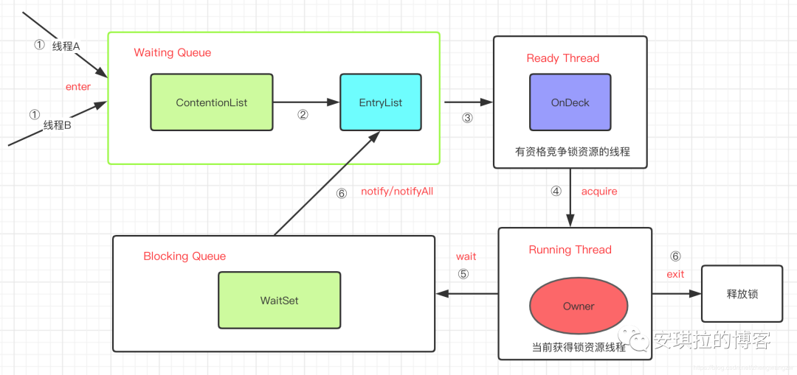

### 5.2 jdk1.6以前的synchronized锁重在哪里?自旋锁为了解决什么问题？

pthread_mutex_lock会发生系统态和内核态的切换，竞争激烈的时候，频繁发生挂起、唤醒线程，发生系统态和内核态切换浪费CPU

### 5.2 偏向锁为了解决什么问题，为什么要引入偏向锁？

### 5.3 偏向锁一定比自旋锁好么，为什么？

## 6. 使用synchronized之后生成的字节码有什么不同？

先看看普通的空方法生成的字节码是什么样的：

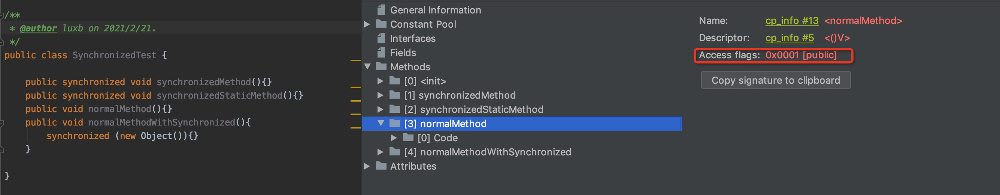

可以发现public方法对应的**access_flag是0x0001**,接下来我们看下普通的空方法字节码是什么样的

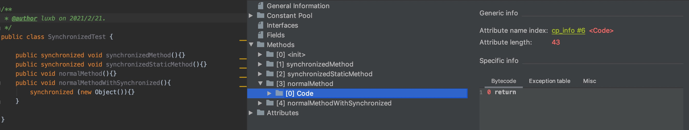

-----------------

接下来看下synchronized修饰的空方法是什么样的

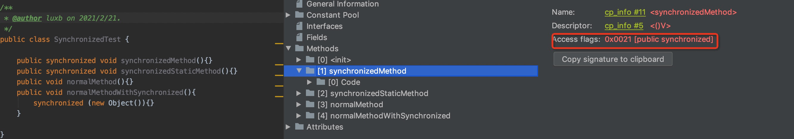

可以发现被synchronized修饰的public方法**access_flag是0x0021**，即0x0020(2^5)+0x0001(2^1)，被synchronized修饰的方法，access_flag的值多了0x0020，接下来我们看下字节码有什么改变

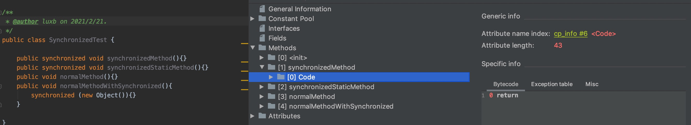

可以看到方法的字节码并没有发生改变，至此我们可以得出结论：**被synchronized修饰的方法access_flag会加上0x0020这个值，而方法的字节码不会发生改变**

--------------------

接下来我们看下被synchronized修饰的静态方法：

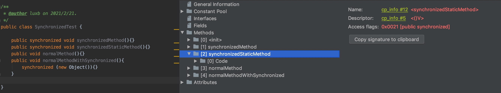

可以看出synchronized修饰的静态方法和普通方法一样，access_flag的值都是增加了0x0020

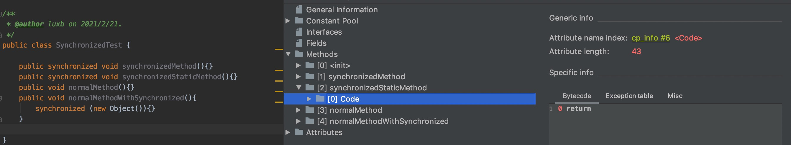

可以看出synchronized修饰的静态方法和普通方法一样，方法的字节码都没有发生变化

至此我们可以得出结论：**被synchronized修饰的静态方法与被被synchronized修饰的普通方法一样access_flag会加上0x0020这个值，而方法的字节码不会发生改变**

---------------

最后我们看下synchronized修饰的代码块字节码发生了什么改变：

首先方法的access_flag肯定是不会发生改变

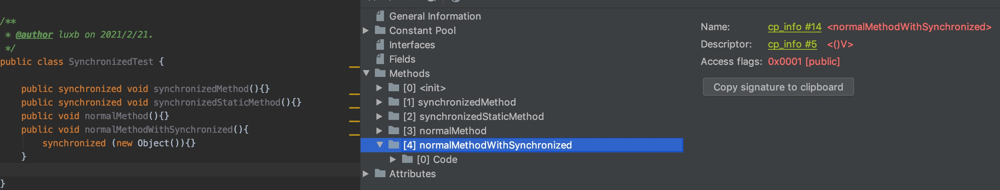

重点看下字节码发生了什么改变

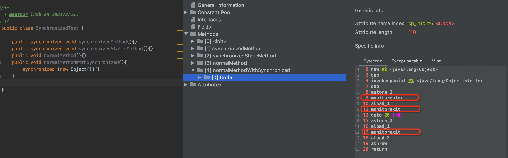

抛开new Object()的字节码不看，我们看到字节码还多了一行monitorenter和2行monitorexit。其中第17行的monitorexit是遭遇异常才会执行的。

-------------------

到目前为止我们总结下：

+ **修饰实例方法：access_flag的值增加0x0020**
+ **修饰静态方法：access_flag的值增加0x0020**
+ **修饰代码块：生成的字节码在进入被synchronized修饰的代码块前增加monitorenter,退出是增加monitorexit**

那么接下来我们就需要看JVM的源码才能知道access_flag增加0x0020有什么用，以及monitorenter和monitorexit分别又是什么了，我们以1.8的hotspot为例

我们先看monitorenter，要找锁的入口，肯定是要在源码中找到对`monitorenter`指令解析的地方。在HotSpot的中有两处地方对`monitorenter`指令进行解析：一个是在[bytecodeInterpreter.cpp#1816](http://hg.openjdk.java.net/jdk8u/jdk8u/hotspot/file/9ce27f0a4683/src/share/vm/interpreter/bytecodeInterpreter.cpp#l1816) ，另一个是在[templateTable_x86_64.cpp#3667](http://hg.openjdk.java.net/jdk8u/jdk8u/hotspot/file/9ce27f0a4683/src/cpu/x86/vm/templateTable_x86_64.cpp#l3667)。

前者是JVM中的字节码解释器(`bytecodeInterpreter`)，用C++实现了每条JVM指令（如`monitorenter`、`invokevirtual`等），其优点是实现相对简单且容易理解，缺点是执行慢。后者是模板解释器(`templateInterpreter`)，其对每个指令都写了一段对应的汇编代码，启动时将每个指令与对应汇编代码入口绑定，可以说是效率做到了极致

**在HotSpot中，只用到了模板解释器，字节码解释器根本就没用到**

## 7.锁升级过程

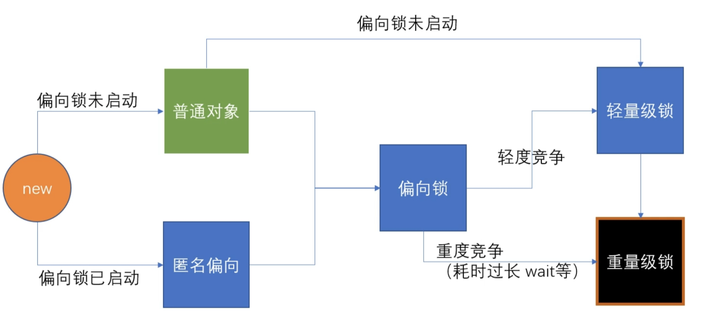

## 8 偏向锁

经过研究发现，在大多数情况下，锁不仅不存在多线程竞争，而且总是由同一线程多次获得，因此为了减少同一线程获取锁(会涉及到一些CAS操作,耗时)的代价而引入偏向锁。偏向锁的核心思想是，如果一个线程获得了锁，那么锁就进入偏向模式，此时Mark Word 的结构也变为偏向锁结构，当这个线程再次请求锁时，无需再做任何同步操作，即获取锁的过程，这样就省去了大量有关锁申请的操作，从而也就提供程序的性能。所以，对于没有锁竞争的场合，偏向锁有很好的优化效果，毕竟极有可能连续多次是同一个线程申请相同的锁。但是对于锁竞争比较激烈的场合，偏向锁就失效了，因为这样场合极有可能每次申请锁的线程都是不相同的，因此这种场合下不应该使用偏向锁，否则会得不偿失。

开启偏向锁：-XX:+UseBiasedLocking（默认开启）

偏向锁延迟开启：-XX:BiasedLockingStartupDelay=4（默认4s）

Tomcat启动的时候会有大量锁竞争（类加载申请内存地址），因此默认偏向锁4s后生效

关键词：线程ID比较

- 如果当前虚拟机启用了偏向锁（启用参数`-XX:+UseBiasedLocking`，这是自JDK6起HotSpot虚拟机的默认值），那么**当锁对象第一次被线程1获取的时候，虚拟机会把对象头中的标志位设为`01`、把偏向模式设置为`1`，表示进入偏向模式。**同时**使用CAS操作把获取到这个锁的线程1的ID记录在对象的Mark Word中**，如果CAS操作成功，持有偏向锁的线程以后每次进入这个锁相关的同步块时。虚拟机都可以不再进行任何同步操作（例如加锁、解锁以及对Mark Word的更新操作等）。
- 当另一个线程去尝试获取这个对象的锁时，它首先会检测对象是否处于偏向模式，如果处于偏向模式，那么就会检测该对象的对象头是否存储了线程2的ID，如果是线程2的ID那就直接进入线程2的偏向模式，如果不是，那么线程2会检测线程1是否还存在，不存在的话就直接把偏向锁标识置为`0`，然后用CAS替换线程ID为自己的ID，如果存在的话就撤销偏向模式（偏向模式设为`0`），随后的操作就按照轻量级锁进行。

###偏向锁撤销

需要注意下，当调用锁对象的`Object#hash`或`System.identityHashCode()`方法会导致该对象的偏向锁或轻量级锁升级。这是因为在Java中一个对象的hashcode是在调用这两个方法时才生成的，如果是无锁状态则存放在`mark word`中，如果是重量级锁则存放在对应的monitor中，而偏向锁是没有地方能存放该信息的，所以必须升级。具体可以看这篇[文章](https://www.aimoon.site/blog/2018/05/21/biased-locking/)的`hashcode()方法对偏向锁的影响（这种方式撤销偏向锁，撤销的是当前线程的锁，只需要遍历当前线程的栈就可以，不需要等到safepoint）

`revoke_bias`方法逻辑：

1. 查看偏向的线程是否存活，如果已经不存活了，则直接撤销偏向锁。JVM维护了一个集合存放所有存活的线程，通过遍历该集合判断某个线程是否存活。
2. 偏向的线程是否还在同步块中，如果不在了，则撤销偏向锁。我们回顾一下偏向锁的加锁流程：每次进入同步块（即执行`monitorenter`）的时候都会以从高往低的顺序在栈中找到第一个可用的`Lock Record`，将其obj字段指向锁对象。每次解锁（即执行`monitorexit`）的时候都会将最低的一个相关`Lock Record`移除掉。所以可以通过遍历线程栈中的`Lock Record`来判断线程是否还在同步块中。
3. 将偏向线程所有相关`Lock Record`的`Displaced Mark Word`设置为null，然后将最高位的`Lock Record`的`Displaced Mark Word` 设置为无锁状态，最高位的`Lock Record`也就是第一次获得锁时的`Lock Record`（这里的第一次是指重入获取锁时的第一次），然后将对象头指向最高位的`Lock Record`，这里不需要用CAS指令，因为是在`safepoint`。 执行完后，就升级成了轻量级锁。原偏向线程的所有Lock Record都已经变成轻量级锁的状态。这里如果看不明白，请回顾上篇文章的轻量级锁加锁过程。

#### 批量重偏向与撤销

1.一个线程创建了大量对象并执行了初始的同步操作，之后在另一个线程中将这些对象作为锁进行之后的操作。这种case下，会导致大量的偏向锁撤销操作。

2.存在明显多线程竞争的场景下使用偏向锁是不合适的，例如生产者/消费者队列。

批量重偏向（bulk rebias）机制是为了解决第一种场景。批量撤销（bulk revoke）则是为了解决第二种场景。

其做法是：以class为单位，为每个class维护一个偏向锁撤销计数器，每一次该class的对象发生偏向撤销操作时，该计数器+1，当这个值达到重偏向阈值（默认20）时，JVM就认为该class的偏向锁有问题，因此会进行批量重偏向。每个class对象会有一个对应的`epoch`字段，每个处于偏向锁状态对象的`mark word中`也有该字段，其初始值为创建该对象时，class中的`epoch`的值。每次发生批量重偏向时，就将该值+1，同时遍历JVM中所有线程的栈，找到该class所有正处于加锁状态的偏向锁，将其`epoch`字段改为新值。下次获得锁时，发现当前对象的`epoch`值和class的`epoch`不相等，那就算当前已经偏向了其他线程，也不会执行撤销操作，而是直接通过CAS操作将其`mark word`的Thread Id 改成当前线程Id。

当达到重偏向阈值后，假设该class计数器继续增长，当其达到批量撤销的阈值后（默认40），JVM就认为该class的使用场景存在多线程竞争，会标记该class为不可偏向，之后，对于该class的锁，直接走轻量级锁的逻辑。

## 9 轻量级锁

关键词：线程的栈帧中创建一个`Lock Record`

线程在执行同步块之前，JVM会先在当前的线程的栈帧中创建一个`Lock Record`，其包括一个用于存储对象头中的 `mark word`（官方称之为`Displaced Mark Word`）以及一个指向对象的指针。下图右边的部分就是一个`Lock Record`

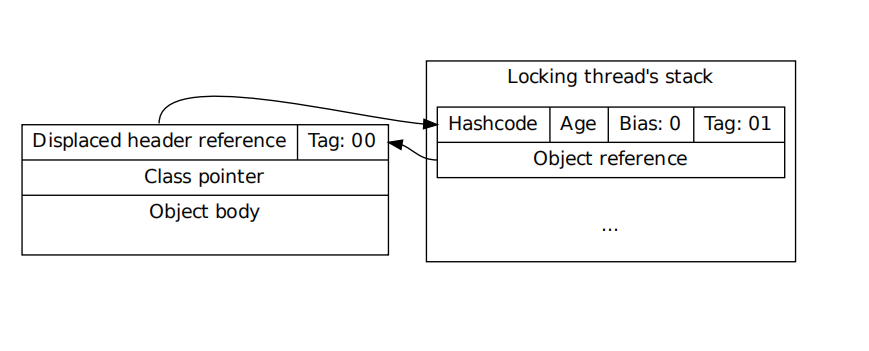

#### 加锁过程

1.在线程栈中创建一个`Lock Record`，将其`obj`（即上图的Object reference）字段指向锁对象。

2.直接通过CAS指令将`Lock Record`的地址存储在对象头的`mark word`中，如果对象处于无锁状态则修改成功，代表该线程获得了轻量级锁。如果失败，进入到步骤3。

3.如果是当前线程已经持有该锁了，代表这是一次锁重入。设置`Lock Record`第一部分（`Displaced Mark Word`）为null，起到了一个重入计数器的作用。然后结束。(重入会创建一个新的Lock Record指向null)

4.走到这一步说明发生了竞争，需要膨胀为重量级锁。

#### 解锁过程

1.遍历线程栈,找到所有`obj`字段等于当前锁对象的`Lock Record`。

2.如果`Lock Record`的`Displaced Mark Word`为null，代表这是一次重入，将`obj`设置为null后continue。

3.如果`Lock Record`的`Displaced Mark Word`不为null，则利用CAS指令将对象头的`mark word`恢复成为`Displaced Mark Word`。如果成功，则continue，否则膨胀为重量级锁。

自旋超过10次，升级为重量级锁 
可以通过参数-XX:PreBlockSpin设置自旋次数

1.6之后，加入自适应自旋 Adapative Self Spinning ， JVM自己控制

## 10 重量级锁

**锁消除**

如果判断一段代码中，在堆上的所有数据都不会逃逸出去被其他线程访问到，那就可以把它们当做栈上数据对待，认为它们是线程私有的

消除锁是虚拟机另外一种锁的优化，这种优化更彻底，Java虚拟机在JIT编译时(可以简单理解为当某段代码即将第一次被执行时进行编译，又称即时编译)，通过对运行上下文的扫描，去除不可能存在共享资源竞争的锁，通过这种方式消除没有必要的锁，可以节省毫无意义的请求锁时间，如下StringBuffer的append是一个同步方法，但是在add方法中的StringBuffer属于一个局部变量，并且不会被其他线程所使用，因此StringBuffer不可能存在共享资源竞争的情景，JVM会自动将其锁消除。**锁消除的依据是逃逸分析的数据支持。**

锁消除，前提是java必须运行在server模式（server模式会比client模式作更多的优化），同时必须开启逃逸分析

:-XX:+DoEscapeAnalysis 开启逃逸分析

-XX:+EliminateLocks 表示开启锁消除。

**逃逸分析**

使用逃逸分析，编译器可以对代码做如下优化：

一、同步省略。如果一个对象被发现只能从一个线程被访问到，那么对于这个对象的操作可以不考虑同步。

二、将堆分配转化为栈分配。如果一个对象在子程序中被分配，要使指向该对象的指针永远不会逃逸，对象可能是栈分配的候选，而不是堆分配。

三、分离对象或标量替换。有的对象可能不需要作为一个连续的内存结构存在也可以被访问到，那么对象的部分（或全部）可以不存储在内存，而是存储在CPU寄存器中。

是不是所有的对象和数组都会在堆内存分配空间？

**不一定**

在Java代码运行时，通过JVM参数可指定是否开启逃逸分析， -XX:+DoEscapeAnalysis ： 表示开启逃逸分析 -XX:-DoEscapeAnalysis ： 表示关闭逃逸分析。从jdk 1.7开始已经默认开启逃逸分析，如需关闭，需要指定-XX:-DoEscapeAnalysis

### 锁粗化 lock coarsening

JVM 会检测到这样一连串的操作都对同一个对象加锁（while 循环内 100 次执行 append，没有锁粗化的就要进行 100  次加锁/解锁），此时 JVM 就会将加锁的范围粗化到这一连串的操作的外部（比如 while 虚幻体外），使得这一连串操作只需要加一次锁即可。

### 锁降级

因为BasicLocking的实现优先于重量级锁的使用，JVM会尝试在SWT的停顿中对处于“空闲(idle)”状态的重量级锁进行降级(deflate)。
在STW时，所有的Java线程都会暂停在“安全点(SafePoint)”，此时VMThread通过对所有Monitor的遍历，或者通过对所有依赖于MonitorInUseLists值的当前正在“使用”中的Monitor子序列进行遍历，从而得到哪些未被使用的“Monitor”作为降级对象。

锁降级的代码在[`deflate_idle_monitors`](http://hg.openjdk.java.net/jdk8u/jdk8u/hotspot/file/9ce27f0a4683/src/share/vm/runtime/synchronizer.cpp#l1503)方法中，其调用点在进入SafePoint的方法`SafepointSynchronize::begin()`中。
在`deflate_idle_monitors`中会找到已经`idle`的monitor(也就是重量级锁的对象)，然后调用`deflate_monitor`方法将其降级。

因为锁降级是发生在safepoint的，所以如果降级时间过长会导致程序一直处于STW的阶段。在[这里](http://openjdk.java.net/jeps/8183909)有篇文章讨论了优化机制。jdk8中本身也有个`MonitorInUseLists`的开关，其影响了寻找`idle monitor`的方式，对该开关的一些讨论看[这里](https://bugs.openjdk.java.net/browse/JDK-8149442)。

### 真的有场景需要用到“偏向锁”吗？

对于JAVA来讲还是有点意义的，主要的问题来自大量历史遗留代码在自己是否线程安全这件事上不是说得特别明白，包括JDK自己的代码，该线程安全没安全，不需要线程安全的却整了安全，比如Vector这种，偏向锁是对付后一种情况的。

你十有八九是在没有竞争的情况下使用Vector，却需要付出不停的加锁解锁的代价，如果使用偏向锁，这个代价就比较低了，无非就是测试一下这个锁是不是已经偏向自己，整个过程代价小不少。

偏向锁的毛病还是撤销的代价太夸张，需要进入safepoint，如果真的竞争很激烈的多线程程序，一开始就关掉可能更好。

参考文档：https://github.com/farmerjohngit/myblog/issues/12