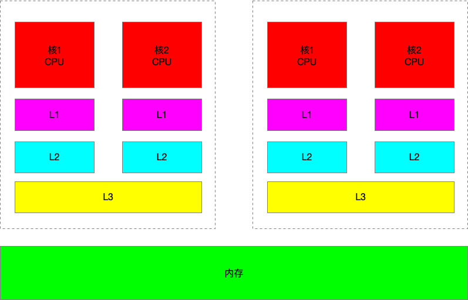

##  1、CPU的基本组成


+ **PC(Program Counter)-->程序计数器**:记录当前指令地址

+ **Register-->寄存器**:暂时存储CPU计算需要的数据。

  英特尔CPU：AX、BX为16位寄存器；EAX、EBX为32位寄存器；RAX、RBX为64位寄存器

  64位CPU指的就是寄存器是64位的

  JVM的本地变量表就相当于寄存器

+ **ALU(Arithmetic & Logic Unit)-->运算单元**

+ **CU(Control Unit)-->控制单元**

+ **MMU(Memory Management Unit)->内存控制单元**

## 2、超线程


一个ALU对应多个PC | Registers。所谓的四核八线程

## 3、CPU高速缓存



###3.1 CPU高速缓存结构

高速缓存相当于一个由硬件实现的容量极小的**散列表（Hash Table）**,key是一个内存地址，value是内存数据的副本或者准备写入内存的数据。

从内部结构来看，高速缓存相当于一个**拉链散列表**，包含若干桶（Bucket，硬件上称为Set）,每个桶可以包含若干个缓存条目（Cache Entry）


缓存条目可以被进一步划分为Tag、DataBlock以及Flag三个部分

+ **Tag：包含了缓存行中数据对应的内存地址的高位比特**
+ **DataBlock：缓存行，x86处理器为64byte**
+ **Flag：表示相应缓存行中的状态信息**

**处理器在执行内存操作时会将相应内存地址解码。内存地址解码结果包括tag、index以及offset这三部分数据**

+ **index:桶编号**，用它定位内存地址对应的桶，一个桶可能包含多个缓存条目
+ **tag:相当于缓存条目的相对编号**，其作用在于用来与一个桶的各个缓存条目的Tag部分进行比较，以定位一个具体的缓存条目
+ **offset:缓存行内的位置偏移**，一个缓存行可以存储多个变量，offset用来确定一个变量在缓存行中的起始位置

###3.2 存在CPU高速缓存的原因：

按块读取，**程序局部性原理**，可以提高效率
充分发挥总线CPU针脚等一次性读取更多数据的能力

### 3.3 缓存行大小：

**缓存行越大，局部性空间效率越高，但读取时间慢**
**缓存行越小，局部性空间效率越低，但读取时间快**
英特尔CPU：**64字节**

```java
package com.meituan.FalseSharing;

public class CacheLineEffect {
    //考虑一般缓存行大小是64字节，一个 long 类型占8字节
    static  long[][] arr;
 
    public static void main(String[] args) {
        arr = new long[1024 * 1024][];
        for (int i = 0; i < 1024 * 1024; i++) {
            arr[i] = new long[8];
            for (int j = 0; j < 8; j++) {
                arr[i][j] = 0L;
            }
        }
        long sum = 0L;
        long marked = System.currentTimeMillis();
        for (int i = 0; i < 1024 * 1024; i+=1) {
            for(int j =0; j< 8;j++){
                sum = arr[i][j];
            }
        }
        System.out.println("Loop times:" + (System.currentTimeMillis() - marked) + "ms");
 
        marked = System.currentTimeMillis();
        for (int i = 0; i < 8; i+=1) {
            for(int j =0; j< 1024 * 1024;j++){
                sum = arr[j][i];
            }
        }
        System.out.println("Loop times:" + (System.currentTimeMillis() - marked) + "ms");
    }
}
```

结果：

Loop times:30ms Loop times:65ms

### 3.4 伪共享问题


不同CPU修改了同一个缓存行的不同数据，无意中影响彼此的性能，这种情况就是**伪共享**。
例如core1修改了x，如果需要保证数据的**可见性**，需要借助**缓存一致性协议**

```java
package com.meituan.FalseSharing;
 
public class FalseSharing implements Runnable{
        public final static long ITERATIONS = 500L * 1000L * 100L;
        private int arrayIndex = 0;
 
        private static ValuePadding[] longs;
        public FalseSharing(final int arrayIndex) {
            this.arrayIndex = arrayIndex;
        }
 
        public static void main(final String[] args) throws Exception {
            for(int i=1;i<10;i++){
                System.gc();
                final long start = System.currentTimeMillis();
                runTest(i);
                System.out.println("Thread num "+i+" duration = " + (System.currentTimeMillis() - start));
            }
 
        }
 
        private static void runTest(int NUM_THREADS) throws InterruptedException {
            Thread[] threads = new Thread[NUM_THREADS];
            longs = new ValuePadding[NUM_THREADS];
            for (int i = 0; i < longs.length; i++) {
                longs[i] = new ValuePadding();
            }
            for (int i = 0; i < threads.length; i++) {
                threads[i] = new Thread(new FalseSharing(i));
            }
 
            for (Thread t : threads) {
                t.start();
            }
 
            for (Thread t : threads) {
                t.join();
            }
        }
 
        public void run() {
            long i = ITERATIONS + 1;
            while (0 != --i) {
                longs[arrayIndex].value = 0L;
            }
        }
 
        public final static class ValuePadding {
            protected long p1, p2, p3, p4, p5, p6, p7;
            protected volatile long value = 0L;
            protected long p9, p10, p11, p12, p13, p14;
            protected long p15;
        }
        public final static class ValueNoPadding {
            // protected long p1, p2, p3, p4, p5, p6, p7;
            protected volatile long value = 0L;
            // protected long p9, p10, p11, p12, p13, p14, p15;
        }
}
```

结果：

- Thread num 1 duration = 447
- Thread num 2 duration = 463
- Thread num 3 duration = 454
- Thread num 4 duration = 464
- Thread num 5 duration = 561
- Thread num 6 duration = 606
- Thread num 7 duration = 684
- Thread num 8 duration = 870
- Thread num 9 duration = 823

把代码中ValuePadding都替换为ValueNoPadding后的结果：

- Thread num 1 duration = 446
- Thread num 2 duration = 2549
- Thread num 3 duration = 2898
- Thread num 4 duration = 3931
- Thread num 5 duration = 4716
- Thread num 6 duration = 5424
- Thread num 7 duration = 4868
- Thread num 8 duration = 4595
- Thread num 9 duration = 4540

disruptor

### 3.5 缓存行对齐

**java8中有专门注解@Contended 解决缓存行对齐的问题**

需要设置虚拟机参数：-XX:-RestrictContended

### 3.6 缓存一致性协议

不同CPU使用的缓存一致性协议是不同的，**x86处理器所使用的缓存一致性协议是基于MESI协议的**

MESI协议对内存数据访问的控制类似于读写锁，同一地址的读操作时并发的，写操作时独占的。

+ **Invalid(无效的，记为I)**:表示相应缓存行中不包含任何内存地址对应的**有效**副本数据。
+ **Shared(共享的，记为S)**:该状态表示相应缓存行包含相应内存地址所对应的副本数据。并且，其他处理器上的高速缓存中也可能包含相同内存地址对应的副本数据。**处于该状态的缓存条目，其缓存行中包含的数据与主内存中包含的数据一致。**
+ **Exclusive(独占的，记为E)**:该状态表示相应缓存行包含相应内存地址所对应的副本数据。**处于该状态的缓存条目，其缓存行中包含的数据与主内存中包含的数据一致。**
+ **Modified(更改过的，记为M)**:该状态表示相应缓存行包含对相应内存地址所做的更新结果数据。**处于该状态的缓存条目，其缓存行中包含的数据与主内存中包含的数据不一致。**

处理器在执行内存读、写操作时在必要的情况下会往总线（Bus）中发送特定的请求消息，同时每个处理器还**嗅探**（Snoop，也称拦截）总线中由其他处理器发出的请求消息并在一定条件下往总线中回复相应的响应消息

| Read                   | 请求     | 通知其他处理器、主内存当前处理器准备读取某个数据。该消息包含带读取数据的内存地址 |
| ---------------------- | -------- | ------------------------------------------------------------ |
| 消息名                 | 消息类型 | 描述                                                         |
| Read Response          | 响应     | 该消息包含被请求读取的数据。该消息可能是主内存提供的，也可能是嗅探Read消息的其他高速缓存提供的 |
| Invalidate             | 请求     | 通知其他处理器将其高速缓存中指定内存地址对应的缓存条目状态置为I，即通知这些处理器删除指定内存地址的副本数据 |
| Invalidate Acknowledge | 响应     | 接收到Invalidate消息的处理器必须回复该消息，以表示删除了其高速缓存上的相应副本数据 |
| Read Invalidate        | 请求     | 相当于Read和Invalidate合起来发送。通知其他处理器当前处理器准备更新（Read-Modify-Write，读后写更新）一个数据，并请求其他处理器删除其高速缓存中相应的副本数据。接受到该消息的处理器必须回复Read Response消息和Invalidate Acknowledge |
| Writeback              | 请求     | 包含写入主内存的数据及其对应的内存地址                       |

每个处理器通过嗅探在总线上传播的数据来检查自己缓存的值是不是过期了，当处理器发现自己缓存行对应的内存地址被修改，就会将当前处理器的缓存行设置成无效状态，当处理器要对这个数据进行修改操作的时候，会强制重新从系统内存里把数据读到处理器缓存里


#####下面讨论**读取数据**S的实现

+ Processor 0 找到的缓存条目的状态如果为M、E、S，那么该处理器可以直接从相应的缓存行中读取地址A所对应，而无需往总线中发送任何消息

+ Processor 0 找到的缓存条目状态如果为I，则说明该处理器的高速缓存中并不包含S的有效副本数据，此时Processor 0 需要往总线发送Read消息以读取地址A对应的数据，而其他处理器Processor 1(或主内存)则需要回复Read Response以提供相应的数据。如下表所示

  <table>
     <tr>
        <td colspan=2></td>
        <td>Processor 0</td>
        <td>Processor 1</td>
     </tr>
     <tr>
        <td rowspan=2>缓存条目</td>
        <td>当前状态</td>
        <td>I</td>
        <td>M/E/S</td>
     </tr>
     <tr>
        <td>目标状态</td>
        <td>S</td>
        <td>S</td>
     </tr>
     <tr>
        <td rowspan=2>消息</td>
        <td>发送</td>
        <td>Read 消息</td>
        <td>Read Response</td>
     </tr>
     <tr>
        <td>接受</td>
        <td>Read Response消息</td>
        <td>Read消息</td>
     </tr>
  </table>

Processor0 接受到Read Response消息时，会将其中携带的数据（包含数据S的数据块）存入相应的缓存行并将相应缓存条目的状态更新为S。Processor 0 接收到的Read Response消息可能来自主内存也可能来自其他处理器（Processor 1）

Processor1 嗅探到Read消息的时候，会从该消息中取出待读取的内存地址，并根据该地址在其高速缓存中查找对应的缓存条目。

+ 如果Processor 1 找到的缓存条目不为I,则说明该处理器的高速缓存中有待读取数据的副本。此时Processor 1会构造相应的Read Response消息并将相应缓存行所存储的**整块**数据（而不仅仅是Processor 0 所请求的数据S）"塞入"该消息。
+ 如果Processor 1找到的相应缓存条目的状态为M，那么Processor 1可能在往总线发送Read Response消息前将相应缓存行数据写入主内存。往总线发送Read Response之后相应缓存条目状态会被更新成S。
+ 如果Processor 1找到的高速缓存条目状态为I，那么Processor 0所接收到的Read Response消息就来自于主存

可见：在Processor 0读取内存的时候，即便Processor 1对相应的内存数据进行了更新并且这种更新停留在Processor 1的高速缓存中而造成**高速缓存与主内存中的数据不一致，在MESI消息的协调下，这种不一致不会导致Processor读取到的是一个旧值**

##### 下面讨论**写入数据**S的实现

**任何一个处理器执行内存写操作时必须拥有相应数据的所有权**

在执行写操作时，Processor 0 会先根据内存地址A找到相应的缓存条目。

+ Processor 0的缓存条目状态为E或者M说明该处理器已经拥有相应数据的所有权，此时该处理器可以直接将数据写入相应的缓存行并将相应缓存条目的状态更新为M
+ Processor 0的缓存条目状态不为E、M，则该处理器需要往总线发送Invalidate消息以获得数据的所有权。其他处理器接受到Invalidate消息会将其高速缓存中相应的缓存条目更新为I并回复Invalidate Acknowledge消息。发送Invalidate消息的处理器必须在接收到其他处理器所回复**所有Invalidate Acknowledge消息之后**再将数据更新到相应缓存行中

<table>
   <tr>
      <td colspan=2></td>
      <td colspan=2>Processor 0</td>
      <td colspan=2>Processor 1</td>
   </tr>
     <tr>
      <td colspan=2></td>
      <td>场景1</td>
      <td>场景2</td>
      <td>场景1</td>
      <td>场景2</td>
   </tr>
   <tr>
      <td rowspan=2>缓存条目</td>
      <td>当前状态</td>
      <td>S</td>
      <td>I</td>
      <td>I</td>
      <td>M/E/S</td>
   </tr>
   <tr>
      <td>目标状态</td>
      <td>M</td>
      <td>M</td>     
      <td>I</td>
      <td>I</td>     
   </tr>
   <tr>
      <td rowspan=2>消息</td>
      <td>发送</td>
      <td>Invalidate</td>
      <td>Read Invalidate</td>
      <td>Invalidate Acknowledge</td>
      <td>Read Response 和 Invalidate Acknowledge</td>     
   </tr>
   <tr>
      <td>接受</td>
      <td>Invalidate Acknowledge</td>
      <td>Read Response消息 和 Invalidate Acknowledge</td>     
      <td>Invalidate</td>
      <td>Read Invalidate</td>     
   </tr>
</table>

+ Processor 0所找到的状态若为S，则说明Processor 1上的高速缓存可能保留了地址A对应的数据副本（场景1），此时Processor 0 需要往总线发送Invalidate消息。Processor 0 在接收到所有处理器所回复的Invalidate Acknowledge消息之后会将相应缓存条目的状态更新为E。此时Processor 0 获得地址A上的数据所有权。接着Processor 0便可以将数据写入相应的缓存行。并将相应的缓存条目的状态更新为M

+ Processor 0所找到的状态若为I，则表示该处理器不包含地址A对应的有效副本数据（场景2）。此时Processor 0 需要往总线发送Read Invalidate消息。Processor 0在接收到Read Response消息以及其他所有处理器所回复的Invalidate Acknowledge消息之后，会将缓存条目状态改为E,表示该处理器已经获得了相应数据的所有权。接着Processor 0可以往相应缓存行写入数据了并将缓存条目状态置为M

可见：**Invalidate消息和Invalidate Acknowledge消息使得针对同一个内存地址的写操作在任意一个时刻只能由一个处理器执行**，从而避免了多个处理器同时更新同一数据可能导致数据不一致的问题

##### Writeback

发起 `Writeback` 一般是因为某个 CPU 的 Cache 不够了，比如需要新 Load 数据进来，但是 Cache 已经满了。就需要找一个 Cache Line 丢弃掉，如果这个被丢弃的 Cache Line 处于 `modified` 状态，就需要触发一次 `WriteBack`，可能是把数据写去主存，也可能写入同一个 CPU 的更高级缓存，还有可能直接写去别的 CPU。比如之前这个 CPU 读过这个数据，可能对这个数据有兴趣，为了保证数据还在缓存中，可能就触发一次 `Writeback` 把数据发到读过该数据的 CPU 上。

### 3.7 缓存一致性协议能够解决可见性问题吗？

假设 CPU 0 要写数据到某个地址，有两种情况：

1. CPU 0 已经读取了目标数据所在 Cache Line，处于 `Shared` 状态；
2. CPU 0 的 Cache 中还没有目标数据所在 Cache Line；

第一种情况下，CPU 0 只要发送 `Invalidate` 给其它 CPU 即可。收到所有 CPU 的 `Invalidate Ack` 后，这块 Cache Line 可以转换为 `Exclusive` 状态。第二种情况下，CPU 0 需要发送 `Read Invalidate` 到所有 CPU，拥有最新目标数据的 CPU 会把最新数据发给 CPU 0，并且会标记自己的这块 Cache Line 为无效。

无论是 `Invalidate` 还是 `Read Invalidate`，CPU 0 都得等其他所有 CPU 返回 `Invalidate Ack` 后才能安全操作数据，这个等待时间可能会很长。

**MESI协议缺点：处理器执行写内存操作时，必须等待其他所有处理器将高速缓存的相应副本数据删除并接收到这些处理器所回复的Invalidate Acknowledge/Read Invalidate消息之后才能将数据写入高速缓存**

为规避和减少这种等待造成的写操作延迟（Latency）硬件设计者引入了**写缓冲器和无效化队列**

##### 3.7.1 写缓冲器

因为 CPU 0 这里只是想写数据到目标内存地址，它根本不关心目标数据在别的 CPU 上当前值是什么，所以这个等待是可以优化的，办法就是用 Store Buffer:


引入写缓存器后，如果相应的缓存条目状态为E或者M，那么处理器可能会直接将数据写入相应的缓存行而无须发送任何消息。
如果相应的缓存条目为S，那么处理器会先将写操作的相关数据存入写缓冲器的条目中，并发送Invalidate消息。
等到所有 CPU 都回复 `Invalidate Ack` 后，再将对应 Cache Line 数据从 Store Buffer 移除，写入 CPU 实际 Cache Line。

除了避免等待 `Invalidate Ack` 外，Store Buffer 还能优化 `Write Miss` 的情况。比如即使只用一个 CPU，如果目标待写内存不在 Cache，正常来说需要等待数据从 Memory 加载到 Cache 后 CPU 才能开始写，那有了 Store Buffer 的存在，如果待写内存现在不在 Cache 里可以不用等待数据从 Memory 加载，而是把新写数据放入 Store Buffer，接着去执行别的操作，等数据加载到 Cache 后再把 Store Buffer 内的新写数据写入 Cache。

另外对于 `Invalidate` 操作，有没有可能两个 CPU 并发的去 `Invalidate` 某个相同的 Cache Line？

这种冲突主要靠 Bus 解决，可以从前面 MESI 的可视化工具看到，所有操作都得先访问 Address Bus，访问时会锁住 Address Bus，所以一段时间内只有一个 CPU 会操作 Bus，会操作某个 Cache Line。但是两个 CPU 可以不断相互修改同一个内存数据，导致同一个 Cache Line 在两个 CPU 上来回切换。

##### 3.7.2 存储转发

比如现在有这个代码，a 一开始不在 CPU 0 内，在 CPU 1 内，值为 0。b 在 CPU 0 内：

```
a = 1;
b = a + 1;
assert(b == 2); 
```

CPU 0 因为没缓存 a，写 a 为 1 的操作要放入 Store Buffer，之后需要发送 `Read Invalidate` 去 CPU 1。等 CPU 1 发来 a 的数据后 a 的值为 0，如果 CPU 0 在执行 `a + 1` 的时候不去读取 Store Buffer，则执行完 b 的值会是 1，而不是 2，导致 assert 出错。

一个处理器在更新一个变量后紧接着又读取该变量的值的时候，由于该处理器先前对该变量的更新结果仍然停留在写缓冲器中，因此该变量相应的内存地址所对应的缓存行中存储的值是该变量的旧值。所以需要先从StoreBuffer中读取数据，如果StoreBuffer不存在才从高速缓存中读取数据


##### 3.73 write barrier

```java
// CPU 0 执行 foo(), 拥有 b 的 Cache Line
void foo(void) { 
    a = 1; 
    b = 1; 
} 
// CPU 1 执行 bar()，拥有 a 的 Cache Line
void bar(void) {
    while (b == 0) continue; 
    assert(a == 1);
} 
```

对 CPU 0 来说，一开始 Cache 内没有 a，于是发送 `Read Invalidate` 去获取 a 所在 Cache Line 的修改权。a 写入的新值存在 Store Buffer。之后 CPU 0 就可以立即写 `b = 1` 因为 b 的 Cache Line 就在 CPU 0 上，处于 `Exclusive` 状态。

对 CPU 1 来说，它没有 b 的 Cache Line 所以需要先发送 `Read` 读 b 的值，如果此时 CPU 0 刚好写完了 `b = 1`，CPU 1 读到的 b 的值就是 1，就能跳出循环，此时如果还未收到 CPU 0 发来的 `Read Invalidate`，或者说收到了 CPU 0 的 `Read Invalidate` 但是只处理完 `Read` 部分给 CPU 0 发回去 a 的值即 `Read Response` 但还未处理完 `Invalidate`，也即 CPU 1 还拥有 a 的 Cache Line，CPU 0 还是不能将 a 的写入从 Store Buffer 写到 CPU 0 的 Cache Line 上。这样 CPU 1 上 a 读到的值就是 0，从而触发 assert 失败。

上述问题原因就是 Store Buffer 的存在，如果没有 Write Barrier，写入操作可能会乱序，导致后一个写入提前被其它 CPU 看到。

上面问题解决办法就是 Write Barrier，其作用是将 Write Barrier 之前所有操作的 Cache Line 都打上标记，Barrier 之后的写入操作不能直接操作 Cache Line 而也要先写 Store Buffer 去，只是这种拥有 Cache Line 但因为 Barrier 关系也写入 Store Buffer 的 Cache Line 不用打特殊标记。等 Store Buffer 内带着标记的写入因为收到 `Invalidate Ack` 而能写 Cache Line 后，这些没有打标记的写入操作才能写入 Cache Line。

```java
// CPU 0 执行 foo(), 拥有 b 的 Cache Line
void foo(void) { 
    a = 1; 
    smp_wmb();
    b = 1; 
} 
// CPU 1 执行 bar()，拥有 a 的 Cache Line
void bar(void){
    while (b == 0) continue; 
    assert(a == 1);
} 
```

此时对 CPU 0 来说，a 写入 Store Buffer 后带着特殊标记，b 的写入也得放入 Store Buffer。这样如果 CPU 1 还未返回 `Invalidate Ack`，CPU 0 对 b 的写入在 CPU 1 上就不可见。CPU 1 发来的 `Read` 读取 b 拿到的一直是 0。等 CPU 1 回复 `Invalidate Ack` 后，Ack 的是 a 所在 Cache Line，于是 CPU 0 将 Store Buffer 内 `a = 1` 的写入写到自己的 Cache Line，在从 Store Buffer 内找到所有排在 a 后面不带特殊标记的写入，即 `b = 1` 写入自己的 Cache Line。这样 CPU 1 再读 b 就会拿到新值 1，而此时 a 在 CPU 1 上因为回复过 `Invalidate Ack`，所以 a 会是 `Invalidate` 状态，重新读 a 后得到 a 值为 1。assert 成功。

##### 3.74 无效化队列

写缓冲器的引入使得处理器在执行写操作的时候可以不等待Invalidate Acknowledge消息，从而减少了写操作延迟，使得写操作的**执行处理器**在其他处理器回复Invalidate Acknowledge消息的这段时间可以执行其他指令。从而减少了处理器的执行效率。

但是每个CPU的Store Buffer都是有限的，当Store Buffer被写满时，后续写入就必须等 Store Buffer 有位置后才能再写。就导致了性能问题。

之前提到 Store Buffer 存在原因就是等待 `Invalidate Ack` 可能较长，那缩短 Store Buffer 排队时间办法就是尽快回复 `Invalidate Ack`。于是解决办法就是为每个 CPU 再增加一个 p Queue。收到 `Invalidate` 请求后将请求放入队列，并立即回复 `Ack`。


这么做会导致一些可见性问题。一个被 Invalidate 的 Cache Line 本来应该处于 `Invalidate` 状态，CPU 不该读、写里面数据的，但因为 `Invalidate` 请求被放入队列，CPU 还认为自己可以读写这个 Cache Line 而在操作老旧数据。从上图能看到 CPU 和 Invalidate Queue 在 Cache 两端，所以跟 Store Buffer 不同，CPU 不能去 Invalidate Queue 里查一个 Cache Line 是否被 Invalidate，这也是为什么 CPU 会读到无效数据的原因。

另一方面，Invalidate Queue 的存在导致如果要 Invalidate 一个 Cache Line，得先把 CPU 自己的 Invalidate Queue 清理干净，或者至少有办法让 Cache 确认一个 Cache Line 在自己这里状态是非 Invalidate 的。

##### 3.75 Read Barrier

```java
// CPU 0 执行 foo(), a 处于 Shared，b 处于 Exclusive
void foo(void) { 
    a = 1; 
    smp_wmb();
    b = 1; 
} 
// CPU 1 执行 bar()，a 处于 Shared 状态
void bar(void){
    while (b == 0) continue; 
    assert(a == 1);
} 
```

CPU 0 将 `a = 1`写入 Store Buffer，发送 `Invalidate` (不是 `Read Invalidate`，因为 a 是 `Shared` 状态) 给 CPU 1。CPU 1 将 `Invalidate` 请求放入队列后立即返回了，所以 CPU 0 很快能将 1 写入 a、b 所在 Cache Line。CPU 1 再去读 b 的时候拿到 b 的新值 0，读 a 的时候认为 a 处于 `Shared` 状态于是直接读 a，拿到 a 的旧值比如 0，导致 assert 失败。最后，即使程序运行失败了，CPU 1 还需要继续处理 Invalidate Queue，把 a 的 Cache Line 设置为无效。

解决办法是加 Read Barrier。Read Barrier 起作用不是说 CPU 看到 Read Barrier 后就立即去处理 Invalidate Queue，把它处理完了再接着执行剩下东西，而只是标记 Invalidate Queue 上的 Cache Line，之后继续执行别的指令，直到看到下一个 Load 操作要从 Cache Line 里读数据了，CPU 才会等待 Invalidate Queue 内所有刚才被标记的 Cache Line 都处理完才继续执行下一个 Load。比如标记完 Cache Line 后，又有新的 `Invalidate` 请求进来，因为这些请求没有标记，所以下一次 Load 操作是不会等他们的。

```java
// CPU 0 执行 foo(), a 处于 Shared，b 处于 Exclusive
void foo(void) { 
    a = 1; 
    smp_wmb();
    b = 1; 
} 
// CPU 1 执行 bar()，a 处于 Shared 状态
void bar(void) {
    while (b == 0) continue; 
    smp_rmb();
    assert(a == 1);
} 
```

有了 Read Barrier 后，CPU 1 读到 b 为 0后，标记所有 Invalidate Queue 上的 Cache Line 继续运行。下一个操作是读 a 当前值，于是开始等所有被标记的 Cache Line 真的被 Invalidate 掉，此时再读 a 发现 a 是 `Invalidate` 状态，于是发送 `Read` 到 CPU 0，拿到 a 所在 Cache Line 最新值，assert 成功。

除了 Read Barrier 和 Write Barrier 外还有合二为一的 Barrier。作用是让后续写操作全部先去 Store Buffer 排队，让后续读操作都得先等 Invalidate Queue 处理完。

##### 3.76 linux中的内存屏障

###### 内存屏障的种类

1. write（或store）内存屏障。
   write内存屏障保证：所有该屏障之前的store操作，看起来一定在所有该屏障之后的store操作之前执行。

2. 数据依赖屏障
   数据依赖屏障是read屏障的一种较弱形式。在执行两个load指令，第二个依赖于第一个的执行结果（例如：第一个load执行获取某个地址，第二个load指令取该地址的值）时，可能就需要一个数据依赖屏障，来确保第二个load指令在获取目标地址值的时候，第一个load指令已经更新过该地址。

3. read（或load）内存屏障。
   read屏障是数据依赖屏障外加一个保证，保证所有该屏障之前的load操作，看起来一定在所有该屏障之后的load操作之前执行。

4. 通用内存屏障。

   通用屏障确保所有该屏障之前的load和store操作，看起来一定在所有屏障之后的load和store操作之前执行。

###### Linux 内核的内存屏障

**显式内核屏障**

- 编译器屏障。
- CPU内存屏障。
- MMIO write屏障。

**编译器屏障**

Linux内核有一个显式的编译器屏障函数，用于防止编译器将内存访问从屏障的一侧移动到另一侧：

```
barrier();
```

**CPU内存屏障**

```
TYPE		MANDATORY		SMP CONDITIONAL
	===============	=======================	===========================
	GENERAL		mb()			smp_mb()
	WRITE		wmb()			smp_wmb()
	READ		rmb()			smp_rmb()
	DATA DEPENDENCY	read_barrier_depends()	smp_read_barrier_depends()
```

**MMIO write屏障**

对于内存映射I / O写操作，Linux内核也有个特殊的障碍；

```
mmiowb();
```

**隐式内核内存屏障 **

Linux内核中的一些其它的功能暗含着内存屏障，主要是锁和调度功能。

该规范是一个最低限度的保证，任何特定的体系结构都可能提供更多的保证，但是在特定体系结构之外不能依赖它们。

**锁功能 **

Linux内核有很多锁结构：

- 自旋锁
- R / W自旋锁
- 互斥
- 信号量
- R / W信号量
- RCU

###### 3.77 x86内存屏障

```
/include/asm-generic/system.h：
053 #ifdef CONFIG_SMP
054 #define smp_mb()        mb()
055 #define smp_rmb()       rmb()
056 #define smp_wmb()       wmb()
057 #else
058 #define smp_mb()        barrier()
059 #define smp_rmb()       barrier()
060 #define smp_wmb()       barrier()
061 #endif
```

**在x86 UP体系架构中**，smp_mb、smp_rmb、smp_wmb被翻译成barrier：

```
012 #define barrier() __asm__ __volatile__("": : :"memory")
```

__volatile告诉编译器此条语句不进行任何优化，"": : :"memory" 内存单元已被修改、需要重新读入。

 

**在x86 SMP体系架构中**，smp_mb、smp_rmb、smp_wmb如下定义：

/arch/x86/include/asm/system.h：

```
352 /*
353  * Force strict CPU ordering.
354  * And yes, this is required on UP too when we're talking
355  * to devices.
356  */
357 #ifdef CONFIG_X86_32
358 /*
359  * Some non-Intel clones support out of order store. wmb() ceases to be a
360  * nop for these.
361  */
362 #define mb() alternative("lock; addl $0,0(%%esp)", "mfence", X86_FEATURE_XMM2)
363 #define rmb() alternative("lock; addl $0,0(%%esp)", "lfence", X86_FEATURE_XMM2)
364 #define wmb() alternative("lock; addl $0,0(%%esp)", "sfence", X86_FEATURE_XMM)
365 #else
366 #define mb()    asm volatile("mfence":::"memory")
367 #define rmb()   asm volatile("lfence":::"memory")
368 #define wmb()   asm volatile("sfence" ::: "memory")
369 #endif
```

362~364行针对x86的32位CPU，366~368行针对x86的64位CPU。

```
在x86的64位CPU中，mb()宏实际为：
asm volatile("sfence" ::: "memory")。
volatile告诉编译器严禁在此处汇编语句与其它语句重组优化，memory强制编译器假设RAM所有内存单元均被汇编指令修改，"sfence" ::: 表示在此插入一条串行化汇编指令sfence。
mfence：串行化发生在mfence指令之前的读写操作
lfence：串行化发生在mfence指令之前的读操作、但不影响写操作
sfence：串行化发生在mfence指令之前的写操作、但不影响读操作
 
在x86的32位CPU中，mb()宏实际为：
```

[mb](http://os1a.cs.columbia.edu/lxr/ident?i=mb)() [alternative](http://os1a.cs.columbia.edu/lxr/ident?i=alternative)("lock; addl $0,0(%%esp)", "mfence", [X86_FEATURE_XMM2](http://os1a.cs.columbia.edu/lxr/ident?i=X86_FEATURE_XMM2))

由于x86的32位CPU有可能不提供mfence、lfence、sfence三条汇编指令的支持，故在不支持mfence的指令中使用："lock; addl $0,0(%%esp)", "mfence"。lock表示将“addl $0,0(%%esp)”语句作为内存屏障。

#### 3.8 JVM上的Memory Barrier


从内存模型一词就能看出来，这是对真实世界的模拟。图中 Java 线程对应的就是 CPU，工作内存对应的就是 CPU Cache，Java 提炼出来的一套 Save、Load 指令对应的就是缓存一致性协议，就是 MESI 等协议，最后主内存对应的就是 Memory。真实世界的硬件需要根据自身情况去向这套模型里套。

##### 3.91 JVM中的内存屏障


- `LoadLoad`，操作序列 Load1, LoadLoad, Load2，用于保证访问 Load2 的读取操作一定不能重排到 Load1 之前。类似于前面说的 `Read Barrier`，需要先处理 Invalidate Queue 后再读 Load2；
- `StoreStore`，操作序列 Store1, StoreStore, Store2，用于保证 Store1 及其之后写出的数据一定先于 Store2 写出，即别的 CPU 一定先看到 Store1 的数据，再看到 Store2 的数据。可能会有一次 Store Buffer 的刷写，也可能通过所有写操作都放入 Store Buffer 排序来保证；
- `LoadStore`，操作序列 Load1, LoadStore, Store2，用于保证 Store2 及其之后写出的数据被其它 CPU 看到之前，Load1 读取的数据一定先读入缓存。甚至可能 Store2 的操作依赖于 Load1 的当前值。这个 Barrier 的使用场景可能和上一节讲的 Cache 架构模型很难对应，毕竟那是一个极简结构，并且只是一种具体的 Cache 架构，而 JVM 的 Barrier 要足够抽象去应付各种不同的 Cache 架构。如果跳出上一节的 Cache 架构来说，我理解用到这个 Barrier 的场景可能是说某种 CPU 在写 Store2 的时候，认为刷写 Store2 到内存，将其它 CPU 上 Store2 所在 Cache Line 设置为无效的速度要快于从内存读取 Load1，所以做了这种重排。
- `StoreLoad`，操作序列 Store1, StoreLoad, Load2，用于保证 Store1 写出的数据被其它 CPU 看到后才能读取 Load2 的数据到缓存。如果 Store1 和 Load2 操作的是同一个地址，StoreLoad Barrier 需要保证 Load2 不能读 Store Buffer 内的数据，得是从内存上拉取到的某个别的 CPU 修改过的值。`StoreLoad` 一般会认为是最重的 Barrier 也是能实现其它所有 Barrier 功能的 Barrier。

**StoreLoad屏障最重，可以实现其他Barrier的功能**

StoreLoad会清空无效化队列，并将写缓冲器的条目写入高速缓存

`StoreStore`， `LoadLoad` 两个都不提了，因为它俩要么只限制读，要么只限制写，也即只有一次内存交互。只有 `LoadStore` 和 `StoreLoad` 看上去有可能对读写都有限制。但 `LoadStore` 里实际限制的更多的是读，即 Load 数据进来，它并不对最后的 Store 存出去数据的可见性有要求，只是说 Store 不能重排到 Load 之前。而反观 `StoreLoad`，它是说不能让 Load 重排到 Store 之前，这么一来得要求在 Load 操作前刷写 Store Buffer 到内存。不去刷 Store Buffer 的话，就可能导致先执行了读取操作，之后再刷 Store Buffer 导致写操作实际被重排到了读之后。而数据一旦刷写出去，别的 CPU 就能看到，看到之后可能就会修改下一步 Load 操作的内存导致 Load 操作的内存所在 Cache Line 无效。如果允许 Load 操作从一个可能被 Invalidate 的 Cache Line 里读数据，则表示 Load 从实际意义上来说被重排到了 Store 之前，因为这个数据可能是 Store 前就在 Cache 中的，相当于读操作提前了。为了避免这种事发生，Store 完成后一定要去处理 Invalidate Queue，去判断自己 Load 操作的内存所在 Cache Line 是否被设置为无效。这么一来为了满足 `StoreLoad` 的要求，一方面要刷 Store Buffer，一方面要处理 Invalidate Queue，则最差情况下会有两次内存操作，读写分别一次，所以它最重。

###### 3.92 x86内存屏障

四个 Barrier 只是 Java 为了跨平台而设计出来的，实际上根据 CPU 的不同，对应 CPU 平台上的 JVM 可能可以优化掉一些 Barrier。比如很多 CPU 在读写同一个变量的时候能保证它连续操作的顺序性，那就不用加 Barrier 了。比如 `Load x; Load x.field` 读 x 再读 x 下面某个 field，如果访问同一个内存 CPU 能保证顺序性，两次读取之间的 Barrier 就不再需要了，根据字节码编译得到的汇编指令中，本来应该插入 Barrier 的地方会被替换为 `nop`，即空操作。在 x86 上，实际只有 `StoreLoad` 这一个 Barrier 是有效的，x86 上没有 Invalidate Queue，每次 Store 数据又都会去 Store Buffer 排队，所以 `StoreStore`， `LoadLoad` 都不需要。x86 又能保证 Store 操作都会走 Store Buffer 异步刷写，Store 不会被重排到 Load 之前，`LoadStore` 也是不需要的。只剩下一个 `StoreLoad` Barrier 在 x86 平台的 JVM 上被使用。

**x86 下使用的是 `lock` 来实现 `StoreLoad`，并且只有 `StoreLoad` 有效果**


### 3.9 思考

从缓存行的角度思考以下问题：

+ 数组和链表的区别
+ 快排和堆排区别

## 4 volatile

#### 4.1 volatile的作用

+ 保证可见性。
+ 保证有序性。
+ 保证volatile变量写操作的原子性

#### 4.2 volatile保障可见性和有序性的方式

+ 禁止指令重排
+ 读取 `volatile` 变量不能使用寄存器

**一个是禁止指令重排不是禁止所有的重排，只是 `volatile` 写入不能向前排，读取不能向后排。别的重排还是会允许。另一个是禁止指令重排实际也是为了去满足可见性而附带产生的。所以 `volatile` 对上述两个特性的维护就能靠 Barrier 来实现。**

volatile` 对代码生成的字节码本身没有影响，即 Java Method 生成的字节码无论里面操作的变量是不是 `volatile` 声明的，生成的字节码都是一样的。`volatile` 在字节码层面影响的是 Class 内 Field 的 `access_flags
可以理解为当看到一个成员变量被声明为 volatile，Java 编译器就在这个成员变量上打个标记记录它是 volatile 的。JVM 在将字节码编译为汇编时，如果碰见比如 getfield, putfield 这些字节码，并且发现操作的是带着 volatile 标记的成员变量，就会在汇编指令中根据 JMM 要求插入对应的 Barrier。


根据 `volatile` 语义，我们依次看下面操作次序该用什么 Barrier，需要说明的是这里前后两个操作需要操作不同的变量：

- Normal Store, Volatile Store。即先写一个普通变量，再写一个带 `volatile` 的变量。这种很明显是得用 StoreStore Barrier。
- Volatile Store, Volatile Store。也明显是 StoreStore，因为第二次修改被别的 CPU 看到时需要保证这次写入之前的写入都能被看到。
- Nolmal Load, Volatile Store。得用 LoadStore，避免 Store 操作重排到 Load 之前。
- Volatile Load, Volatile Store。得用 LoadStore，原因同上。

上面四种情况要用 Barrier 的原因统一来说就是前面 Oracle 对 Atomic Access 的说明，写一个 `volatile` 的变量被别的 CPU 看到时，需要保证写这个变量操作之前的操作都能完成，不管前一个操作是读还是写，操作的是 `volatile` 变量还是不是。如果 Store 操作做了重排，排到了前一个操作之前，就会违反这个约定。所以 `volatile` 变量操作是在 Store 操作前面加 Barrier，而 Store 后如果是 Normal 变量就不用 Barrier 了，重不重排都无所谓：

- Volatile Store, Normal Load
- Volatile Store, Normal Store

对于 `volatile` 变量的读操作，为了满足前面提到 `volatile` 的两个特性，为了避免后一个操作重排到读 `volatile` 操作之前，所以对 `volatile` 的读操作都是在读后面加 Barrier：

- Volatile Load, Volatile Load。得用 LoadLoad。
- Volatile Load, Normal Load。得用 LoadLoad。
- Volatile Load, Normal Store。得用 LoadStore。

而如果后一个操作是 Load，则不需要再用 Barrier，能随意重排：

- Normal Store, Volatile Load。
- Normal Load, Volatile Load。

最后还有个特别的，前一个操作是 Volatile Store，后一个操作是 Volatile Load：

- Volatile Store, Volatile Load。得用 StoreLoad。因为前一个 Store 之前的操作可能导致后一个 Load 的变量发生变化，后一个 Load 操作需要能看到这个变化。

还剩下四个 Normal 的操作，都是随意重排，没影响：

- Normal Store, Normal Load
- Normal Load, Normal Load
- Normal Store, Normal Store
- Normal Load, Normal Store


JMM 说明中，除了上面表中讲的 `volatile` 变量相关的使用 Barrier 地方之外，还有个特殊地方也会用到 Barrier，是 `final` 修饰符。在修改 `final` 变量和修改别的共享变量之间，要有一个 `StoreStore` Barrier。例如 `x.finalField = v; StoreStore; sharedRef = x;`下面是一组操作举例，看具体什么样的变量被读取、写入的时候需要使用 Barrier。


#### 4.3 回顾False Sharing

这篇文章内介绍了 False Sharing 的概念以及如何观察到 False Sharing 现象。其中有个关键点是为了能更好的观察到 False Sharing，得将被线程操作的变量声明为 `volatile`，这样 False Sharing 出现时性能下降会非常多，但如果去掉 `volatile` 性能下降比率就会减少，这是为什么呢？

简单来说如果没有 `volatile` 声明，也即没有 Barrier 存在，每次对变量进行修改如果当前变量所在内存的 Cache Line 不在当前 CPU，那就将修改的操作放在 Store Buffer 内等待目标 Cache Line 加载后再实际执行写入操作，这相当于写入操作在 Store Buffer 内做了积累，比如 `a++` 操作不是每次执行都会向 Cache 里执行加一，而是在 Cache 加载后直接执行比如加 10，加 100，从而将一批加一操作合并成一次 Cache Line 写入操作。而有了 `volatile` 声明，有了 Barrier，为了保证写入数据的可见性，就会引入等待 Store Buffer 刷写 Cache Line 的开销。当目标 Cache Line 还未加载入当前 CPU 的 Cache，写数据先写 Store Buffer，但看到例如 `StoreLoad` Barrier 后需要等待 Store Buffer 的刷写才能继续执行下一条指令。还是拿 `a++` 来说，每次加一操作不再能积累，而是必须等着 Cache Line 加载，执行完 Store Buffer 刷写后才能继续下一个写入，这就放大了 Cache Miss 时的影响，所以出现 False Sharing 时 Cache Line 在多个 CPU 之间来回跳转，在被修改的变量有了 `volatile` 声明后会执行的更慢。

#### 4.4 x86 JVM使用的内存屏障

JSR-133 Cookbook 里定义了一堆 Barrier，但 JVM 虚拟机上实际还会定义更多一些 Barrier 在 [src/hotspot/share/runtime/orderAccess.hpp](https://github.com/openjdk/jdk/blob/0ad50c2b5c594e544f92ff41ffc9f70e17039654/src/hotspot/share/runtime/orderAccess.hpp)。

每个不同的系统或 CPU 架构会使用不同的 `orderAccess` 的实现，比如 linux x86 的在 [src/hotspot/os_cpu/linux_x86/orderAccess_linux_x86.hpp](https://github.com/openjdk/jdk/blob/0ad50c2b5c594e544f92ff41ffc9f70e17039654/src/hotspot/os_cpu/linux_x86/orderAccess_linux_x86.hpp)，BSD x86 和 Linux x86 的类似在 [src/hotspot/os_cpu/bsd_x86/orderAccess_bsd_x86.hpp](https://github.com/openjdk/jdk/blob/0ad50c2b5c594e544f92ff41ffc9f70e17039654/src/hotspot/os_cpu/bsd_x86/orderAccess_bsd_x86.hpp)，都是这样定义的：

```java
inline void OrderAccess::loadload()   { compiler_barrier(); }
inline void OrderAccess::storestore() { compiler_barrier(); }
inline void OrderAccess::loadstore()  { compiler_barrier(); }
inline void OrderAccess::storeload()  { fence();            }

inline void OrderAccess::acquire()    { compiler_barrier(); }
inline void OrderAccess::release()    { compiler_barrier(); }

inline void OrderAccess::fence() {
   // always use locked addl since mfence is sometimes expensive
#ifdef AMD64
  __asm__ volatile ("lock; addl $0,0(%%rsp)" : : : "cc", "memory");
#else
  __asm__ volatile ("lock; addl $0,0(%%esp)" : : : "cc", "memory");
#endif
  compiler_barrier();
}
```

`compiler_barrier()` 只是为了不做指令重排，但是对应的是空操作。看到上面只有 `StoreLoad` 是实际有效的，对应的是 `fence()`，看到 `fence()` 的实现是用 `lock`。为啥用 `lock` 在前面贴的 `assembler_x86` 的注释里有说明。


之后 `volatile` 变量在每次修改后，都需要使用 `StoreLoad` Barrier，在解释执行字节码的代码里能看到。[src/hotspot/share/interpreter/bytecodeInterpreter.cpp](https://github.com/openjdk/jdk/blob/149134070844ec83bdba5558de8a5399d3e92820/src/hotspot/share/interpreter/bytecodeInterpreter.cpp#L2112)，看到是执行 `putfield` 的时候如果操作的是 `volatile` 变量，就在写完之后加一个 `StoreLoad` Barrier。我们还能找到 `MonitorExit` 相当于对 `volatile` 的写入，在 JSR-133 Cookbook 里有说过，在 openjdk 的代码里也能找到证据在 [src/hotspot/share/runtime/objectMonitor.cpp](https://github.com/openjdk/jdk/blob/79ed5ba4927a40905742af03c5808e533094ab30/src/hotspot/share/runtime/objectMonitor.cpp#L919)。

JSR-133 Cookbook 还提到 `final` 字段在初始化后需要有 `StoreStore` Barrier，在 [src/hotspot/share/interpreter/bytecodeInterpreter.cpp](https://github.com/openjdk/jdk/blob/149134070844ec83bdba5558de8a5399d3e92820/src/hotspot/share/interpreter/bytecodeInterpreter.cpp#L2968) 也能找到。

这里问题又来了，按 JSR-133 Cookbook 上给的图，连续两次 `volatile` 变量写入中间不该用的是 `StoreStore` 吗，从上面代码看用的怎么是 `StoreLoad`。从 JSR-133 Cookbook 上给的 `StoreLoad`是说 `Store1; StoreLoad; Load2` 含义是 Barrier 后面的所有读取操作都不能重排在 Store1 前面，并不是仅指紧跟着 Store1 后面的那次读，而是不管隔多远只要有读取都不能做重排。所以我理解拿 `volatile` 修饰的变量来说，写完 `volatile` 之后，程序总有某个位置会去读这个 `volatile` 变量，所以写完 `volatile` 变量后一定总对应着 `StoreLoad` Barrier，只是理论上存在比如只写 `volatile` 变量但从来不读它，这时候才可能产生 `StoreStore` Barrier。当然这个只是我从 JDK 代码上和实际测试中得到的结论。

怎么观察到上面说的内容是不是真的呢？我们需要把 JDK 编码结果打印出来。可以参考[这篇文章](https://www.beyondjava.net/show-assembly-code-generated-jvm)。简单来说有两个关键点：

- 启动 Java 程序时候带着这些参数：`-XX:+UnlockDiagnosticVMOptions -XX:+PrintAssembly`
- 需要想办法下载或编译出来 hsdis，放在 `JAVA_HOME` 的 `jre/lib` 下面

如果缺少 `hsdis` 则会在启动程序时候看到：

```
Could not load hsdis-amd64.dylib; library not loadable; PrintAssembly is disabled
```

之后我们去打印之前测试 False Sharing 例子中代码编译出来的结果，可以看到汇编指令中，每次执行完写 `volatile` 的 `valueA` 或者 `valueB` 后面都跟着 `lock` 指令，即使 JIT 介入后依然如此，汇编指令大致上类似于：

```
0x0000000110f9b180: lock addl $0x0,(%rsp)     ;*putfield valueA
                                                ; - cn.leancloud.filter.service.SomeClassBench::testA@2 (line 22)
```


## 5 内存屏障在JVM里的其他应用

### 5.1 Atomic 的LazySet

跟 Barrier 相关的还一个有意思的，是 Atomic 下的 LazySet 操作。拿最常见的 `AtomicInteger` 为例，里面的状态 `value` 是个 `volatile` 的 `int`，普通的 `set` 就是将这个状态修改为目标值，修改后因为有 Barrier 的关系会让其它 CPU 可见。而 `lazySet` 与 `set` 对比是这样：

```java
public final void set(int newValue) {
    value = newValue;
}
public final void lazySet(int newValue) {
    unsafe.putOrderedInt(this, valueOffset, newValue);
}
```

其作用是在写入 `volatile` 状态前增加 `StoreStore` Barrier。它只保证本次写入不会重排到前面写入之前，但本次写入什么时候能刷写到内存是不做要求的，从而是一次轻量级的写入操作，在特定场景能优化性能。 

### 5.2 ConcurrentLinkedQueue 下的黑科技

简单介绍一下这个黑科技。比如现在有 a b c d 四个 `volatile` 变量，如果无脑执行:

```
a = 1;
b = 2;
c = 3;
d = 4;
```

会在每个语句中间加上 Barrier。直接上面这样写可能还好，都是 `StoreStore` 的 Barrier，但如果写 `volatile` 之后又有一些读 `volatile` 操作，可能 Barrier 就会提升至最重的 `StoreLoad` Barrier，开销就会很大。而如果对开始的 a b c 写入都是用写普通变量的方式写入，只对最后的 d 用 `volatile` 方式更新，即只在 `d = 4`前带上写 Barrier，保证 `d = 4` 被其它 CPU 看见时，a、b、c 的值也能被别的 CPU 看见。这么一来就能减少 Barrier 的数量，提高性能。

JVM 里上一节介绍的 `unsafe` 下还有个叫 `putObject` 的方法，用来将一个 `volatile` 变量以普通变量方式更新，即不使用 Barrier。用这个 `putObject` 就能做到上面提到的优化。

`ConcurrentLinkedQueue` 是 Java 标准库提供的无锁队列，它里面就用到了这个黑科技。因为是链表，所以里面有个叫 `Node` 的类用来存放数据，`Node` 连起来就构成链表。`Node` 内有个被 `volatile` 修饰的变量指向 `Node` 存放的数据。`Node` 的部分代码如下：

```java
private static class Node<E> {
    volatile E item;
    volatile Node<E> next;
    Node(E item) {
        UNSAFE.putObject(this, itemOffset, item);
    }
    ....
}
```

因为 Node 被构造出来后它得通过 `cas` 操作队尾 `Node` 的 `next` 引用接入链表，接入成功之后才需要被其它 CPU 看到，在 `Node` 刚构造出来的时候，`Node` 内的 `item` 实际不会被任何别的线程访问，所以看到 `Node` 的构造函数可以直接用 `putObject` 更新 `item`，等后续 `cas` 操作队列队尾 `Node` 的 `next` 时候再以 `volatile` 方式更新 `next`，从而带上 Barrier，更新完成后 `next` 的更新包括 `Node` 内 `item` 的更新就都被别的 CPU 看到了。从而减少操作 `volatile` 变量的开销。