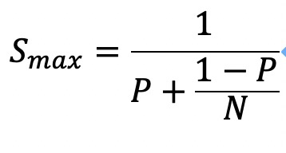
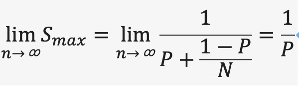
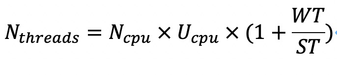

# 1 Amdahl's 定律

Amdahl’s描述了线程数与多线程程序相对于单线程程序的提速之间的关系。

N：处理器的数量

P：程序里必须串行（即无法并发化）的部分耗时占程序全部耗时的比率P

S：最大提速

当N趋近于无穷大的时候，S趋向于1/P，可见最终决定多线程提速的因素是整个计算中串行部分的耗时比率P，而不是线程数N。

P的值越大，即程序中不能并行化的部分所占比率越大，那么提速越小

# 线程数设置原则

+ 对于**CPU密集型**线程，这类线程执行任务时消耗的主要是处理器资源，我们可以将这类线程的线程数设置成N个，但是由于某些原因（缺页中断/page fault）而被切出，此时为了避免处理器资源浪费，我们可以设置一个额外的线程，即**线程数为N+1**
+ 对应**I/O密集型**的线程，I/O操作可能导致上下文切换，可以设置**线程数为2N**，这是因为I/O密集型线程在等待I/O操作返回结果时是不占用处理器资源的，因此我们可以为每个处理器安排一个额外的线程以提高处理器资源的利用率。

商业软件往往会规定某个软件对处理器的使用率不能超过某个阀值（如75%）。因此，线程数的设置需要考虑目标处理器的使用率。

如果任务不太好拆分成CPU密集型和I/O密集型的混合型任务，可以用下面公式确定线程数

Ncpu：CPU数目

Ucpu：目标CPU使用率（0~1）

WT（wait time）：程序花费等待的时长

ST（service time）：程序占用处理器执行计算时长

可以使用jvisualvm提供的监控数据计算WT/ST的值