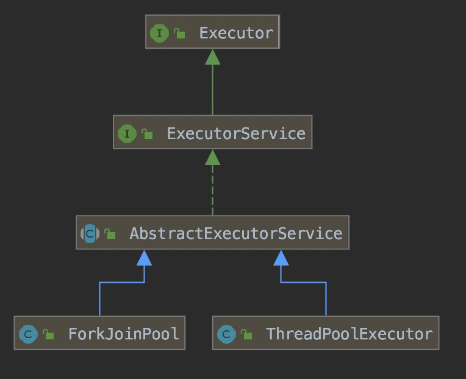

Executor：线程池顶级接口，对线程执行的抽象

+ ```java
  //执行任务
  void execute(Runnable command);
  ```

ExecutorService：

+ ```java
  //关闭线程池
  void shutdown();
  ```

+ ```java
  //立刻关闭线程池，尝试停止正在运行的任务
  List<Runnable> shutdownNow();
  ```

+ ```java
  //检查线程池是否已关闭
  boolean isShutdown();
  ```

+ ```java
  //线程线程池是否被中断
  boolean isTerminated();
  ```

+ ```java
  //阻塞指定时间返回是否中断
  boolean awaitTermination(long timeout, TimeUnit unit) throws InterruptedException;
  ```

+ ```java
  //提交任务
  <T> Future<T> submit(Callable<T> task);
  <T> Future<T> submit(Runnable task, T result);
  Future<?> submit(Runnable task);
  ```

+ ```java
  // 批量执行任务，只有当这些任务都完成了这个方法才会放回
  <T> List<Future<T>> invokeAll(Collection<? extends Callable<T>> tasks) throws InterruptedException;
  // 在指定时间内批量执行任务，只有当这些任务都完成了这个方法才会放回
  <T> List<Future<T>> invokeAll(Collection<? extends Callable<T>> tasks,long timeout, TimeUnit unit) throws InterruptedException;
  ```

+ ```java
  // 返回任意一个已完成的执行结果，未完成的任务将被取消
  <T> T invokeAny(Collection<? extends Callable<T>> tasks) throws InterruptedException, ExecutionException;
  // 在指定时间内返回任意一个已完成的执行结果，未完成的任务将被取消
  <T> T invokeAny(Collection<? extends Callable<T>> tasks,long timeout, TimeUnit unit) throws InterruptedException, ExecutionException, TimeoutException;
  ```

AbstractExecutorService：使用模板模式为线程池提供方法的默认实现

ThreadPoolExecutor：线程池实现类

ForkJoinPool：线程池实现类

Executors：快速创建线程池的工具类